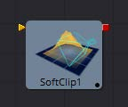
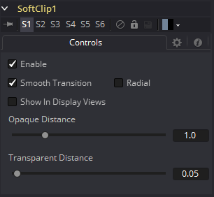

### Softclip [3Sc]

Softclip工具是用来淡出接近相机的几何物体和粒子。这有助于避免影响许多粒子系统和3D飞行的可见“弹出”。这个工具非常类似于Fog 3D工具，因为它依赖于几何物体与相机的距离。

Softclip工具通常放在渲染器之前，以确保下游的灯光和纹理调整不会影响结果。如果只需要对场景的一部分使用软裁剪效果，则可以将其放置在流的任何3D部分。

#### 外部输入

 

*Softclip.SceneInput* 

[橙色，必需的]这个输入需要一个3D场景。

#### Controls

##### Enable

此复选框可用于启用或禁用该工具。

##### Smooth Transition

将线性梯度更改为曲线形状的梯度。

##### Radial

默认情况下，软裁剪是根据经过视点的平面(与近平面平行)的垂直距离来完成的。当选中径向选项时，使用到视点的径向距离而不是垂直距离。垂直距离软裁剪的问题在于，当你移动相机时，当截体左右两侧的物体移动到中心时，它们的剪切变少了，即使它们与眼睛的距离保持不变。径向软剪辑能修复这个。不过有时径向软裁剪是不可取的。

例如，如果您将软裁剪应用于靠近摄像机的对象，比如一个图像平面，图像平面的中心可以被不裁剪，而边缘可以被完全裁剪，因为它们离视点更远。

##### Show In Display Views

通常，这种效果只有在使用相机工具查看场景时才可见。当启用时，软剪辑在场景中从所有角度都可见。

##### Transparent/Opaque Distance

定义软剪辑的范围。在透明距离处，对象的不透明度将从0开始淡入，在不透明距离处完全可见。所有单元都表示为与相机沿Z轴的距离。