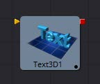

### Text 3D [3Txt]

Text 3D工具是2D Text工具的3D版本。这个工具的控件几乎在所有方面都与2D版本的控件相同，只是它只支持一个着色元素。有关此工具中找到的控件的更多详细信息，请参见Text Plus。

Text 3D工具基于一个早于Fusion 3D环境工具。因此，在此工具的控件中找不到基本形状和几何载入器中找到的一些控件，例如许多材质、光照和matte选项。Text 3D工具有内置的材质，但与其他3D工具不同，它没有材质输入。Shading选项卡包含调整漫反射和高光组件的控件。要使用更高级的材质替换此默认材质，请跟随Text Plus工具和Replace Material 3D工具。Override 3D工具可用于控制该工具的照明、可视性和matte选项。

当网络渲染包含Text 3D工具的工程时，需要注意的一件事是，每台没有安装字体的机器都将失败。由于法律问题，Fusion不能共享或复制字体到Render Slaves。

#### 外部输入

 

**Text3d.SceneInput** 

[橙色，必需的]这个输入需要一个3D场景。

**Text3d.ColorImage** 

[橙色，必需的]这个输入需要一个2D图像。只有在Material选项卡的Shading部分启用Image模式时，它才可见。

**Text3d.BevelTexture** 

[橙色，必需的]这个输入需要一个2D图像。只有在Material选项卡的Shading部分启用Image模式时，它才可见。

（译注：**Text3d.ColorImage** 和**Text3d.BevelTexture** 的颜色为绿色或粉色，以开启Image模式先后为准。）

#### Text Extrusion

##### Extrusion Depth

挤压值为0生成完全的2D文本。任何大于0的值都将通过挤出文本生成具有深度的文本。

##### Bevel Depth

增加Bevel Depth滑块的值来倒角文本。文本必须经过挤压后，此控件才会生效。

##### Bevel Width

使用Bevel Width控件来增加倒角的宽度。

##### Smoothing Angle

使用此控件可调整应用于倒角的平滑角。

##### Front/Back Bevel

使用这些复选框可分别对文本的正面和背面启用倒角。

##### Custom Extrusion

在Custom模式下，Smoothing Angle控制文本字符边缘法线的平滑。样条本身控制沿挤压轮廓线的平滑。如果样条线段被平滑，例如使用快捷键Shift-S，法线也会被平滑。如果关键点是线性的，将会有一个锐利的阴影边缘。样条上的第一个和最后一个关键点定义了文本的范围。

**Custom Extrusion Subdivisions:** 控制挤压侧面的光滑部分内细分的数量。

> **提示：** 记住样条也可以在Spline Editor选项卡中编辑，您不必使用 Text3D. ExtrusionProfile曲线控件有限的功能和大小。不要尝试将正面/背面的尺寸调到零。这将导致自交面产生的Z冲突。为了避免这个问题，请确保第一个和最后一个点的侧面设置为0。

#### Shading

##### Opacity

降低材质的不透明度将同样降低高光和漫反射颜色的颜色和alpha值，使材质透明，并允许隐藏的物体通过材质被看到。

##### Use One Material

取消选择此选项将显示文本斜边的第二组材质控件。

#### Material

##### Type

要使用纯色纹理，请选择Solid模式。选择图像模式将在工具栏上显示一个新的外部输入，可以连接到另一个2D图像。

##### Specular Color

Specular Color决定了从光亮表面反射的光的颜色。一种材料的高光越高，它看起来就越有光泽。像塑料和玻璃这样的表面往往有白色的高光，而像黄金这样的金属表面则有继承于材质颜色的高光。基本着色器材质不提供纹理输入来控制对象的高光性。当需要对高光外观进行更精确的控制时，可以使用3D Material类别中的工具。

##### Specular Intensity

Specular Intensity控制高光的强度。如果高光强度纹理端口有一个有效的输入，那么这个值乘以输入的alpha值。

##### Specular Exponent

Specular Exponent控制高光的衰减。值越大，衰减越明显，材质就显得越光滑和有光泽。基本着色器材质不提供纹理输入来控制对象的高光指数。当需要对高光指数进行更精确的控制时，请使用3D Material类别中的工具。

##### Image Source

此控件确定应用于该材料的纹理的来源。如果将该选项设置为Tool，则会在工具块上显示一个输入，该输入可用于将2D工具的输出应用于纹理。Selecting Clip将显示一个文件浏览器，该浏览器可用于从磁盘中选择图像或图像序列。Brush选项将提供一个在Fusion\Brush文件夹中找到的剪辑列表。

#### Bevel Material

此显示框仅在（译注：不）选中Use One Material复选框控件时出现。此显示项下的控件与上述材质控件的完全一致，但仅应用于文本倒角。

#### Transform

这些控件可用于变换应用于文本的材质。有关这些工具的完整描述，请参见Text Plus工具。

#### Tips for Text3D

##### Character Level Styling

Text 3D工具不直接支持Character Level Styling。您必须首先创建一个Text+工具，并使用Character Level Styling修改器修改其文本字段。然后，将Text 3D的文本字段连接到现在可用的修饰符，或复制Text+工具并将其设置粘贴到Text 3D工具(右键单击>Paste Settings)。

##### Uncapped 3D Text

若要隐藏挤出文本的正面，取消勾选Shading选项卡上的Use One Material，并将第一种材质的颜色(包括其alpha值)降为黑色。