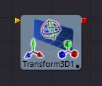
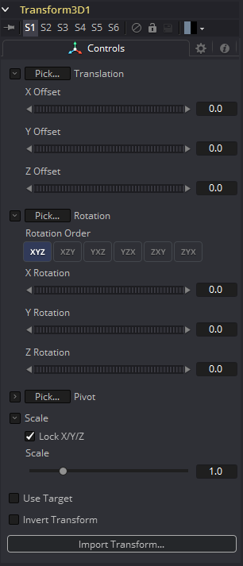
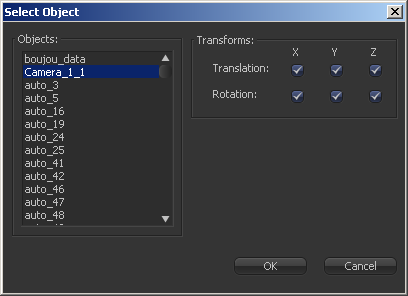
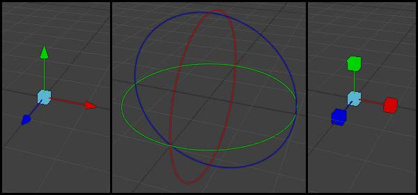

### Transform 3D [3Xf] 变换3D

Transform 3D工具可以用来平移、旋转或缩放场景中的所有元素，而不需要Merge 3D工具。这对于层次化变换，或者偏移多次合并到场景中的对象都很有用。它的控件与其他3D工具的Transformation选项卡中的控件相同。

 

#### 3D 3D变换选项卡

#### Translation 位移

##### X, Y, Z Offset XYZ偏移

这些控件可用于定位3D元素。

#### Rotation 旋转

##### Rotation Order 旋转顺序

使用这些按钮来选择用于沿着对象的每个轴应用旋转的顺序。例如，XYZ首先对X轴进行旋转，然后是Y轴，然后是Z轴。

##### X, Y, Z Rotation XYZ旋转

使用这些控件使对象围绕其轴心点旋转。如果选择了Use Target复选框，则旋转相对于目标的位置，否则使用全局轴。

#### Pivot 旋转中心

##### X, Y, Z Pivot XYZ旋转中心

轴心点是物体旋转的点。通常，一个物体会绕着它自己的中心旋转，这个中心被认为是0,0,0的轴心。这些控件可用于从中心偏移轴心。

#### Scale 缩放

##### X, Y, Z Scale XYZ缩放

如果选中Lock X/Y/Z复选框，将显示一个缩放滑块。这将调整对象的总体大小。如果未选中Lock复选框，则将显示单独的X、Y和Z滑块，以允许在任何维度上缩放。

> **注意：** 如果选中Lock复选框，就不可能缩放单个维度，即使在缩放模式下拖动Transformation小部件的特定轴也是如此。

##### Use Target 使用目标

选择Use Target复选框可以启用一组用于定位XYZ目标的控件。当目标被启用时，对象将始终旋转以面对目标。物体的旋转与目标相对。

##### Import Transform 导入变换

打开文件浏览器，在其中可以选择3D应用程序保存或导出的场景文件。它支持以下文件类型：

| 文件类型       | 文件后缀 |
| -------------- | -------- |
| LightWave场景  | .lws     |
| Max场景        | .ase     |
| Maya Ascii场景 | .ma      |
| dotXSI         | .xsi     |

Import Transform按钮将只导入变换数据。对于3D几何物体、灯光和摄像机，考虑使用菜单中的File > FBX Import选项。

##### On Screen Transformation Widget 屏幕上变换小部件

Transformation Widget表示查看器中此选项卡中的大多数控件，具有平移、旋转和缩放模式。要更改小部件的模式，请选择查看器一侧工具栏中的三个按钮之一。这些模式也可以通过键盘快捷键Q来平移，用W来旋转，用E来缩放。在所有三种模式中，可以拖动控件的单个轴来只影响该轴，或者拖动控件的中心来影响所有三个轴。

大多数3D工具的缩放滑块默认为锁定，这导致三个轴的缩放一致。解锁Lock X/Y/Z Scale复选框，只缩放单个轴上的对象。

