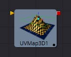
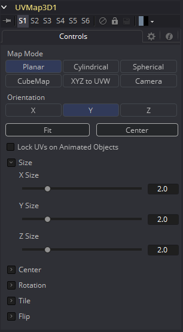

### UV Map 3D [3UV]

UV map 3D工具替换了场景中几何物体上的UV纹理坐标。这些坐标告诉Fusion如何将纹理应用到对象上。该工具提供了平面、圆柱、球面、XYZ和立方映射模式，可以应用于基本的Fusion基础物体以及导入的几何物体。可以调整纹理坐标的位置、旋转和比例，以便对纹理的外观进行精细控制。还提供了一个选项，根据参考帧将该工具生成的UV锁定为动画几何物体。这可以用来确保应用于动画几何物体的纹理不会滑动。

虽然可以调整所选映射模式的全局属性，但不能直接从Fusion中操作单个顶点的UV坐标。
在监视器中绘制的屏幕控件仅供参考，不能操纵。

#### 外部输入

 

**UVMap3d.SceneInput** 

[橙色，必需的]这个输入需要一个3D场景。

**UVMap3d.CameraInput** 

[绿色，可选的]这个输入需要一个Camera 3D工具的输出。它只在使用Camera Map模式时可见。

##### Camera Projections with UV Map 3D 

Camera Mapping模式使得通过相机将纹理坐标投射到几何物体上成为可能。在UV Map 3D工具上启用Camera Mapping模式。直接将用于创建UV坐标的相机连接到流中UV Map 3D工具块上出现的新的“Camera”输入。

注意，这并不直接通过相机投射图像。要投影的图像应该连接到指定给对象的任何材质的漫反射纹理输入。当纹理被应用时，它将使用相机创建的UV坐标。因为这是一个纹理投影而不是光，纹理的alpha通道将正确地设置几何物体的不透明度。

请参阅Camera 3D和Projector 3D工具了解投影的其他方法。

当投影出现在选定的帧上时，可以选择将其锁定到顶点。如果mesh中的顶点数量随时间变化，这将失败，因为Fusion必须能够在参考时间和当前时间匹配mesh。更具体地说，顶点不能被创建、销毁或重新排序。由于这个原因，投影锁定不适用于许多粒子系统、具有动画细分的基础物体以及使用非零时间偏移量的duplicate工具。

> **注意：** UV Map 3D工具不把纹理或材质放到mesh上，它只修改材质将使用的纹理坐标。这可能令人困惑，因为材质通常位于上游。例如，一个工程这样包含包含工具：Loader > Blinn > Shape 3D (cube) > UV Map 3D > Renderer 3D。

#### Controls

##### Map Mode

定义如何创建纹理坐标。把它想象成一个虚拟的几何体，将UV空间投射到物体上。

- **Planar:** 使用平面创建UV坐标。
- **Cylindrical:** 使用圆柱形对象创建UV坐标。
- **Spherical:** 使用球体创建UV坐标。
- **XYZ to UVW:** 将顶点的位置坐标直接转换为uvw坐标。这用于处理过程纹理。
- **CubeMap:** 使用立方体创建UV坐标。
- **Camera:** 启用工具的Camera Input端口。将相机与之连接后，基于相机投影创建纹理坐标。

##### Orientation X/Y/Z

定义用于对齐Map Mode的参考轴。

##### Fit

单击此按钮将使Map Mode适合于输入场景的边框。

##### Center

单击此按钮将Map Mode的中心移动到输入场景的边框中心。

##### Lock UVs on Animated Objects

如果对象是动画的，uv可以锁定到它。启用此选项将完成此操作，并显示Ref Time滑块，在那里可以为UV映射选择一个参考帧。使用这个特性，不需要对uv映射参数进行动画。在参考时间设置UV贴图就足够了。

##### Size X/Y/Z

定义投影对象的大小。

##### Center X/Y/Z

定义投影对象的位置。

##### Rotation/Rotation Order

使用这些按钮来选择用于沿着对象的每个轴应用旋转的顺序。例如，XYZ首先对X轴进行旋转，然后是Y轴，然后是Z轴。

##### Rotation X/Y/Z

根据旋转顺序为每个轴设置投影对象的方向。

##### Tile u/v/w

定义纹理在对应轴上与投影UV空间的匹配频率。注意，UVW坐标被转换，而不是纹理。当与Create Texture工具一起使用时效果最好。

##### Flip u/v/w

镜像翻转纹理坐标周围的参考轴。

##### Flip Faces (CubeMap mode only)

将纹理坐标映射到立方体的各个面上。

> **注意：** 为了充分利用UV Map 3D工具的功能，要先对2D图像如何映射到3D几何物体有一个基本的了解。当二维图像应用于三维表面时，它被转换成一个纹理映射，使用UV坐标来确定图像如何转换到对象。mesh上的每个顶点都有一个(U, V)纹理坐标对，用于描述对象在展开和平展时的外观。不同的映射模式使用不同的方法来计算顶点如何转换成平面二维纹理。当使用UV Map 3D工具修改mesh上的纹理坐标时，最好使用mesh或基础物体的默认坐标系统。因此，典型的工作流将看起来像Shape 3D > UV Map 3D > Transform 3D。Shape工具上的Transform选项卡将保留其默认值，而紧随UV Map 3D之后的Transform 3D工具将执行将工具放置到场景中所需的任何调整。修改/制作动画Shape工具的变换将导致纹理滑过形状，这通常是不可取的。UV Map 3D工具修改每个顶点的纹理坐标，而不是每个像素。如果应用UV映射的几何物体镶嵌得不好，那么可能会出现不希望出现的伪影。