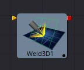
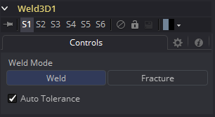

### Weld 3D [3We] 焊接3D

有时3D几何物体有一些本该连接但没有连接的顶点。这可能导致一些缺陷，特别是当两个顶点有不同的法线时。

例如：

- 不同的法线将产生一个意料之外的硬阴影/光照边缘；
- 如果你试图沿着法线替换三维顶点，会出现裂缝；
- 在所渲染的图像中缺少像素或像素重叠；
- 粒子通过微小的看不见的裂缝。

Weld3D工具允许您在Fusion中完成这一操作，而不是返回到您的3D建模应用程序来修复“重复的”顶点。Weld3D会焊接具有相同或几乎相同位置的顶点。这可以用于修复顶点在Displace前通过焊接几何物体而置换时的开裂问题。没有用于选择顶点的用户控件。目前，这个工具焊接在一起只是位置顶点；它不焊接法线，纹理，或任何其他顶点流。因此，即使两个顶点的位置相同，它们的法线仍然有它们原来的值。在某些情况下，这可能导致硬边。

 

#### Controls 控件

##### Fracture 断裂

断裂是焊接的对立面，所以所有的顶点都是不焊接的。这意味着所有的多边形邻接信息都丢失了。例如，Imageplane3D通常由共享顶点的连接四边形组成。破碎的图像平面使它成为一堆不相连的四边形。

##### Tolerance 容差

在自动模式下，将自动检测到Tolerance。这在大多数情况下都是可行的。如果需要，还可以手动调整。

> **用法** 
>
> 当几何物体出现问题时，使用Weld3D。不要仅仅因为它在那里就到处使用它，因为它会影响渲染时间。
>
> Weld3D的目的是作为一个mesh健壮性工具，而不是作为一个mesh编辑工具合并顶点。如果您可以在3D视图中看到要焊接的顶点之间的间隙，那么您可能正在滥用Weld3D。当你这样做的时候，意想不到的事情可能会发生；这样做的后果自负。
>
> **当前的问题** 
>
> 设置太大的容差值(Tolerance)会导致边缘/面折叠到点。
>
> 如果您的模型的细节分布在几个级别上，那么选择一个容差值可能是困难的，也可能是不可能的。
>
> 例如，假设你有一个ISS的模型，里面有很多大的多边形和非常小的多边形。如果你把公差设置得太大，小多边形就会被合并，这是不应该的；如果您将公差设置得太小，一些较大的多边形将不会被合并。
>
> 远离原点的顶点可能无法正确合并。这是因为大数字+小数字在浮点数运算中完全可以等于大数字。这是最好在本地坐标系中合并而不是在世界坐标系中合并的原因之一。
>
> 有时焊接mesh会使事情变得更糟。以Fusion的圆锥为例。圆锥的顶部顶点目前为每个相邻的面复制，它们都有不同的法线。如果你焊接圆锥，顶部的顶点会合并在一起，只有一个法线，使照明看起来很奇怪。
>
> Weld3D不是多线程的。
>
> **警告** 
>
> 不要滥用Weld3D来简化mesh(减少多边形数)。它的设计是为了有效地焊接只有非常小的值不同的顶点，如0.001的距离。

