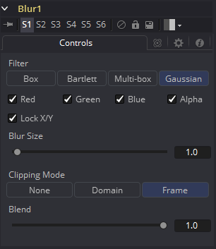
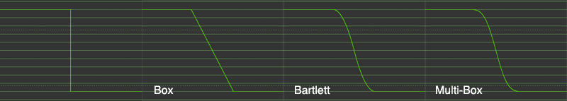

### Blur [Blur] 模糊

Blur工具所做的正是其名所指——模糊输入的图像。这是最常用的图像处理操作之一。

#### Controls 控件

> **注意：**由于理论完美的高斯滤镜需要检查无限多个像素，因此实际上的高斯滤镜肯定都是近似的。Fusion使用的算法是一种具有许多优点的高度优化的方法，不过在某些极端情况下可能会在边缘产生可见的“[振铃](https://zh.wikipedia.org/wiki/%E6%8C%AF%E9%88%B4%E6%95%88%E6%87%89)”。这种振铃效应仅在模糊浮动深度图像时出现，并且通常远低于可见性限制，尤其是在最终渲染或HiQ模式下，但可能出现在后续处理中。如果遇到这种情况，可以换用Multi-Box滤镜试试。

##### Filter Type 滤镜类型

Filter Type按钮组允许选择要应用于图像的滤镜。

- **Box Blur 盒式模糊 :** 此选项将盒式模糊效果应用于整个图像。此方法比高斯模糊更快但产生较低质量的结果。
- **Soften 柔化：**柔化应用一般的柔化滤镜效果。此滤波器方法比高斯滤镜慢，并产生较低质量的结果。它只是为了对旧版流程的兼容而包含。
- **Bartlett:** Bartlett应用了一种更精细、抗锯齿的模糊滤镜。
- **Multi-Box 多重盒式：**多重盒式使用分层多通的盒式滤镜来逼近高斯的形状。利用适度的通过次数（如4次），可以获得高质量的模糊，通常可以比高斯滤镜更快且没有“振铃”。
- **Gaussian 高斯：**高斯应用平滑、对称的模糊滤镜，使用复杂的常量时间高斯近似算法。此模式是默认滤镜方法。

##### Color Channels (RGBA) 颜色通道（RGBA）

滤镜默认在R、G、B和A通道上运行。通过单击每个通道旁边的复选框可以使它们处于活动或非活动状态，从而实现选择性通道滤镜。

> **注意：**这与常用控件下的RGBA复选框不同。模糊工具在处理图像之前会考虑这些选择，因此取消选择通道可以使工具在处理时跳过该通道，从而加快渲染效果的速度。

相反，Common Controls选项卡下的通道控件将在工具处理后应用。

##### Lock X/Y 锁定X/Y

将X和Y模糊滑块锁定在一起，以实现对称模糊。默认情况下会选中此选项。

##### Blur Size 模糊尺寸

设置应用于图像的模糊量。取消选中Lock X/Y控件时，将提供对每个轴的独立控件。

##### Clipping Mode 裁剪模式

此选项设置用于在执行定义域渲染时处理图像边缘的模式。这对于像Blur这样的工具非常重要，可能需要来自当前域之外的图像部分的样本。

- **Frame 帧：**默认选项是Frame，它自动设置工具的定义域以使用图像的完整帧，忽略当前的定义域。如果上游DoD小于帧，则帧中的剩余区域将被处理为黑色/透明。

- **Domain 域：**在应用工具的效果时，将此选项设置为域将遵循定义的上游域。在工具使用大型滤镜的情况下，这会产生不利的剪切效果。

- **None 无：**将此选项设置为None将不会执行任何源图像剪切。这意味着处理通常位于上游DoD之外的工具效果所需的任何数据都将被视为黑/透明。

##### Blend 混合

这是Common Controls选项卡中Blend滑块的克隆实例。对此控件进行的更改同时对常用控件中的控件进行。

Blend滑块将工具的结果与其输入混合，将效果与任何小于1.0的值混合。

#### Examples 示例

这是模糊滤镜的比较，可视化为过滤边缘的“横截面”。正如您所看到的，Box将创建一个线性斜坡，而Bartlett创建一个更平滑的斜坡。Multi-box和Gaussian导致更平滑的斜坡，除非您在斜坡上非常靠近放大，否则几乎无法区分。如上所述，Gaussian将略微过冲，如果在浮点图像上使用，可能会导致负值。

