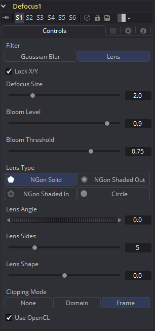
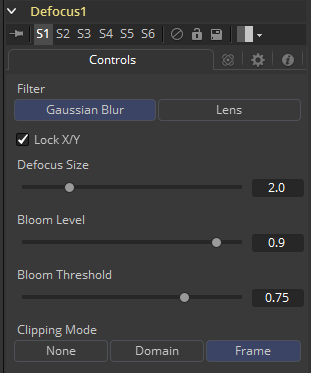

### Defocus [Dfo] 散焦

Defocus工具模拟失焦相机镜头以及泛光和图像眩光的效果。它提供了快速但相对不准确的高斯（Gaussian）模式，以及更逼真但更慢的镜头（Lens）模式。

#### Controls 控件

##### Filter 滤镜

使用此菜单选择应用于创建散焦的精确方法。高斯模式应用相当简单的效果，而镜头模式将创建更加逼真的散焦。镜头模式将比高斯模式慢得多。

##### Lock X/Y 锁定X/Y

勾选Lock X/Y时，将对图像的X轴和Y轴执行相同的散焦量。取消选择以获得单独控制。

##### Defocus Size 散焦大小

Defocus Size控件设置散焦效果的大小。较高的值会使图像模糊更多，并产生更大的光晕。

##### Bloom Level 泛光级别

Bloom Level控件确定应用于高于泛光阈值的像素的泛光的强度和大小。

##### Bloom Threshold 泛光阈值

值高于设置Bloom Threshold的像素将散焦并应用泛光。低于该值的像素仅进行散焦。

##### Lens Type 镜头类型

用于创建“糟糕的散景（bad bokeh）”效果的基本形状。这可以通过Angle、Sides和Shape滑块进一步细化。

##### Lens Angle 镜头角度

定义形状的旋转。将Lens Types设置为NGon可以看到最佳效果。当Lens Types设置为Circle时，因为是圆形，所以此滑块将没有可见的效果。

##### Lens Sides 镜头边数

定义NGon形状的边数。将Lens Types设置为NGon可以看到最佳效果。当Lens Types设置为Circle时，因为是圆形，所以此滑块将没有可见的效果。

##### Lens Shape 镜头形状

定义NGons的指向性。较高的值将创造一个更尖锐的星形外观。较低的值创造更平滑的NGons。将Lens Types设置为NGon并将Lens Sides设置为5至10可以看到最佳效果。当Lens Types设置为Circle时，因为是圆形，所以此滑块将没有可见的效果。

##### Use OpenCL 使用OpenCL

这个选项在Fusion的OpenCL Supercomputing中引入，可以在GPU而不是CPU上产生效果。根据计算机中使用的显卡，这可将工具的速度提高30倍甚至更多。

##### Clipping Mode 裁剪模式

此选项设置用于在执行定义域渲染时处理图像边缘的模式。这对于像Blur这样的工具非常重要，可能需要来自当前域之外的图像部分的样本。

- **Frame 帧：**默认选项是Frame，它自动设置工具的定义域以使用图像的完整帧，忽略当前的定义域。如果上游DoD小于帧，则帧中的剩余区域将被处理为黑色/透明。

- **Domain 域：**在应用工具的效果时，将此选项设置为域将遵循定义的上游域。在工具使用大型滤镜的情况下，这会产生不利的剪切效果。

- **None 无：**将此选项设置为None将不会执行任何源图像剪切。这意味着处理通常位于上游DoD之外的工具效果所需的任何数据都将被视为黑/透明。