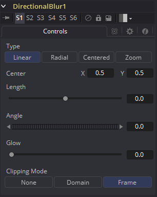

### Directional Blur [DrBl]

此工具用于创建方向性（Directional）和径向（Radial）模糊。它对于创建模拟运动模糊和光线类型效果很有用。Directional Blur会影响所有通道（RGBA）。

#### Controls

##### Type

此按钮阵列用于选择要提供给图像的方向模糊的类型（Type）。

- **Linear:** Linear以直线扭曲图像，类似于超速列车窗口中出现的风景。
- **Radial:** 径向将产生一种扭曲，起源于某个任意中心，向外辐射，如果一个人在火车头部向前看就会出现。
- **Centered:** Centered按钮产生类似于Linear的结果，但模糊效果均匀分布在原件的两侧。
- **Zoom:** Zoom会在图像拖影的比例中产生失真，以模拟以低速快门拍摄相机的变焦条纹。

##### Center X and Y

此坐标控件和十字准线仅影响Radial和Zoom运动模糊类型。它用于计算模糊效果开始的位置。

##### Length

长度调整效果的强度和方向。低于零的值会导致模糊与角度控制相反。大于滑块最大值的值可以输入到滑块的编辑框中。

##### Angle

在两种Linear模式下，此控件将修改方向模糊的方向。在Radial和Zoom模式下，效果将类似于在查看同一点时相机旋转的效果。如果长度滑块的设置不为0，将会产生漩涡的效果。

##### Glow

这将为方向模糊添加一个Glow，可用于复制由较长的快门速度引起的相机曝光增加的效果。

##### Clipping Mode

此选项设置用于在执行定义渲染域时处理图像边缘的模式。这对于像Blur这样的工具非常重要，这可能需要来自当前域之外的图像部分的样本。

- **Frame:** 默认选项是Frame，它自动设置工具的定义域以使用图像的完整帧，有效地忽略当前的定义域。如果上游DoD小于帧，则帧中的剩余区域将被处理为黑色/透明。
- **Domain:** 在应用工具的效果时，将此选项设置为域将遵循定义的上游域。在工具使用大型滤镜的情况下，这会产生不利的剪切效果。
- **None:** 将此选项设置为None将不会执行任何源图像剪切。这意味着处理通常位于上游DoD之外的工具效果所需的任何数据都将被视为黑/透明。