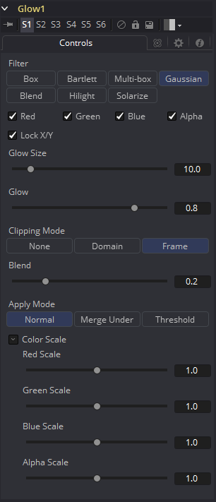

### Glow [Glo]

Glow基本上是通过模糊图像，然后使模糊的结果变亮并将其与原始图像混合来创建的。
Glow工具提供了一种更方便的方式来实现这种效果，以及该方法的各种变化。例如，Bartlett发光是一种高质量的发光，并有着更平滑的下降，但是，在较大尺寸的情况下，处理器密集程度更高。

#### Controls

##### Filter

使用这些按钮选择滤镜中使用的模糊方法。选项如下所述。

- **Box:** 一个简单但非常快速的Box滤镜。
- **Bartlett:** Bartlett增加了更柔和、更精细的发光和更平滑的下降，但渲染时间可能比Box更长。
- **Multi-box:** Multi-box使用多个过程中分层的Box滤镜来近似Gaussian形状。利用适度的通过次数（例如，4次），可以获得高质量的模糊，通常比Gaussian滤镜更快，并且没有任何振铃。
- **Gaussian:** Gaussian增加了柔和的光晕，由Gaussian算法模糊。这是默认方法。
- **Blend:** Blend添加了一种在白色和黑色中均匀可见的非线性光晕。
- **Hilight:** Hilight在周围像素中添加发光而不会产生光晕。
- **Solarize:** Solarize增添了发光，使图像过曝。

##### Color Channels (RGBA)

滤镜默认在R、G、B和A通道上运行。通过单击每个通道旁边的复选框可以使它们处于活动或非活动状态，从而实现选择性通道过滤。
这与在常用控件下找到的RGBA复选框不同。该工具在处理之前会考虑这些控件。取消选择通道将导致工具在处理时跳过该通道，从而加快效果的渲染速度。
相反，Common Controls选项卡下的通道控件将在工具处理后应用。

##### Lock X/Y

选中Lock X/Y时，水平和垂直发光量都将被锁定。否则，可能会对每个轴应用单独的模糊量。

##### Glow Size

Glow Size确定发光效果的大小。较大的值会扩展图像的发光高光的大小。

##### Num Passes

仅在Multi-box模式下可用。较大的值可以使效果更平滑，但也会增加渲染时间。最好在所需要的质量和可接受的渲染时间之间找到平衡。

##### Glow

Glow滑块确定发光效果的强度。较大的值趋向于使图像完全变为白色。

##### Clipping Mode

此选项设置用于在执行定义渲染域时处理图像边缘的模式。这对于像Blur这样的工具非常重要，这可能需要来自当前域之外的图像部分的样本。

- **Frame:** 默认选项是Frame，它自动设置工具的定义域以使用图像的完整帧，有效地忽略当前的定义域。如果上游DoD小于帧，则帧中的剩余区域将被处理为黑色/透明。
- **Domain:** 在应用工具的效果时，将此选项设置为域将遵循定义的上游域。在工具使用大型滤镜的情况下，这会产生不利的剪切效果。
- **None:** 将此选项设置为None将不会执行任何源图像剪切。这意味着处理通常位于上游DoD之外的工具效果所需的任何数据都将被视为黑/透明。

##### Blend

这是Common Controls选项卡中Blend滑块的克隆实例。对此控件进行的更改同时对常用控件中的控件进行。
Blend滑块将工具的结果与其输入混合，将效果与任何小于1.0的值混合。

##### Apply Mode

在将发光（Glow）应用于图像时，可以使用三种Apply Mode。

- **Normal:** 默认。此模式只是将发光直接添加到原始图像的顶部。
- **Merge Under:** Merge Under根据Alpha通道放置图像下方的发光。
- **Threshold:** Threshold模式允许剪切阈值。将出现一个新的范围滑块，此控件会剪切发光的效果。值低于低值的发光区域中的像素将被推到黑色。值大于高的像素将被推到白色。

##### High-Low Range Control

仅在Threshold模式下可用。亮度区域中值低于低值的像素将被推至黑色。值大于高的像素将被推到白色。

##### Color Scale (RGBA)

这些Scale滑块通常是标记为Color Scale的显示控件。它们可用于单独调整应用于每个颜色通道的发光量，从而对发光进行着色。

##### Glow Pre Mask

Glow工具支持使用发光蒙版进行预遮罩。Glow Pre Mask在应用发光之前过滤图像。然后将发光合并回原始图像上。这与剪切渲染结果的常规效果蒙版不同。
发光遮罩允许发光延伸到遮罩的边框之外，同时将发光源限制为遮罩内的那些像素。
要应用发光蒙版（glow mask），请在发光工具处于活动状态时从上下文菜单中选择Glow Mask而不是Effect Mask。Glow Mask与其他方面的Effect Mask相同。