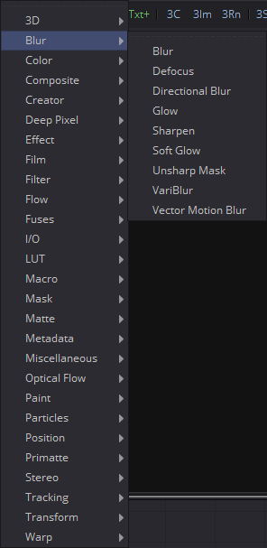

## 第五章 Blur Tools 模糊工具

- [Blur [Blur]](./Blur%20[Blur].md) 
- [Defocus [Dfo]](./Defocus%20[Dfo].md) 
- [Directional Blur [DrBl]](./Directional%20Blur%20[DrBl].md) 
- [Glow [Glo]](./Glow%20[Glo].md) 
- [Sharpen [Shrp]](./Sharpen%20[Shrp].md) 
- [Soft Glow [SGl]](./Soft%20Glow%20[SGl].md) 
- [Unsharp Mask [Us]](./Unsharp%20Mask%20[Us].md) 
- [VariBlur [VBl]](./VariBlur%20[VBl].md) 
- [Vector Motion Blur [VBl]](./Vector%Motion%20Blur%20[VBl].md) 

<table id="img">
  <tr>
    <td></td>
    <td>
      <table id="img">
        <tr>
          <td></td>
          <td></td>
        </tr>
        <tr>
          <td></td>
          <td></td>
        </tr>
        <tr>
          <td></td>
          <td></td>
        </tr>
        <tr>
          <td></td>
          <td></td>
        </tr>
        <tr>
          <td></td>
        </tr>
      </table>
    </td>
  </tr>
</table>