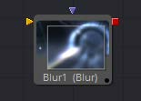
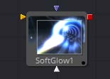
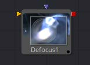
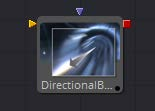
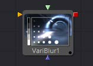
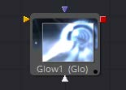
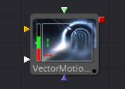
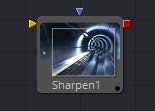

## 第五章 Blur Tools 模糊工具

- [Blur [Blur] 模糊](./Blur%20[Blur].md) 
- [Defocus [Dfo] 散焦](./Defocus%20[Dfo].md) 
- [Directional Blur [DrBl] 方向性模糊](./Directional%20Blur%20[DrBl].md) 
- [Glow [Glo] 发光](./Glow%20[Glo].md) 
- [Sharpen [Shrp] 锐化](./Sharpen%20[Shrp].md) 
- [Soft Glow [SGl] 柔光](./Soft%20Glow%20[SGl].md) 
- [Unsharp Mask [Us] 锐化遮罩](./Unsharp%20Mask%20[Us].md) 
- [VariBlur [VBl] 可变模糊](./VariBlur%20[VBl].md) 
- [Vector Motion Blur [VBl] 矢量运动模糊](./Vector%20Motion%20Blur%20[VBl].md) 

<table id="img">
  <tr>
	<td rowspan="5"></td>
    <td></td>
    <td></td>
  </tr>
  <tr>
    <td></td>
    <td></td>
  </tr>
  <tr>
    <td></td>
    <td></td>
  </tr>
  <tr>
    <td></td>
    <td></td>
  </tr>
  <tr>
    <td></td>
  </tr>
</table>