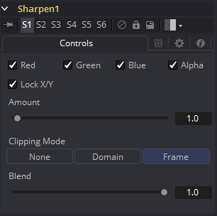

### Sharpen [Shrp] 锐化

Sharpen工具使用卷积滤镜来增强图像中的细节。

#### Controls 控件

##### Color Channels (RGBA) 颜色通道（RGBA）

滤镜默认在R、G、B和A通道上运行。通过单击每个通道旁边的复选框可以使它们处于活动或非活动状态，从而实现选择性通道过滤。

这与在常用控件下找到的RGBA复选框不同。该工具在处理之前会考虑这些控件。取消选择通道将导致工具在处理时跳过该通道，从而加快效果的渲染速度。

相反，Common Controls选项卡下的通道控件将在工具处理后应用。

##### Lock X/Y 锁定X/Y

这将锁定X和Y锐化滑块以进行对称锐化。默认情况下会选中此选项。

##### Amount 量

此滑块设置应用于图像的锐化量。取消勾选Lock X/Y控件时，将提供对每个轴的独立控制。

##### Clipping Mode 裁剪模式

此选项设置用于在执行定义域渲染时处理图像边缘的模式。这对于像Blur这样的工具非常重要，可能需要来自当前域之外的图像部分的样本。

- **Frame 帧：**默认选项是Frame，它自动设置工具的定义域以使用图像的完整帧，忽略当前的定义域。如果上游DoD小于帧，则帧中的剩余区域将被处理为黑色/透明。

- **Domain 域：**在应用工具的效果时，将此选项设置为域将遵循定义的上游域。在工具使用大型滤镜的情况下，这会产生不利的剪切效果。

- **None 无：**将此选项设置为None将不会执行任何源图像剪切。这意味着处理通常位于上游DoD之外的工具效果所需的任何数据都将被视为黑/透明。

##### Blend 混合

这是Common Controls选项卡中Blend滑块的克隆实例。对此控件进行的更改同时对常用控件中的控件进行。

Blend滑块将工具的结果与其输入混合，将效果与任何小于1.0的值混合。