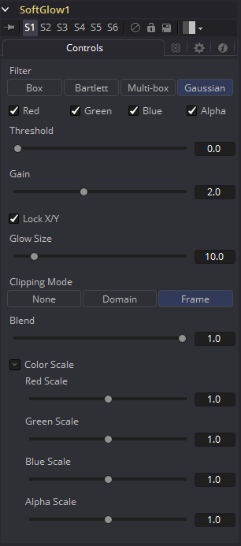

### Soft Glow [SGl]

Soft Glow工具类似于Glow工具，但对图像执行额外处理以创建更柔和，更自然的发光。
该工具非常适合行星周围的大气雾霾、肤色和模拟梦幻般的环境。

#### Controls

> **注意：**Glow工具支持使用工具图块上的Glow Pre Mask输入进行预遮罩。预遮罩在应用发光之前限制图像。然后将发光与原始图像组合。这与限制渲染结果的常规效果遮罩不同。

发光遮罩允许发光延伸到遮罩的边框之外，同时将发光源限制为遮罩内的那些像素。

##### Filter

使用这些按钮选择滤镜中使用的模糊方法。选项如下所述。

- **Box:** 一个简单但非常快速的Box滤镜。
- **Bartlett:** Bartlett增加了更柔和、更精细的发光和更平滑的下降，但渲染时间可能比Box更长。
- **Multi-box:** Multi-box使用多个过程中分层的Box滤镜来近似Gaussian形状。利用适度的通过次数（例如，4次），可以获得高质量的模糊，通常比Gaussian滤镜更快，并且没有任何振铃。
- **Gaussian:** Gaussian增加了柔和的光晕，由Gaussian算法模糊。这是默认方法。

##### Color Channels (RGBA)

滤镜默认在R、G、B和A通道上运行。通过单击每个通道旁边的复选框可以使它们处于活动或非活动状态，从而实现选择性通道过滤。
这与在常用控件下找到的RGBA复选框不同。该工具在处理之前会考虑这些控件。取消选择通道将导致工具在处理时跳过该通道，从而加快效果的渲染速度。
相反，Common Controls选项卡下的通道控件将在工具处理后应用。

##### Threshold

该控件用于限制柔和发光的影响。阈值越高，像素在受到发光影响之前必须越亮。

##### Gain

Gain控制定义发光的亮度。

##### Lock X/Y

选中Lock X/Y时，水平和垂直发光量都将被锁定。否则，可能会对每个轴应用单独的模糊量。

##### Glow Size

Glow Size确定发光效果的大小。较大的值会扩展图像的发光高光的大小。

##### Num Passes

仅在Multi-box模式下可用。较大的值可以使效果更平滑，但也会增加渲染时间。最好在所需要的质量和可接受的渲染时间之间找到平衡。

##### Glow

Glow滑块确定发光效果的强度。较大的值趋向于使图像完全变为白色。

##### Clipping Mode

此选项设置用于在执行定义渲染域时处理图像边缘的模式。这对于像Blur这样的工具非常重要，这可能需要来自当前域之外的图像部分的样本。

- **Frame:** 默认选项是Frame，它自动设置工具的定义域以使用图像的完整帧，有效地忽略当前的定义域。如果上游DoD小于帧，则帧中的剩余区域将被处理为黑色/透明。
- **Domain:** 在应用工具的效果时，将此选项设置为域将遵循定义的上游域。在工具使用大型滤镜的情况下，这会产生不利的剪切效果。
- **None:** 将此选项设置为None将不会执行任何源图像剪切。这意味着处理通常位于上游DoD之外的工具效果所需的任何数据都将被视为黑/透明。

##### Blend

这是Common Controls选项卡中Blend滑块的克隆实例。对此控件进行的更改同时对常用控件中的控件进行。
Blend滑块将工具的结果与其输入混合，将效果与任何小于1.0的值混合。

##### Color Scale (RGBA)

这些Scale滑块通常是标记为Color Scale的显示控件。它们可用于单独调整应用于每个颜色通道的发光量，从而对发光进行着色。