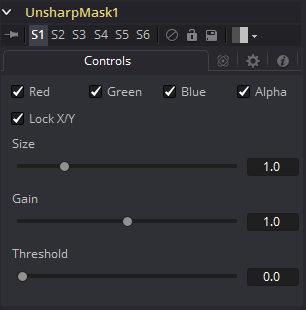

### Unsharp Mask [Us] 锐化蒙版

Unsharp Mask是一种仅用于锐化图像中边缘的技术。此工具最常用于校正低对比度图像中的模糊和细节丢失，例如，从远距离星系的长曝光照片中提取有用的细节。
此滤镜从图像中提取一系列频率并使其模糊以减少细节。然后将模糊结果与原始图像进行比较。原始图像和模糊图像之间具有显着差异的像素可能是边缘细节。然后增亮像素以增强它。

#### Controls

##### Color Channels (RGBA)

滤镜默认在R、G、B和A通道上运行。通过单击每个通道旁边的复选框可以使它们处于活动或非活动状态，从而实现选择性通道过滤。
这与在常用控件下找到的RGBA复选框不同。该工具在处理之前会考虑这些控件。取消选择通道将导致工具在处理时跳过该通道，从而加快效果的渲染速度。
相反，Common Controls选项卡下的通道控件将在工具处理后应用。

##### Lock X/Y

选中Lock X/Y时，水平和垂直锐化量都将被锁定。否则，可以对图像的每个轴应用单独的发光量。

##### Size

此控件调整应用于提取图像的模糊滤镜的大小。此值越高，将像素识别为细节的可能性越大。

##### Gain

Gain控件可调整通过蒙版识别为细节的像素的增益量。更高的值将创建更清晰的图像。

##### Threshold Low and High

该范围控制确定来自要提取的源图像的频率。提高低值将消除比较中的暗像素。高值以上的像素将具有所应用的增益的全部效果。