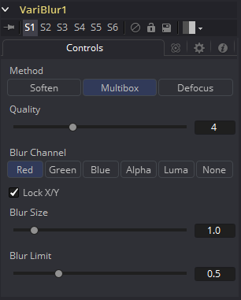

### VariBlur [VBl]

VariBlur工具提供真实的每像素变量模糊，使用第二个图像来控制每个像素的模糊量。它在某种程度上与Depth Blur工具类似，但在许多情况下使用不同的方法来获得更清晰的结果。

#### Controls

> **注意：**必须连接Blur Image输入，否则不会进行模糊处理。

##### Method

- **Soften:** 随着Quality的提高，这种方法从简单的Box形状到Bartlett三角形变为看起来不错的平滑模糊。在模糊较少的区域中保留细节比使用Multibox要好一些。
- **Multibox:** 与Soften类似，这可以在更高的Quality设置下提供更好的Gaussian近似。
- **Defocus:** 这不是一个真正的散焦，它为一个模糊的像素提供了一个平坦的圆形形状，可以近似散焦的外观。

##### Quality

提高Quality会提供更加平滑的模糊，但代价是速度。Quality设置为1会对所有方法设置使用非常快速但简单的Box模糊。对于低模糊大小值，Quality设置为2通常就足够了.除非Blur Size特别高，否则4对于大多数工作来说通常都足够好。

##### Blur Channel

该控件选择使用Blur Image的哪个通道控制应用于每个像素的模糊量。

##### Lock X/Y

选择后，仅显示Blur Size控件，并且模糊量的更改将同等地应用于两个轴。如果清除该复选框，则会同时显示X和Y的Blur Size单独控件。

##### Blur Size

增大此控件将增加应用于每个像素的总体模糊量。无论Blur Size如何，模糊图像为黑色或不存在的像素都不会被模糊。