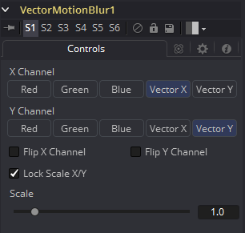

### Vector Motion Blur [VBl]

此工具用于基于Vector Channel创建方向性模糊。
此工具将使用由3D应用生成的矢量贴图对图像执行2D模糊。矢量贴图通常是两个浮点图像，一个通道指定像素在X中移动的距离，另一个指定像素在Y中移动的距离。在OpenEXR的情况下，这些通道可以嵌入图像中或RLA/RPF图像、或者也可以使用工具的Vectors输入以单独的图像提供。
矢量通道应使用float16或float32颜色深度，以提供+和-值。 X通道中的值1表示像素已向右移动一个像素，而值-10表示向左移动十个像素。

#### Controls

##### X Channel

使用此多按钮阵列选择图像的哪个通道将提供沿X轴移动像素的矢量。

##### Y Channel

使用此多按钮阵列选择图像的哪个通道将提供沿Y轴移动像素的矢量。

##### Flip X Channel

此复选框可用于翻转或反转X矢量。当选中此复选框时，X矢量通道中像素的值5将变为-5。

##### Flip Y Channel

此复选框可用于翻转或反转Y矢量。当选中此复选框时，Y矢量通道中像素的值5将变为-5。

##### Lock Scale X/Y

选中此复选框将允许使用对X和Y的Scale的单独滑块。默认情况下，仅提供单个Scale滑块。

##### Scale/Scale X

如果未选中Lock Scale X/Y复选框，则此滑块将标记为Scale，否则将标记为Scale X。像素的矢量通道值乘以此滑块的值。例如，给定2的缩放和10的矢量值，结果将是20。

##### Scale Y

仅当选中Lock Scale X/Y复选框时，才会显示此滑块。否则，它将被隐藏，并使用上面Scale滑块中设置的相同值。