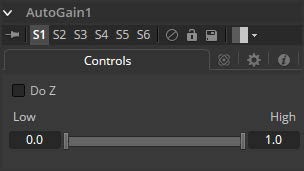

### Auto Gain [AG] 自动增益

Auto Gain工具用于自动调整图像的颜色范围，以便将最暗和最亮的像素设置为用户选择的值。默认情况下，图像中最暗的像素被向下推到黑色，最亮的像素被推到白色，其间的所有像素都被拉伸以均匀地覆盖颜色范围。
这在补偿光照变化、处理低对比度图像或可视化浮点动图像的全色范围时非常有用（尽管查看器的View Normalized Image按钮通常更适合此）。

#### Controls

> **注意：**输入图像随时间的变化可能会导致结果的级别相应变化。例如，如果一个明亮的物体移出一个黑暗的镜头，剩下的场景会突然变亮，因为剩下的较暗的值被拉伸为白色。这也适用于应用Do Z时的突然深度变化; 当近或远物体进入或离开场景时，可以向前或向后推动现有物体。

##### Do Z

选择Do Z复选框以将自动增益效果应用于Z通道。这对于将一个Z通道的范围与另一个Z通道匹配或在RGB值中查看浮动Z通道非常有用。

##### Range

此Range控件用于设置图像中的最低和最高可能像素值。图像中的所有颜色值都会重新调整以适合此范围。

> **示例**
>
> - 使用Background工具创建水平渐变。将一种颜色设置为深灰色（RGB值0.2）。将另一种颜色设置为浅灰色（RGB值0.8）。
> - 添加Auto Gain工具并将Low值设置为0.0，将High设置为0.5。这将使最亮的像素向下推到0.5，最暗的像素将被推到黑色。剩余的像素值将在该上下限间缩放。