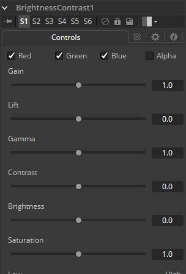
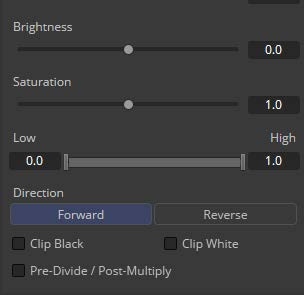

### Brightness Contrast [BC]

Brightness Contrast工具用于调整图像的增益（Gain），亮度（Brightness），对比度（Contrast），伽马（Gamma）和饱和度（Saturation）。控件的顺序表示每个操作的应用顺序（例如，在对比度之前但在增益之后应用伽马）。使用Forward和Reverse按钮，亮度对比度也是可逆的。因此，颜色校正应用后可以在下游进一步逆转。
为使其工作得最好，请确保以32位浮点处理图像。

#### Controls 控件

##### Color Channels (RGBA)

滤镜默认在R、G、B和A通道上运行。通过单击每个通道旁边的复选框可以使它们处于活动或非活动状态，从而实现选择性通道过滤。
这与在常用控件下找到的RGBA复选框不同。该工具在处理之前会考虑这些控件。取消选择通道将导致工具在处理时跳过该通道，从而加快效果的渲染速度。
相反，Common Controls选项卡下的通道控件将在工具处理后应用。

##### Gain 增益

像素值乘以该控件的值。Gain为1.2将使`R0.5 G0.5 B0.4`的像素成为`R0.6 G0.6，B0.48`（即`0.4 * 1.2 = 0.48`）。Gain会影响较高的值而不是影响较低的值，因此效果将在图像的中间范围和顶部范围内最强。

##### Lift 抬起

高于1.0的值将提高Gamma（中间灰色），而较低的值将降低Gamma。此工具的效果不是线性的，现有的黑色或白色级别根本不会受到影响。纯灰色的颜色会受到最大影响。

##### Gamma 伽马

高于1.0的值将提高Gamma（中间灰色），而较低的值将降低Gamma。此工具的效果不是线性的，现有的黑色或白色级别根本不会受到影响。纯灰色受影响最大。

##### Contrast 对比度

Contrast是明暗区域之间的差异范围。增加此滑块的值将增加对比度，将颜色从中间区域推向黑色和白色。降低对比度将导致图像中的颜色向中间范围移动，从而减少图像中最暗和最亮像素之间的差异。

##### Brightness 亮度

Brightness滑块的值将添加到图像中每个像素的值。此控件对图像的影响是线性的，因此无论值如何，效果都将一致地应用于所有像素。

##### Saturation 饱和度

此控件用于增加或减少图像中的饱和度。饱和度为0即没有颜色。所有颜色均为灰度。

##### Low and High 低值与高值

该范围控件在某些方面类似于Gain控件。如果Low固定在0.0并且High值从1.0减小，则效果与增加增益相同。High值乘以High值的倒数。（即，如果High值是0.75，则每个像素将乘以`1 / 0.75`或1.3333）。
将High值固定在1.0并增加Low值与反转图像颜色和增加增益并将其反转再次完全相同。这会将更多的图像推向黑色，而不会影响白色。

##### Direction 方向

Forward正常应用所有值。而Reverse将有效地反转所有值。

##### Clip Black/White 剪切黑/白

Clip Black和Clip White复选框用于剪切在浮点颜色深度处理时可能出现在图像中的范围外颜色值。超出范围的颜色为低于黑色`(0.0)`或高于白色`(1.0)`。这些复选框对用8位或16位处理每个通道的图像没有影响，因为这样的图像不能超出范围值。

##### Pre-Divide/Post-Multiply 预除/后乘

选择Pre-Divide/Post-Multiply复选框将使图像像素值除以颜色校正之前的alpha值，然后在校正后重新乘以alpha值。这有助于防止创建非法加性图像，特别是蓝/绿键的边缘或在使用3D渲染对象时。