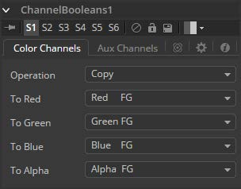
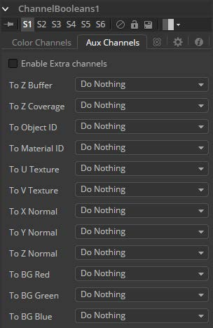
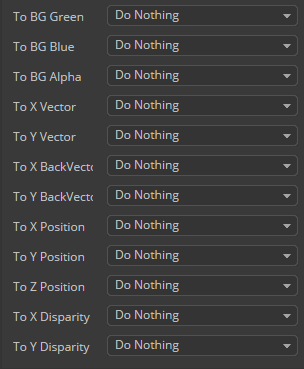

### Channel Boolean [Bol] 通道布尔

Channel Booleans工具可用于对图像中的通道应用各种数学和逻辑运算。此工具通过使用一个图像的通道来修改另一个图像的通道。如果前景输入不可用，则选择使用前景颜色通道的选项将最终使用背景输入的颜色通道。

<b>在Color Channels选项卡上，工具控件按以下方式划分：</b>

位于左侧的是用于通过Channel Booleans（背景输入）传输图像的目标通道。下拉菜单可让您选择是否要使用自己的通道（列表名称后面的后缀BG）修改BG图像，或者使用另一个图像中的通道进行修改，这些通道必须通过管道传输到Channel Booleans节点上的前景输入（ 下拉列表中的后缀FG）。

#### Controls 控件

##### Operation Type 运算类型

此下拉框用于选择应用于所选通道的数学方法。其设置如下：

- **Copy 复制：**将值从一个颜色通道复制到另一个颜色通道。例如，将前景红色通道复制到Alpha通道以创建遮罩。
- **Add 相加：**将颜色值从颜色通道添加到通道。
- **Subtract 相减：**从另一个颜色通道中减去颜色通道的颜色值。
- **And 与：**对从颜色通道到颜色通道的颜色值执行逻辑AND。前景图像通常将从背景图像的颜色通道中移除位。
- **Or 或：**对从颜色通道到颜色通道的颜色值执行逻辑OR。前景图像通常会添加来自背景图像的颜色通道的位。
- **Exclusive Or 异或：**对从颜色通道到颜色通道的颜色值执行逻辑XOR。前景图像通常会添加来自背景图像的颜色通道的位。
- **Multiply 相乘：**乘以颜色通道的值。当值从0到1缩放时，这将使图像变暗。使白色的值为1，因此结果将相同。灰色的值为0.5，因此结果将是较暗的图像，或者换句话说，图像的一半是明亮的。
- **Divide 相除：**划分颜色通道的值。当值从0缩放到1时，这将使图像变亮。
- **Maximum 最大：**比较两个图像并从每个图像中获取最大或最亮的值。
- **Minimum 最小：**比较两个图像并从每个图像中获取最小值或最暗值。
- **Negative 负片：**反转FG输入以生成图像的负片版本。
- **Solid 填满：**Solid将通道设置为255的完整值。这对于将alpha设置为完整值非常有用。
- **Clear 清除：**Clear将通道设置为零值。这对于清除alpha非常有用。
- **Difference 差异：**Difference从另一个颜色通道的较小值中减去一个颜色通道的较大颜色值。
- **Signed Add 带符号相加：**Signed Add会减去低于中灰色的区域，并添加高于中灰色的区域，这对于使用浮雕灰色图像创建效果非常有用。

##### To Red, Green, Blue, Alpha 至Red、Green、Blue、alpha

这些菜单表示输出图像的四个颜色通道。使用下拉菜单选择源图像中的哪个通道将用于生成输出通道。
默认设置只是复制前景通道中的通道。选择四个颜色通道中的任何一个，以及Z缓冲区，饱和度，亮度和色相等几个辅助通道。

#### Auxiliary Channels 辅助通道

这有几个辅助通道。使用这些菜单选择输出图像的辅助通道源。有关辅助通道的更多详细信息，请参阅有关3D Tools的章节。

##### Enable Extra Channels 启用额外通道

选中Enable Extra Channels复选框后，Channel Boolean工具将能够输出超出常规RGBA的通道的图像。此选项卡中的其余控件将变为活动状态，可用于将数据复制到辅助通道中。

> **例子：**要将一个图像的Alpha通道复制到自己的颜色通道，请将Red、Green和Blue通道设置为Alpha BG。将操作设置为复制。要从另一个图像复制Alpha通道，请将操作类型设置为Alpha FG。
>
> 要用另一个图像的Alpha替换图像的现有Alpha通道，请将To Red、To Green和To Blue选择为"Do Nothing"，To Alpha选择为"Alpha FG"。将包含Alpha的图像传输到Channel Booleans节点上的Foreground输入。设置操作："Copy"。也可以使用Matte Control工具执行相同的操作。
>
> 要将任何类型的遮罩组合进图像的Alpha，将To Red、To Green和To Blue选择Do Nothing，为To Alpha选择Matte。连接遮罩到Channel Booleans节点上的Foreground输入。设置操作："Copy"。
>
> 要从蓝色通道中减去红色通道的另一个图像的像素，请将To Red和To Green选择"Do Nothing"，为ToBlue选择"Red FG"。连接包含红色通道的图像，以减去Channel Booleans节点上的Foreground输入。设置操作："Subtract"。