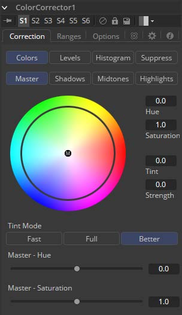
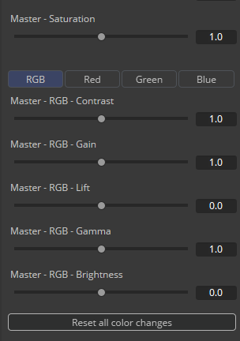
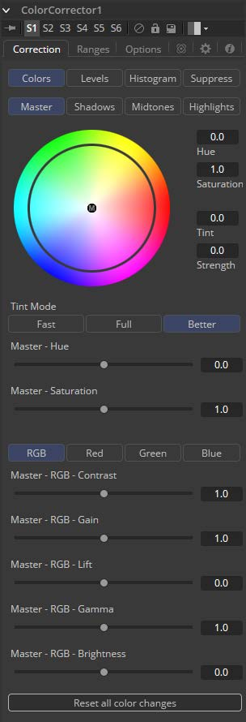
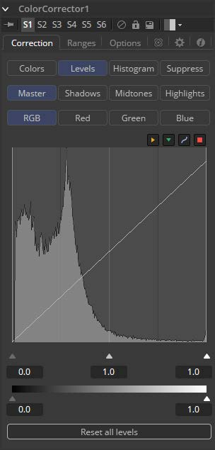
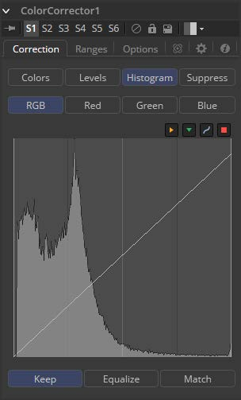
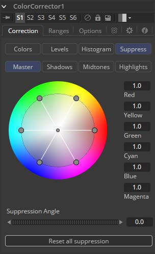
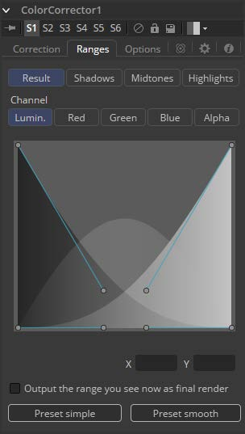
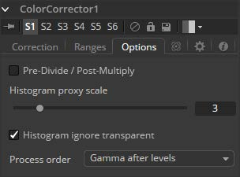

### Color Corrector [CC]

Color Corrector工具是一款综合的色彩工具，具有直方图、匹配和均衡，色调偏移、着色和颜色抑制功能。Color Corrector有两个图像输入。将要校正的图像连接到主输入。辅助输入可用作直方图匹配的参考。

#### Overview 概览

Color Corrector工具中的控件分为四个单独的类别：颜色（Colors）、色阶（Levels）、直方图（Histogram）和颜色抑制（Suppress）。从Correction选项卡顶部的阵列中选择一个类别按钮将导致显示该类别的控件。下面详细描述了每个类别。

#### Colors Mode 色彩模式

##### Master/Shadows/Midtones/Highlights 整体/阴影/中间调/高光

此组按钮确定此选项卡中受控件影响的颜色范围。比如，选择Shadows范围时，所做的任何颜色调整都只会影响图像的较暗像素。

在Color Corrector工具的Colors，Levels和Suppress部分中，将保持此按钮的选定状态。

在对Highlight，Midtone和Shadow范围进行任何更改后，对Master通道中的图像进行的调整将应用于图像。

> **注意：**控件对于每种颜色范围都是独立的。例如，在Shadows模式下调整Gamma控制不会改变或影响Highlights模式的Gamma控制值。每个控件都是独立的并单独应用。

##### Color Wheel 色轮

Color Wheel显示提供了对Hue和Saturation进行调整的直观表示，以及应用于图像的任何着色。可以直接在显示屏上进行调整，也可以在Color Wheel右侧的文本框中输入值。

##### Hue 色相

Hue控件提供了一种通过色谱移动图像的Hue（或所选颜色范围）的方法。控制值的有效范围在0.0和1.0之间，表示顺时针方向的旋转角度。值0.25将是90度（90/360）并且具有将红色变为蓝色，绿色变为红色等的效果。

色相偏移的程度可以直接输入文本控件，或者将鼠标放在颜色控件的外环上方并向上或向下拖动鼠标。与控件中心显示的原始颜色相比，外圈将始终显示偏移的颜色。

##### Saturation 饱和度

Saturation控件用于调整颜色值的强度。Saturation为0产生没有任何色度或颜色分量的灰色像素，而值为1.0产生输入图像的色度分量没有变化。较高的值将产生具有高颜色分量的过饱和值。

Saturation值可以直接输入文本控件，也可以通过在色轮控件的外环上向左和向右拖动鼠标来输入。

##### Tint/Strength 色泽/强度

Tint控件用于着色图像或选定的颜色范围。此控件中的值从0到1.0，表示色轮上的色泽颜色的角度。值25表示90度，色轮上的绿色和黄色之间的中间位置。

Strength 控件确定对所选颜色范围应用的色泽量。

色泽在Color Wheel控件中由小圆圈表示，小圆圈显示色调的颜色和强度。Highlight Ranges标记是圆形的黑色轮廓。Midtones和Shadows由灰色圆圈表示。Master Tint Marker也是黑色的，但它的中心有一个白色M，以区别于其他。

只有在选择了适当的范围时，鼠标才能为每个范围定位标记。例如，选择Master范围时，无法移动Highlight Marker。

拖动此控件时按住Command或Ctrl键可以通过降低控件对鼠标移动的敏感度来进行更精细的调整。按住Shift键将限制标记移动到单个轴，允许您将效果限制为色泽或强度。

#### Tint Mode 色泽模式

##### Fast/Full/Better 快速/完整/更好

这三个按钮用于选择用于应用色泽、色相和饱和度调整的算法的速度和质量。默认值为Better，但是对于处理较大的图像，可能需要使用Fast方法。

##### Hue 色相

此滑块是上面Color Wheel中显示的Hue控件的克隆。使用鼠标可以更轻松地对值进行小幅调整。

##### Saturation 饱和度

此滑块是上面Color Wheel中显示的Saturation控件的克隆。使用鼠标可以更轻松地对值进行小幅调整。

##### RGB/Red/Green/Blue RGB/红/绿/蓝

这些按钮与Color Corrector工具的Histogram、Color和Levels部分中显示的按钮相同。选择Red通道时，此选项卡中的控件将仅影响Red通道，依此类推。

控件是独立的，因此切换到Blue不会删除或消除对Red、Green或Master所做的任何更改。对每个通道进行的动画和调整是分开的。这些按钮只是确定要显示的控件。

##### Master RGB Contrast 整体RGB对比度

Contrast是明暗区域之间的差异范围。增加此滑块的值将增加对比度，将颜色从中间区域推向黑色和白色。降低对比度将导致图像中的颜色向中间范围移动，从而减少图像中最暗和最亮像素之间的差异。

##### Master RGB Gain 整体RGB增益

像素值乘以该控件的值。Gain为1.2将使`R0.5 G0.5 B0.4`的像素成为`R0.6 G0.6，B0.48`（即`0.4 * 1.2 = 0.48`）。增益会影响较高的值而不是影响较低的值，因此效果在图像的中间范围和顶部范围内最强。

##### Master RGB Lift 整体RGB抬起

虽然Gain基本上会缩放黑色周围的颜色值，但Lift会将颜色值围绕白色进行缩放。像素值乘以该控件的值。Lift为0.5将使`R0.0 G0.0 B0.0`的像素成为`R0.5 G0.5 B0.5`，同时使白色像素完全不受影响。提升对较低值的影响大于影响较高值的值，因此在图像的中间范围和低范围内效果最强。

##### Master RGB Gamma 整体RGB伽马

高于1.0的值将提高Gamma（中间灰色），而较低的值将降低Gamma。此工具的效果不是线性的，现有的黑色或白色级别根本不会受到影响。纯灰色受影响最大。

##### Master RGB Brightness 整体RGB亮度

Brightness滑块的值将添加到图像中每个像素的值。此控件对图像的影响是线性的，因此无论值如何，效果都将一致地应用于所有像素。

##### Reset All Color Changes 重设所有颜色变更

选择此按钮将使此部分中的所有颜色控件返回其默认值。

#### Levels Mode 色阶模式

##### Master/Shadows/Midtones/Highlights 整体/阴影/中间调/高光

此数组在上面的Colors模式中描述。

##### Histogram Control 直方图控件

直方图是表示场景中颜色值分布的图表。从左到右读此图表：最左边的值表示场景中最暗的颜色，最右边的值表示最亮的颜色。具有相同或相似值的图像中的像素越多，图表的该部分就越高。

每个通道计算亮度，因此，Red、Green和Blue通道都有自己的直方图，其组合结果组成了Master Histogram。

要垂直缩放直方图，请将鼠标指针放在控件内，然后向上拖动指针以放大或缩小或向下以缩小。

##### RGB/Red/Green/Blue RGB/红/绿/蓝

这些按钮用于选择和显示每个颜色通道或主通道的直方图。

##### Display Selector Toolbar 显示选择器工具栏

Display Selector Toolbar提供了启用和禁用直方图显示组件的方法。将鼠标指针悬停在按钮上以显示描述按钮功能的工具提示。

##### Input Histogram 输入直方图

这将启用或禁用输入图像直方图的显示。

##### Reference Histogram 参考直方图

这将启用或禁用Reference图像直方图的显示。

##### Output Histogram 输出直方图

这启用或禁用来自后期颜色校正图像的直方图的显示。

##### Corrective Curve 校正曲线

这会切换样条曲线的显示，该样条曲线用于准确显示使用参考图像应用的自动颜色校正如何影响图像。当均衡输入图像和参考图像之间的亮度时，这可能很有用。

##### Low/Mid/High 低/中/高

这些控件用于调整输入图像的直方图、压缩或移动所选颜色通道的范围。

可以通过将直方图显示下方的三角形向左和向右拖动来调整控件。

向左移动高值（减小该值）将使直方图倾斜为白色，将图像分布向白色移动。低值将在相反方向上具有类似的效果，将图像分布推向黑色。

##### Threshold Output Low/High 阈值输出低/高

Threshold控件可以对图像应用剪切、压缩直方图。降低High控件的级别将降低图像中像素的值，将白色像素向下滑向灰色，灰色像素向黑色滑动。

将Low控件调高至High将执行相反的操作，将最暗的像素向白色滑动。

如果低值设置为0.1，则值为0.0的像素将设置为0.1，而所有其他值将增加以适应更改。可视化效果的最佳方法是观察上面显示的输出直方图的变化。

##### Reset All Levels 重置所有色阶

单击此按钮会将色阶部分中的所有控件重置为其默认值。

#### Histogram Mode 直方图模式

##### Float Images and Histogram Equalization or Matching 浮点图像和直方图均衡或匹配

在浮点图像上使用直方图匹配或均衡方法，输出图像的颜色深度将转换为16位整数。二维直方图不适合处理极端动态范围的浮点图像，因此这些操作将始终恢复为16位整数处理。

##### Histogram Control 直方图控件

Histogram Control在本工具文档的前面详细描述，Levels Mode的标题之下。

##### Keep/Equalize/Match Buttons 保持/均衡/匹配按钮

这些按钮中的每一个都能够进行不同类型的色彩校正操作。

- **Keep 保持：**Keep不会对图像产生任何变化，并忽略参考直方图。

- **Equalize 均衡：**选择Equalize可调整源图像，使图像中的所有颜色值均匀表示，实质上是平直直方图，使图像中的颜色分布更加均匀。

- **Match 匹配：**Match模式基于参考图像中的直方图修改源图像。它用于匹配具有不同光照条件和曝光的两个镜头，使它们看起来相似。

  选中后，Equalize和Match模式将显示以下控件。

##### Match/Equalize Luminance 匹配/均衡亮度

此滑块会影响Color Corrector工具根据其亮度分布尝试影响图像的程度。当此控件为零（默认值）时，匹配和均衡将独立应用于每个颜色通道，并且Luminance或三个颜色通道的组合值不受影响。

如果在均衡图像时此控件具有正值，则在应用任何颜色均衡之前，输入图像的亮度分布将变平。

如果当校正模式设置为匹配时该控制具有正值，则在对R，G和B通道应用任何校正之前，输入的亮度值与参考匹配。

L值和RGB控件可以具有累积效果，并且通常它们不会同时设置为满（1.0）。

##### Lock Red/Green/Blue 锁定红/绿/蓝

选中此复选框后，颜色匹配将同等地应用于所有颜色通道。如果未选中该复选框，则会显示每个频道的各个控件。

##### Equalize/Match Red, Green, Blue 匹配/均衡红、绿、蓝

此控件的名称会根据是否已选择Equalize或Match模式而更改。滑块可用于减少应用于图像的校正量以使其均衡或匹配。值为`1.0`会导致均衡或匹配的完全效果，而较低的值会调整结果。

##### 8-Bit, 10-Bit, 16-Bit Buttons 8位、10位、16位按钮

此组按钮确定采样图像以生成直方图时使用的颜色保真度级别。10-Bit产生比8-Bit更高的保真度，而16-Bit产生比10-Bit更高的保真度。

##### Smooth Out Correction Curves 平滑校正曲线

通常，颜色均衡和匹配操作将在图像中引入色调分离（Posterization），这是因为图像中的梯度已被扩展或压缩，使得颜色之间的动态范围不足以显示平滑过渡。此控件可用于平滑校正曲线，将一些原始直方图混合回结果，以实现更均匀的过渡。

##### Snapshot Match 快照匹配

单击此按钮可冻结当前参考直方图，将其当前状态存储为内存中的快照。如果参考直方图不是快照，则参考直方图在帧与帧之间更新。当工具试图将变化的源与变化的参考匹配时，这可能导致校正的闪烁和定相。

##### Release Match 发布匹配

单击此按钮以释放直方图的当前快照并返回使用实时参考输入。

##### Reset All Histogram Changes 重置所有直方图更改

选择此按钮将删除对直方图所做的所有更改，将控件恢复为默认值并将模式设置为Keep。

#### Suppress Mode 抑制模式

色彩抑制（Color Suppression）提供了一种从图像中去除不需要的颜色成分的机制。色轮控件类似于工具的颜色部分中显示的控件，但是这个控件由六个控件包围，每个控件代表色轮的特定颜色。

要抑制所选范围内的颜色，请将表示该颜色的控件拖向色轮的中心。控制越接近中心，颜色将从图像中抑制得越多。

##### Suppression Angle 抑制角度

使用该Suppression Angle控件旋转抑制轮上的控件并将特定颜色置零。

##### Reset All Suppression 重置所有抑制

单击此控件可将抑制颜色重置为默认值`1.0`。

#### Ranges Tab 范围选项卡

Ranges选项卡包含用于指定图像中哪些像素被视为阴影以及哪些像素被视为高光的控件。中间值始终计算为阴影或高光中尚未包含的任何像素。

##### Result/Shadows/Midtones/Highlights 结果/阴影/中间调/高光

这些按钮用于选择查看器中显示的颜色范围。它们有助于将包含在范围内的实际像素可视化。选择Result按钮时，视图中Color Corrector显示的图像将是颜色校正图像的图像。这是默认值。

选择其他按钮之一会将显示切换为灰度图像，显示哪些像素是所选范围的一部分。白色像素表示被认为是该范围的一部分的像素，并且黑色像素不包括在该范围内。例如，选择Shadows会将被视为阴影的像素显示为白色，将不是阴影的像素显示为黑色。中灰色像素仅部分在该范围内，并且不会获得对该范围的任何颜色调整的完全效果。

##### Spline Display 样条显示

通过操纵样条曲线控制柄来选择范围的范围。有四个样条点，每个样条点都有一个Bezier手柄。顶部的两个手柄代表hadow和高光范围的开始，而底部的两个手柄代表范围的结束。Bezier手柄用于控制衰减。

中间调范围没有特定的控制，因为它的范围被理解为阴影和高光范围之间的空间。

样条显示下方的X和Y文本控件可用于输入所选贝塞尔曲线点或手柄的精确位置。

##### Channel 通道

此选项卡中显示的Channel选择按钮可用于检查特定颜色通道的范围。默认情况下，Fusion会在检查颜色范围时显示亮度通道。

##### Output the Range You See Now as Final Render 输出您现在看到的最终渲染范围

选中此复选框将导致监视器中显示的范围的单色显示输出为最终渲染。通常，颜色工具将输出完整的RGBA图像，即使工具留在显示视图中的一个颜色范围。此控件可以使用Color Corrector工具生成范围的遮罩，以用作其他工具中的效果遮罩。

##### Preset Simple/Smooth Ranges 预设简单/平滑的范围

这两个按钮可用于将样条曲线范围返回到Smooth（默认）或Simple（线性）设置。

#### Options Mode 选项模式

##### Pre-Divide/Post-Multiply 预除/后乘

选择此选项将在应用颜色校正之前将颜色通道除以alpha的值。在颜色校正之后，颜色值被alpha重新乘以以产生适当的附加图像。这在执行添加剂合并或处理针对黑色生成的CG图像时至关重要。

##### Histogram Proxy Scale 直方图代理缩放

Histogram Proxy Scale确定创建和计算直方图时使用的精度级别。较低的值表示较高的精度，较高的值表示较粗糙、泛化的直方图。

##### Process Order 处理顺序

此菜单用于选择是否在对图像级别进行任何更改之前或之后应用对图像的伽玛的调整。