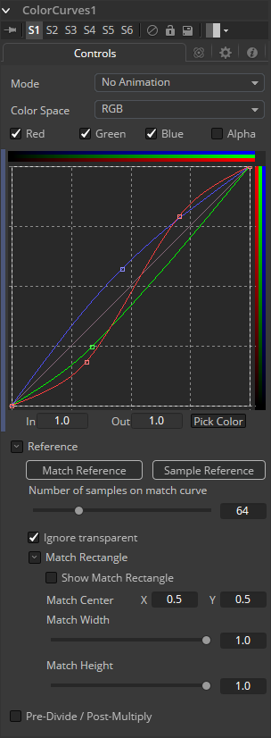

### Color Curves [CCv] 色彩曲线

Color Curves工具是一种基于样条线的工具，用于执行查找表（Look Up Table，LUT）颜色操作。每个颜色通道都有提供单独的样条。该效果可以为“Animated”或者“Dissolve”，并且可以使用RGB、YUV、YIQ、CMY或HLS颜色空间应用于图像。

可以使用数字键盘上的`+`和`-`键缩放色彩校正器中的LUT视图。 颜色曲线LUT完全支持超出范围的值（值大于1.0或小于0.0的像素）。

如果在调整控件时需要更高的精度，也可以从样条曲线编辑器中获得以LUT视图显示的样条线。

#### Controls 控件

##### Mode 模式

Mode选项可以在Animated和Dissolve模式之间切换。默认模式是静态的，也就是说对曲线的调整是静态的。设置模式为每个通道提供了更改样条，允许颜色曲线随时间变化。

溶解模式基本上是过时的，仅出于兼容性原因而包含在内。

##### Color Space 色彩空间

LUT视图中的样条线可以表示来自各种颜色空间的颜色通道。默认为Red、Green和Blue。此菜单中的选项允许选择备用颜色空间。有关此处可用颜色空间的详细说明，请参阅Color Space工具的在线参考文档。

##### Color Channels (RGBA) 颜色通道（RGBA）

使用Color Channel控件选择当前激活的通道的样条曲线以进行编辑。这些控件的标签将更改以反映当前颜色空间的通道名称。通常它们会显示为Red、Green和Blue。如果Color Curves工具在YUV颜色空间中运算，则它们将显示为Y、U和V.

这些控件不会限制工具对特定通道的影响。 它们仅选择该通道的样条曲线是否可编辑。 这些控件通常用于确保在一个通道的样条曲线上添加或移动点不会无意中影响不同通道的样条曲线。

##### Spline Window 样条窗口

Spline Window显示每个RGBA通道的样条线。这些可以单独编辑或作为一组编辑，具体取决于上面选择的颜色通道。

样条曲线默认为线性范围，从左下角的`0 in，0 out`到右上角的`1 in，1 out`。 在默认情况下，颜色将处理与输出相同的值。如果一个点在中间加`0.5 in 0.5 out`，并且该点向上移动，这将使图像的中间颜色更亮。

样条曲线允许精确控制颜色范围，因此可以在不影响其他颜色值的情况下进行特定调整。

##### In and Out 入和出

使用In和Out控件可以处理所选点的精确值。要更改值，请选择一个点并输入所需的入/出值。

##### Pick 拾取

单击Pick按钮并从显示中的图像中选择一种颜色，以自动在样条曲线上为所选颜色设置关键点。新点将绘制为三角形，并且只能垂直移动（如果点被锁定，则只有Out值可以更改）。

点仅添加到启用的样条线。要仅在特定通道上添加点，请在进行选择之前禁用其他通道。

该技巧的一个用途是白平衡图像。使用Pick控件从图像中选择应为纯灰色的像素。调整出现的点，使Out值为0.5，将像素颜色更改为灰色。

使用上下文菜单的Locked Pick Points选项可以解锁使用Pick选项创建的点，将它们转换为普通点。

##### Match Reference 匹配参考

单击Match Reference按钮将自动设置曲线上的点，以匹配Color Curves工具的第二个（reference，参考）输入中提供的图像。

##### Sample Reference 采样参考

单击Sample Reference按钮将对背景图像的中心扫描线进行采样，并创建其颜色值的LUT。

##### Number of Samples on Match Curve  匹配曲线上的采样数

此滑块确定用于将曲线与参考图像中的范围匹配的点数。

##### Pre-Divide/Post-Multiply 预乘/后除

勾选此复选框将使图像的像素值除以颜色校正之前的alpha值，然后在校正后重新乘以alpha值。这有助于避免创建非法加性图像，尤其是在蓝/绿键的边缘或使用3D渲染对象时。