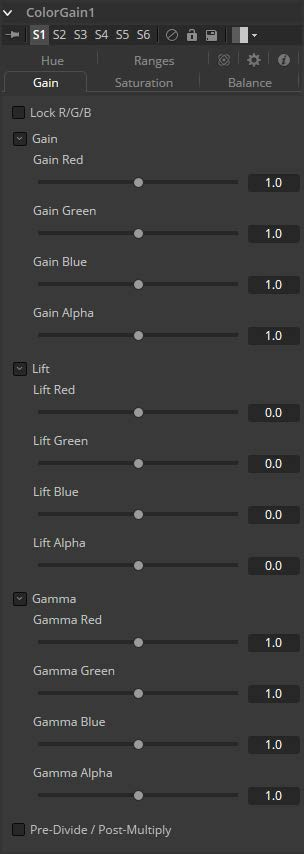
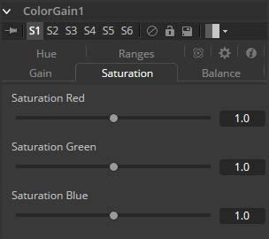
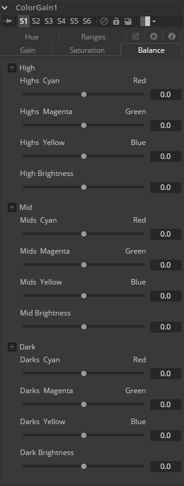
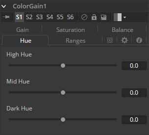
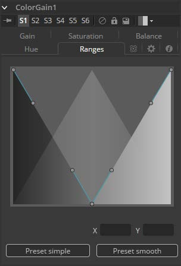

### Color Gain [Clr] 色彩增益

Color Gain工具包含用于调整图像的增益、伽马、饱和度和色相的选项。Color Gain工具提供的许多控件也可以在Color Corrector工具中找到，但这个更简单的工具可以更快地渲染。区分Color Gain工具和Color Corrector的一个功能是其平衡控制。这些可用于调整高、中、低的颜色色泽。

#### Gain Tab 增益选项卡

##### Lock R/G/B 锁定R/G/B

选择后，每个效果的红色，绿色和蓝色通道控件将合并为一个滑块。 Alpha通道效果保持独立。

##### Gain RGBA 增益RGBA

Gain RGBA控制以线性方式乘以图像通道的值。所有像素都乘以相同的因子，但效果在明亮像素上会更大，在黑暗时会更小。黑色像素不会改变（`x * 0=0`）。

##### Lift RGBA 抬起RGBA

虽然Gain基本上会缩放黑色周围的颜色值，但Lift会将颜色值围绕白色进行缩放。 像素值乘以该控件的值。0.5的Lift将使`R0.0 G0.0 B0.0`的像素成为`R0.5 G0.5，B0.5`，同时使白色像素完全不受影响。Lift对较低值的影响大于影响较高值的值，因此在图像的中间范围和低范围内效果最强。

##### Gamma RGBA 伽马RGBA

Gamma RGBA控件会影响图像中间范围的亮度。该工具的效果是非线性的。 修改gamma时，图像中的白色和黑色像素不受影响，而纯灰色受此参数更改的影响最大。此控件的较大值更改将倾向于将中间像素推入黑色或白色，具体取决于所使用的值。

##### Pre-Divide/Post-Multiply 预乘/后除

选中此复选框将使图像的像素值除以颜色校正之前的alpha值，然后在校正后重新乘以alpha值。这有助于避免创建非法加性图像，尤其是在蓝/绿键的边缘或使用3D渲染对象时。

#### Saturation Tab 饱和度选项卡

#### 

##### RGB Saturation RGB饱和度

此设置控制图像通道中颜色的强度。值0.0将剥离图像通道中的所有颜色。大于1的值将强化场景中的颜色，将它们推向基础色。

#### Balance Tab 平衡选项卡

##### CMY Brightness Highs/Mids/Darks CMY亮度高/中/暗

Color Gain工具的这一部分提供了用于调整颜色通道整体平衡的控件。 为图像的高，中和暗范围提供独立的颜色和亮度控制。

颜色被分组为来自两个主色空间的相对对。 可以将红色值推向青色，将绿色值推向洋红色，将蓝色推向黄色。可以为每个通道提高或降低亮度。

默认情况下，可以将平衡滑块调整为-1到+1，但可以手动输入此范围之外的值以增加效果。 任何滑块的值为0.0表示图像通道没有变化。 正值和负值表示图像通道的平衡已被推向一对中的一种颜色或另一种颜色。

#### Hue Tab 色相选项卡

##### High/Mid/Dark Hue 高/中/暗色相

使用Color Gain工具的Hue部分可以移动图像的整体色调，而不会影响亮度或饱和度。三个滑块提供对高、中、暗范围的独立控制。

以下是RGB颜色空间中的色相顺序：红色、黄色、绿色、青色、蓝色、洋红色和红色。高于0的值会将图像的色相向右推（红色变为黄色）。低于0的值将色相向左推（红色变为品红色）。在-1.0或1.0时，色相完成循环并返回其原始值。色相滑块的默认范围是-1.0到+1.0。可以手动输入此范围之外的值。

#### Ranges Tab 范围选项卡

Ranges选项卡包含用于指定图像中哪些像素被视为阴影以及哪些像素被视为高光的控件。中间值始终计算为阴影或高光中尚未包含的任何像素。

##### Spline Display 样条显示

通过操纵样条曲线控制柄来选择范围的范围。有四个样条点，每个样条点都有一个贝塞尔手柄。顶部的两个手柄代表阴影和高光范围的开始，而底部的两个手柄代表范围的结束。贝塞尔手柄用于控制衰减。

中间调范围没有特定的控制，因为它的范围被理解为阴影和高光范围之间的空间。样条显示下方的X和Y文本控件可用于输入所选贝塞尔曲线点或手柄的精确位置。

##### Preset Simple/Smooth Ranges 预设简单/平滑的范围

这两个按钮可用于将样条曲线范围返回到平滑（默认）或简单（线性）设置。