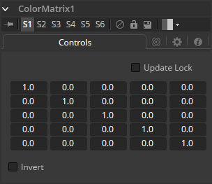
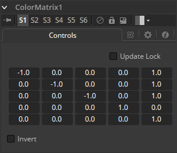
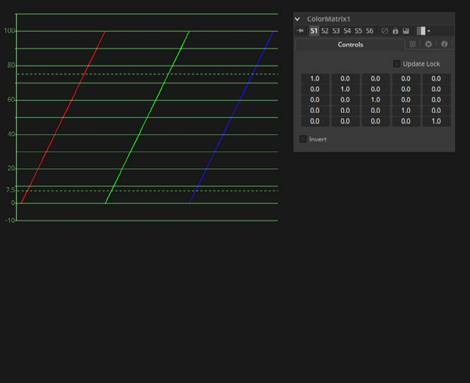
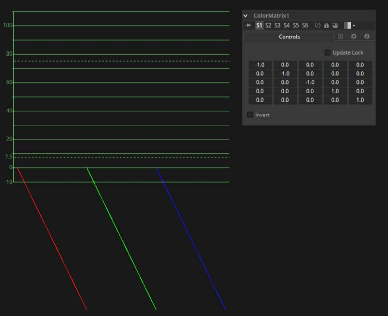
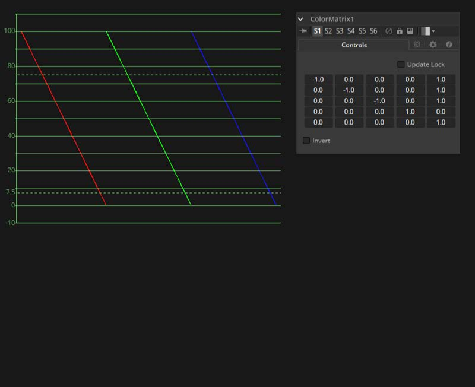
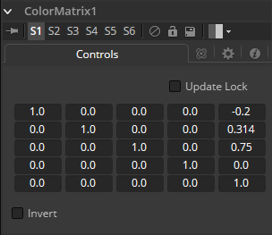
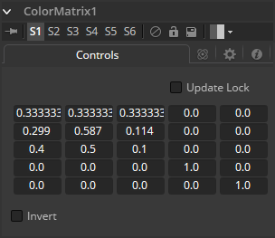

### Color Matrix [CMx] 色彩矩阵

ColorMatrix允许大量操作来单独修改不同颜色通道的值。

#### Controls 控件

##### Update Lock 更新锁定

选择此控件后，Fusion将不会渲染该工具。这有助于先设置工具的每个值，再关闭Update Lock以进行渲染。

##### Matrix 矩阵

这定义了实际发生的操作类型。水平行定义工具的输出值，垂直列定义输入值。“添加”列允许简单地将值添加到各个颜色通道。默认情况下，输出值与输入值相同。

- 100％的Red通道输入被复制到Red通道输出。
- 100％的Green通道输入被复制到Green通道输出。
- 100％的Blue通道输入被复制到Blue通道输出。
- 100％的Alpha通道输入被复制到Alpha通道输出。

我们也可以以数学公式的形式写出默认设置。

- `[R out] = 1 * [R in] + 0 * [G in] + 0 * [B in] + 0 * [A in] + 0`
- `[G out] = 0 * [R in] + 1 * [G in] + 0 * [B in] + 0 * [A in] + 0`
- `[B out] = 0 * [R in] + 0 * [G in] + 1 * [B in] + 0 * [A in] + 0`
- `[A out] = 0 * [R in] + 0 * [G in] + 0 * [B in] + 1 * [A in] + 0`

##### Invert 转置

启用此选项将转置Matrix。考虑到交换通道、使用不同的工具进行其他操作，然后复制并粘贴原始ColorMatrix并将其设置为Invert以使您的通道恢复原始状态。

#### Example 1 – Invert 示例1 — 反转

如果我们想要对颜色值进行简单的反转或反转，但保持我们的Alpha通道不变，矩阵将如下所示。

观察到我们必须向每个通道加上1以将反转值变回正数。

让我们一步一步地跟随示例看一下32位灰度梯度的波形。

- **01：**原始灰度。

  

- **02：**RGB设置为-1。值反转但低于0。

  

- **03：**向每个通道加上1来保持反转，但会将值移回正范围。

  

#### Example 2 – Brightness per Channel 示例2 — 每个通道的亮度

让我们分别影响每个通道的亮度。这将从Red通道中减去0.2，向Green通道加上0.314并向Blue通道加上0.75，同时保持Alpha不变。

#### Example 3 – Copying Values 示例3 — 复制值

当然，我们也可以在各个通道之间来回复制颜色值。让Red通道包含基于三分之一的图像的亮度值，Green通道包含基于正确的黑白转换方法的亮度值，而在Blue通道中我们使用第三种基于获取更多来自Red而不是来自Blue信息的方法。我们还将Blue通道的亮度降低0.1，并将Alpha通道替换为原始Blue通道。

