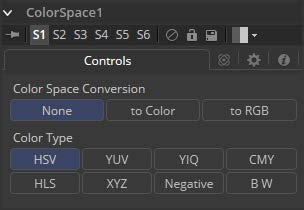

### Color Space [CS]

Color Space工具提供了以各种其他色彩空间格式处理图像的功能。默认情况下，Fusion使用RGB色彩空间，大多数工具和显示器将图像的主要通道解释为Red、Green和Blue。

从RGB更改色彩空间将导致大多数图像看起来很奇怪，因为Fusion的监视器仍将主要通道解释为Red、Green和Blue。例如，在其中一个监视器中查看转换为YUV的图像将显示Y通道为Red，U通道显示为Green，V通道显示为Blue。

Fusion接口的不少元素直接引用RGB通道。用于将工具的效果限制为单个色彩通道的四个复选框便是一个例子。将转换应用于图像时，这些元素的标签保留为R、G和B，但它们表示的值来自当前色彩空间。（对于RGB到HLS转换来说，Red是Hue，Green是Luminance，Blue是Saturation。色彩空间转换不会改变Alpha值。）

#### Controls 控件

##### Color Space Conversion 色彩空间转换

此按钮组有三个选项：

- **None 无：**Color Space工具对图像没有影响。
- **To Color 至颜色：**输入图像将转换为在下面的Color Type控件中选择的色彩空间。
- **To RGB 至RGB：**输入图像将从下面的Color Type控件中选择的类型（如YUV到RGB）转换回RGB色彩空间。

##### Color Type 色彩类型

这些按钮用于选择选中To Color转换时应用的色彩空间转换：

- **HSV (Hue, Saturation and Value) HSV（色相、饱和度和明度）：**HSV颜色空间中的每个像素根据其色相、饱和度和明度组件来描述。明度定义为我们区分浅色和暗色或亮度的质量。降低饱和度大致相当于将白色添加到调色板上的油漆芯片上。而增加其值大致类似于添加黑色。

- **YUV (Luma, Blue Chroma and Red Chroma) YUV（亮度、蓝色色度和红色色度）：**YUV色彩空间用于PAL视频的模拟广播。由于大部分视频工程师对其熟悉，这种格式通常用于对图像进行色彩校正。每个像素根据其亮度，蓝色色度和红色色度分量进行描述。

- **YIQ (Luma, In Phase and Quadrature) YIQ（相位和正交）：**YIQ色彩空间用于NTSC视频的模拟广播。这种格式比YUV更罕见，几乎从未见过。每个像素根据其亮度、色度（同相或红-青色通道）和正交（品红-绿）分量进行描述。

- **CMY (Cyan, Magenta and Yellow) CMY（青色、洋红色和黄色）：**虽然在印刷中更常见，但CMY格式通常存在于来自其他软件包的计算机图形中。每个像素根据其青色、洋红色和黄色成分进行描述。CMY是非线性的。

- **HLS (Hue, Luminance and Saturation) HLS（色相、亮度和饱和度）：**HLS色彩空间中的每个像素根据其色相、亮度和饱和度分量进行描述。HLS和HSV颜色空间之间的差异很小。

- **XYZ (CIE Format) XYZ（CIE格式）：**此模式用于将CIE XYZ图像转换为RGB色彩空间和从RGB色彩空间转换。与其他可用色彩空间不同，CIE XYZ是加权空间，而不是非线性空间。在该上下文中的非线性意味着在颜色空间中的不同位置处的值的相等变化可能不一定在视觉上产生与眼睛相同的变化幅度。

  简单地说，CIE颜色空间是感知颜色系统，具有从实验获得的加权值，其中要求受试者使用三个主要光源匹配现有光源。

  此颜色空间最常用于执行图像显示格式之间的色域转换和色彩空间匹配，因为它包含整个色域的可感知色彩。

- **Negative 取反：**色彩通道被反转。色彩空间保持RGBA。

- **BW 黑白：**图像转换为黑白。每个通道对图像亮度的影响可通过选择此选项时出现的滑块控件进行调整。这些滑块的默认值表示每个通道对图像亮度的通常感知影响。图像的色彩空间保持RGBA。