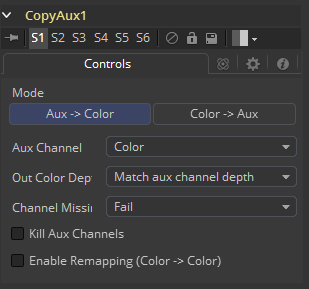
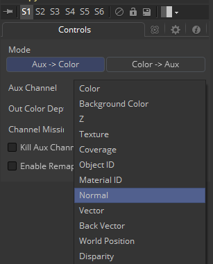

### Copy Aux [CpA] 复制辅助通道

CopyAux将辅助通道组复制到RGBA通道。CopyAux只在Fusion Studio中可用。

它主要是一种便捷性工具，因为花费更多精力来使用ChannelBoolean工具也可以完成复制。虽然CopyAux有很多选项，但大多数时候你只会调整要复制的通道而忽略其余的通道。

在Fusion 6.31之前，为了访问辅助通道，需要使用ChannelBoolean将它们复制到RGBA通道。通常这也会涉及ChangeDepth工具，来确保接收辅助通道的RGBA通道是float32。现在在Dimension中，CopyAux通过更少的鼠标点击实现了相同的结果，让您更快地工作。ChannelBooleans处理各个单独的通道，而CopyAux处理通道组。默认情况下，CopyAux工具会自动提升其输出深度以匹配辅助通道的深度。

CopyAux还支持静态归一化。静态归一化与Fusion查看器所做的动态归一化的优势在于颜色随着时间的推移保持不变。例如，如果您正在查看一个球的Z或WorldPos值，您将看到从白色到黑色的平滑渐变。现在想象一下其他3D对象在某个时间被引入背景中。动态归一化将使球几乎完全变白，而背景物体现在是新的黑色。动态归一化还会导致查看矢量/视差通道时的闪烁问题，这使得难以在视觉上在比较不同时间两个帧的辅助通道。

#### Controls 控件

##### Mode 模式

Mode确定辅助通道是否复制到RGBA颜色通道，反之亦然。使用此选项，您可以使用一个CopyAux将辅助通道变为颜色通道，对其执行一些合成操作，然后使用另一个CopyAux将颜色写回辅助通道。 当Mode设置为“Color> Aux”时，除AuxChannel外的所有输入都被隐藏。

##### Aux Channel 辅助通道

根据当前模式，可以复制或写入辅助通道。当辅助通道abcd有一个有效组件时，它将被复制为aaa1，两个有效组件被复制为ab01，三个有效组件被复制为abc1，四个组件被复制为abcd。例如，Z通道将复制为zzz1，纹理坐标复制为uv01，法线将复制为nxnynz1。

##### Out Color Depth 输出色彩深度

Out Color Depth控制输出图像的颜色深度。大多数辅助通道包含浮点值，或者如果它们是整数值，则它们可以包含超过255的值。将浮点值复制到int8或int16图像时，这可能会有问题，因为负值和超过1.0的值可能会被剪裁。此外，可能会丢失精度。此选项确定如果输入图像的RGBA通道深度不足以包含复制的辅助通道会发生什么。

将浮点通道复制为整数图像格式时要小心，因为如果没有正确设置CopyAux，它们可能会被剪裁。出于此工具的目的，除ObjectID/MaterialID被认为是int16外，其他所有辅助通道都被认为是float32。

- **Match Aux Channel Depth 匹配辅助通道深度：**输出图像的RGBA通道的位深度将增加以匹配辅助通道的深度。实际上，这意味着输出图像的RGBA通道将是int16或float32。使用此选项时要小心谨慎，例如，如果您通常使用int8颜色通道，则现在将为颜色通道使用2倍或4倍的内存。特别是，Z、Coverage、TextureCoordinate、Normal、Vector、BackVector、WorldPosition和Disparity通道将始终作为float输出，Material / ObjectID通道将输出为int16。
- **Match Source Color Depth 匹配源色彩深度：**输出图像的RGBA通道的位深度将与输入图像相同。这会产生一些意想不到的后果。例如，如果您的输入图像是int8，则[-1,1]范围内的浮点数的法线的XYZ分量将被剪切为非负数[0,1]范围。作为一个更极端的例子，考虑一下Z值会发生什么。而Z值是存储在[-1e30,0]范围内的浮点数，它们都会被截断到[0,1]范围，这意味着你的Z通道将充满零。
- **Force Float32 强制Float32：**输出图像的RGBA通道的位深度将始终为float32。

##### Channel Missing 通道缺失

Channel Missing确定如果通道不存在会发生什么。例如，如果您选择将Disparity复制到Color并且输入图像没有Disparity辅助通道，则将确定会发生什么。

- **Fail 失败：**该工具失败并向控制台输出错误消息。
- **Use Default Value 使用默认值：**除了Z为-1e30，其他所有通道为RGBA通道填充默认值零。

##### Kill Aux Channels 消除辅助频道

选中此项后，CopyAux会将请求的通道复制到RGBA，然后输出纯RGBA的结果图像，消除其他所有通道。如果您想增加可以缓存以进行播放的CopyAux的帧数，例如播放长序列的差异，这将非常有用。一个方便的提示是，你可以使用“Kill Aux”功能，只需Copy Color > Color来进行更长时间色彩播放。

##### Enable Remapping 启用重新映射

启用重新映射后，将重新调整当前选定的辅助通道，根据From和To滑块选择线性映射范围，如下所述。在转换操作之前应用重新映射选项。这意味着您可以设置From. Min/From. Max值为-1、1来将法线重新调整为[0,1]范围，或将它们设置为[-1000,0]，将Z值从[-1000,0]重新调整为[0,1]范围在剪裁发生之前。

请注意，重新映射选项是对于每个通道选项。这意味着法线的默认比例可以设置为[-1,+1]> [0,1]，对于Z，它可以设置为[-1000,0]>[0,1]。当您在法线和Z之间切换时，会同时记住两个选项。这可能有用的一种方法是您可以设置所有重新映射范围并将其保存为可以重复使用的设置。重新映射可用于将辅助通道压缩到静态[0,1]范围以供查看，或者，若如果您希望将法线压缩到[0,1]范围以便将它们存储在int8图像中。

##### From. Min 自.最小

这是与To. Min对应的辅助通道的值。

##### From. Max 自.最大值

这是与To. Max对应的辅助通道的值。可以将最大值设置为小于最小值以实现值的翻转/反转。

##### Detect Range 检测范围

这将扫描当前图像以检测最小/最大值，然后将From. Min/From. Max值控件设置为这些值。

##### Update Range 更新范围

这将扫描当前图像以检测最小/最大值，然后放大当前[From. Min, From. Max]区域，以便包含扫描的最小值/最大值。

##### To. Min 至.最小值

这是最小输出值，默认为0。

##### To. Max 至.最大值

这是最大输出值，默认为1。

##### Invert 反转

将值重新调整为[To. Min, To. Max]的范围，这会反转/翻转范围。