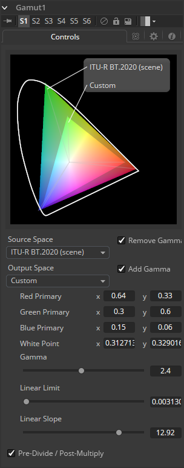

### Gamut [Gmt] 色域

Gamut工具将颜色从不同的色域转换为其他色域，并移除或添加适当的伽玛来完全线性化输入图像。

#### Controls 控件

##### Source Space 源空间

Source Space确定图像的输入颜色空间。如果您只想使用Output Space控件添加Gamma，请将其保留为No Change。

- **DCI-P3：**DCI-P3色彩空间最常用于DLP投影仪，通常作为2K DLP投影仪可用的色彩空间提供，并作为10位LCD监视器（如HP Dreamcolor）的仿真模式提供。该色彩空间在SMPTE-431-2标准中定义。

- **Custom 自定义：**自定义色域允许您根据CIE 1931原色和白点描述颜色空间，这些颜色空间表示为XY坐标，以及伽马，极限和斜率。 例如，如果使用Custom色彩空间来描述的话，则上面提到的DCI-P3色域将具有以下值：

  | 变量          | x      | y     |
  | ------------- | ------ | ----- |
  | Red Primary   | 0.68   | 0.32  |
  | Green Primary | 0.265  | 0.69  |
  | Blue Primary  | 0.15   | 0.06  |
  | White Point   | 0.314  | 0.351 |
  | Gamma         | 2.6    | –     |
  | Linear Limit  | 0.0313 | –     |

  要了解这些控件的工作原理，您可以在波形（Waveform）模式下查看附加到渐变背景的工具，并观察不同的调整如何修改输出。

##### Output Space 输出空间

输出空间是转换后的色域到所需的色彩空间。如果您想使用Source Space控件删除Gamma，请将此保留为No Change。

##### Remove/Add Gamma 移除/添加Gamma

选中这些复选框可以在线性或非线性伽玛中进行色域转换，或者只是删除或添加适当的伽玛值而不更改色彩空间。

##### Pre-Divide/Post-Multiply 预除/后乘

选择Pre-Divide/Post-Multiply复选框将使图像像素值除以颜色校正之前的alpha值，然后在校正后重新乘以alpha值。这有助于防止创建非法加性图像，特别是蓝/绿键的边缘或在使用3D渲染对象时。