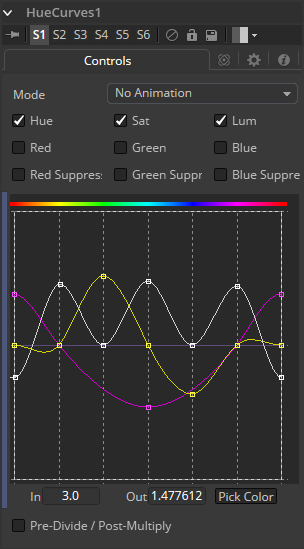

### Hue Curves [HCv] 色相曲线

Hue Curves工具允许您使用一系列样条曲线调整图像中的色彩。提供样条来控制图像色相（Hue）、饱和度（Saturation）和亮度（Luminance）以及每个单独的颜色通道。另外一组曲线允许您将抑制应用于各个颜色通道。

Hue Curves工具优于Fusion中其他色彩校正工具的优点是可以通过操纵样条曲线来将工具效果限制在图像的非常窄的部分，或者扩展为包括图像的宽范围部分。此外，可以对这些曲线进行动画处理，以跟踪图像随时间的变化。由于样条曲线的主轴由图像的色相定义，因此更容易将特定颜色与图像隔离以进行调整。

#### Controls 控件

##### Mode 模式

Mode选项可以在Animate和Dissolve模式之间切换。默认模式为Static，其中曲线的调整会随着时间的推移而一致地应用。将Mode设置为Animate或Dissolve来允许颜色曲线随时间变化。

Dissolve式基本上是过时的，仅出于兼容性原因而包含在内。

##### Color Channel Checkboxes 颜色通道复选框

这些复选框定义哪些样条线可编辑并包含在Pick Color过程中。

可以同时编辑任意数量的激活样条曲线，但在大多数情况下，只有当前修改的样条曲线处于活动状态以避免对其他样条曲线进行不必要的更改会更方便。

使用Pick Color按钮时，将在所有活动样条线上创建一个点，表示所选色彩。

##### Spline Window 样条窗口

此查找表（LUT）控件是Hue Curves工具的主要界面元素，该工具存放了各种样条线。在外观上，该工具与Color Curves工具非常相似，但在本情景下，水平轴表示图像的色相，而垂直轴表示调整的程度。Spline Window显示各个通道的曲线。它基本上是一个微型的Spline Editor。

实际上，也可以在样条曲线编辑器中找到并编辑此窗口中显示的曲线。所有组件的样条曲线最初都是平的，关键点水平放置在每种原色上。从左到右分别是：Red、Yellow、Green、Cyan、Blue和Magenta。由于色调梯度的周期性，每条曲线中最左边的关键点会连接到曲线的最右边的关键点。

右键单击LUT控件将显示一个上下文菜单，其中包含用于重置曲线、导入外部曲线、调整所选关键点的平滑度等的选项。有关样条控件一般如何工作的详细信息，请参阅本手册的工具控件（Tool Controls）一章。

##### In and Out 入和出

使用In和Out控件可以处理所选点的精确值。要更改值，请选择一个点并输入所需的in/out值。

##### Pick 拾取

从Pick Color按钮左键单击并拖动将将当前鼠标光标更改为吸管。在按住鼠标左键的同时，将光标拖动到查看器以从显示的图像中选择一个像素。这将导致锁定在水平轴上的关键点出现在当前活动的曲线上。关键点将表示所选颜色在曲线上的位置。使用上下文菜单的“锁定所选点”（Lock Selected Points）切换以解锁点并恢复水平移动选项。

点仅添加到启用的样条线。要仅在特定通道上添加点，请在进行选择之前禁用其他通道。

##### Pre-Divide/Post-Multiply 预除/后乘

勾选Pre-Divide/Post-Multiply复选框将使图像像素值除以颜色校正之前的alpha值，然后在校正后重新乘以alpha值。这有助于防止创建非法加性图像，特别是蓝/绿键的边缘或在使用3D渲染对象时。