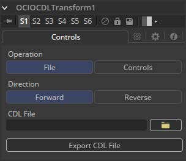
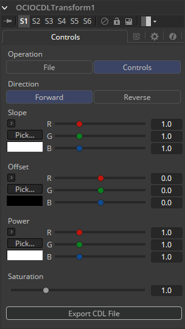
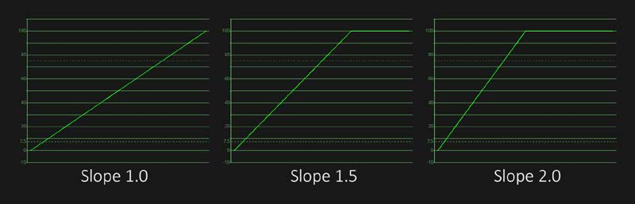
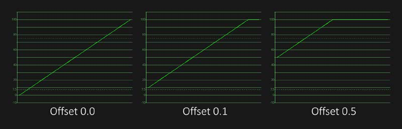

### OCIO CDL Transform [OCD] OCIO CDL变换

Fusion支持Sony Imageworks指定的Open Color IO工作流程。通常，色彩管道由一组由OCIO特定的配置文件定义的颜色转换组成，通常以“.ocio”扩展名命名，它允许用户轻松共享设施内或设施之间的颜色设置。要使用的配置文件的路径通常由用户创建的名为“OCIO”的环境变量指定，尽管有些工具允许覆盖它。如果找不到其他* .ocio配置文件，将使用Fusion的LUTs目录中的DefaultConfig.ocio文件。

有关格式内部的深入文档，请参阅opencolorio.org上的官方页面。

OCIO CDLTransform允许用户创建、保存、加载和应用CDL文件。

#### Controls 控件

##### Operation 运算

在文件和控件之间切换。 在文件模式下，可以加载标准ASC-CDL文件。在控制模式下，可以对坡度（Slope），偏移（Offset），强度（Power）和饱和度（Saturation）进行手动调整，并可以保存CDL文件。

##### Direction 方向

在Forward和Reverse之间切换。Forward应用工具中指定的更正，而reverse尝试删除这些更正。请记住，并非所有色彩校正都可以撤消。

想象一下，所有坡度值都设置为0.0，从而产生完全黑色的图像。无论是数学上还是视觉上都不可能反转该操作。

##### Slope 坡度

相乘到颜色值。这与BrightnessContrast工具中的Gain相同。

##### Offset 偏移

相加到颜色值。这与BrightnessContrast工具中的Brightness相同。

##### Power 强度

应用Gamma曲线。这是BrightnessContrast工具的Gamma功能的反转。

##### Saturation 饱和度

增强或降低色彩饱和度。这与BrightnessContrast工具中的Saturation相同。

##### Export File 导出文件

允许用户将设置导出为CDL文件。