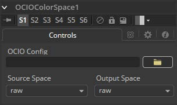
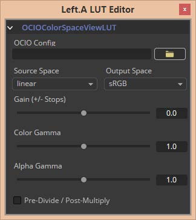

### OCIO ColorSpace [OCC] OCIO色彩空间

Fusion支持Sony Imageworks指定的Open Color IO工作流程。

通常，色彩管道由一组由OCIO特定的配置文件定义的颜色转换组成，通常以“.ocio”扩展名命名，它允许用户轻松共享设施内或设施之间的颜色设置。要使用的配置文件的路径通常由用户创建的名为“OCIO”的环境变量指定，尽管有些工具允许覆盖它。

如果找不到其他* .ocio配置文件，将使用Fusion的LUTs目录中的DefaultConfig.ocio文件。有关格式内部的深入文档，请参阅opencolorio.org上的官方页面。OCIOColorSpace允许基于OCIO配置文件进行复杂的色彩空间转换。示例配置可以从[opencolorio.org/downloads.html](https://opencolorio.org/downloads.html)获得。

OCIOColorSpace工具的功能也可作为ViewLUT菜单中的ViewLUT工具使用。

#### Controls 控件

​	

##### OCIO Config OCIO配置

显示一个File > Open对话框以加载所需的配置文件。

##### Source Space 源空间

根据Config文件，此处将列出可用的源色彩空间。

此列表的内容仅基于加载的配置文件，因此可能会有很大差异。

##### Output Space 输出空间

根据Config文件，此处将列出可用的输出色彩空间。

此列表的内容仅基于加载的配置文件，因此可能会有很大差异。

##### The ViewLUT Version of the Tool 工具的ViewLUT版本

