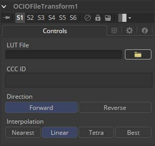
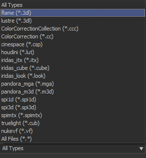
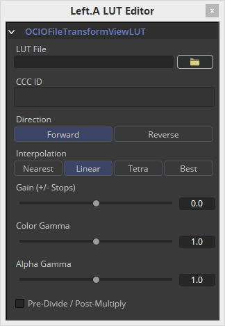

### OCIO FileTransform [OCF] OCIO文件变换

Fusion支持Sony Imageworks指定的Open Color IO工作流程。

通常，色彩管道由一组由OCIO特定的配置文件定义的颜色转换组成，通常以“.ocio”扩展名命名，它允许用户轻松共享设施内或设施之间的颜色设置。要使用的配置文件的路径通常由用户创建的名为“OCIO”的环境变量指定，尽管有些工具允许覆盖它。

如果找不到其他* .ocio配置文件，将使用Fusion的LUTs目录中的DefaultConfig.ocio文件。有关格式内部的深入文档，请参阅opencolorio.org上的官方页面。OCIOFileTransform允许用户加载和应用各种查找表。

OCIOFileTransform工具的功能也可作为ViewLUT菜单中的ViewLUT工具使用。

#### Controls 控件

##### LUT File LUT文件

显示一个File > Open对话框以加载所需的LUT。

##### CCC ID

##### Direction 方向

在前进和后退之间切换。Forward应用工具中指定的更正，而reverse尝试删除这些更正。请记住，并非所有颜色校正都可以撤消。想象一下，所有斜率值都设置为0.0，从而产生完全黑色的图像。无论是数学上还是视觉上都不可能反转该操作。

##### Interpolation 插值

允许用户选择颜色插值以获得最佳质量/渲染时间比率。

##### The ViewLUT Version of the Tool 工具的ViewLUT版本

