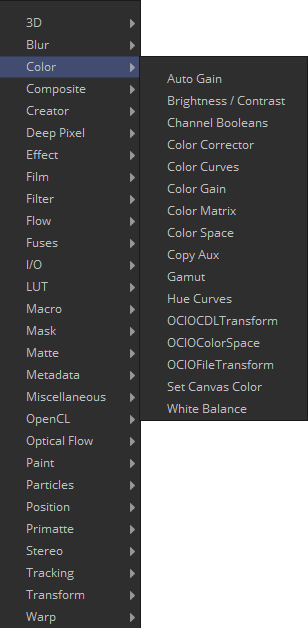
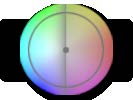
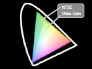
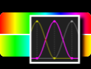
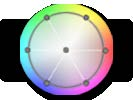
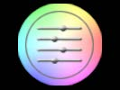
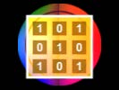
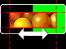
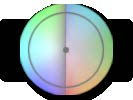
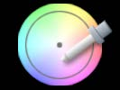

## 第六章 Color Tools 色彩工具

- [Auto Gain [AG]](./Auto%20Gain%20[AG].md) 
- [Brightness Contrast [BC]](./Brightness%20Contrast%20[BC].md) 
- [Channel Boolean [Bol]](./Channel%20Boolean%20[Bol].md) 
- [Color Corrector [CC]](./Color%20Corrector%20[CC].md) 
- [Color Curves [CCv]](./Color%20Curves%20[CCv].md) 
- [Color Gain [Clr]](./Color%20Gain%20[Clr].md) 
- [Color Matrix [CMx]](./Color%20Matrix%20[CMx].md) 
- [Color Space [CS]](./Color%20Space%20[CS].md) 
- [Copy Aux [CpA]](./Copy%20Aux%20[CpA].md) 
- [Gamut [Gmt]](./Gamut%20[Gmt].md) 
- [Hue Curves [HCv]](./Hue%20Curves%20[HCv].md) 
- [OCIO CDL Transform [OCD]](./OCIO%20CDL%20Transform%20[OCD].md) 
- [OCIO ColorSpace [OCC]](./OCIO%20ColorSpace%20[OCC].md) 
- [OCIO FileTransform [OCF]](./OCIO%20FileTransform%20[OCF].md) 
- [Set Canvas Color [SCv]](./Set%20Canvas%20Color%20[SCv].md) 
- [White Balance [WB]](./White%20Balance%20[WB].md) 

<table id="img">
  <tr>
    <td rowspan="8"></td>
    <td></td>
    <td></td>
  </tr>
  <tr>
    <td></td>
    <td></td>
  </tr>
  <tr>
    <td></td>
    <td></td>
  </tr>
  <tr>
    <td></td>
    <td></td>
  </tr>
  <tr>
    <td></td>
    <td></td>
  </tr>
  <tr>
    <td></td>
    <td></td>
  </tr>
  <tr>
    <td></td>
    <td></td>
  </tr>
  <tr>
    <td></td>
    <td></td>
  </tr>
</table>