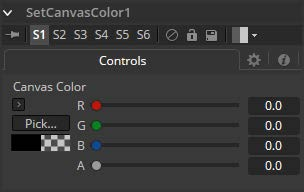

### Set Canvas Color [SCv] 设置画布颜色

设置画布颜色用于设置工作区的颜色——超出图像（DoD）中定义像素的所有区域。这个区域通常延伸到无限远。默认情况下，使用的画布颜色为黑色/无Alpha（透明）。

某些工具可能会更改图像的画布颜色，例如，反转遮罩会将遮罩的画布从黑色更改为白色。Set Canvas Color允许您控制和覆盖它。

#### Controls 控件

##### Color Picker 颜色拾取器

使用这些控件调整图像画布的颜色和Alpha值。默认为零Alpha的黑色。