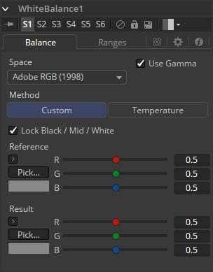
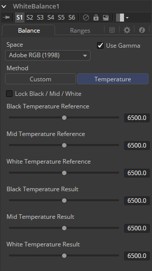
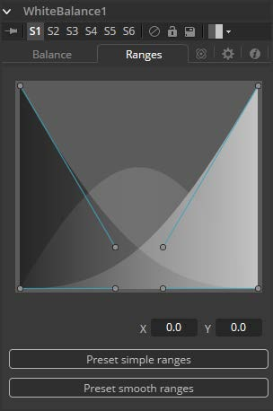

### White Balance [WB] 白平衡

White Balance工具可用于自动消除由于相机设置错误，相机CCD出现问题或光线条件不佳而导致的图像偏色。可以通过选择色温，或者从原始图像中选择渲染要校正的色偏的中性色来进行校正。

> **非常重要** 使用Custom方法选择中性色时，请确保从源图像中进行拾取，而不是使用White Balance工具的结果。这样可以确保在拾取时图像不会发生变化，并且White Balance工具可以准确获得需要校正的原始颜色。

#### Balance Tab 平衡选项卡

##### Color Space 色彩空间 

使用此菜单选择源图像的色彩空间（如果已知）。这可以使校正更准确，因为该工具将能够将色彩空间的自然伽玛考虑作为校正的一部分。如果图像使用的色彩空间未知，请将此菜单保留为默认值。

##### Method 方法

白平衡工具可以使用两种方法之一操作，即Custom方法和色彩Temperature方法。

- **Custom 自定义：**Custom方法需要从场景中选择应该是纯灰色的像素。

  该工具使用此信息计算转换像素所需的色彩校正，使其实际为灰色。当校正应用于整个图像时，它通常会对整个镜头进行白平衡。

- **Temperature 温度：**色彩Temperature方法要求指定镜头的实际色温。

##### Lock Black/Mid/White 锁定黑/中/白

此复选框将Black、Mid和White点锁定在一起，以便整个图像受到同等影响。取消选中控件将分别为白色平衡每个范围提供单独的控件。此控件同等地影响两种方法。

#### Custum Control 自定义控件

##### Black/Mid/White Reference 黑/中/白参考

仅在选择Custom方法时才会显示这些控件。它们用于从源图像中的像素中选择颜色。White Balance工具将对图像进行色彩校正，以便将所选颜色转换为下面结果颜色选择器中设置的颜色。一般来说，这是灰色的。应该选择应该是纯灰色但由于某种原因而不是真正灰色的颜色。

如果取消选中Lock Black/Mid/White复选框，则可以为每个颜色范围选择不同的参考。

例如，尝试为未在任何色彩通道中剪切的黑白参考选择像素。在高端，一个例子是浅粉红色的像素，值为`255,240,240`。即使颜色不是白色，像素也会在红色中饱和/剪裁。同样，一个非常深的蓝灰色的像素可能是`0,2,10`。即使它不是黑色，也会被剪裁成红色。

这两个示例都不是一个作为参考像素很好的选择，因为White Balance工具没有足够的余量。

##### Black/Mid/White Result 黑/中/白结果

仅在选择Custom方法时才会显示这些控件。它们用于选择工具平衡参考颜色的颜色。这通常默认为纯中灰色。

如果取消选中Lock Black/Mid/White复选框，则可以为每个颜色范围选择不同的结果。

#### Temperature Control 温度控件

##### Temperature Reference 温度参考

使用此控件设置源图像的色温。如果取消选中Lock Black/Mid/White复选框，则可以为每个色彩范围选择不同的参考。

##### Temperature Result 温度结果

使用此控件设置图像的目标色温。如果取消选中Lock Black/Mid/White复选框，则可以为每个颜色范围选择不同的结果。

##### Use Gamma 使用伽马

此复选框选择在应用校正时工具是否将图像的灰度系数考虑在内，使用选项卡顶部菜单中所选颜色空间的默认灰度系数。

#### Ranges Tab 范围选项卡

##### Ranges 范围

使用Ranges选项卡中的控件可以自定义图像中被视为阴影、中间调和高光的像素范围。Color Corrector工具文档中详细记录了此选项卡中控件的使用。