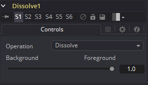
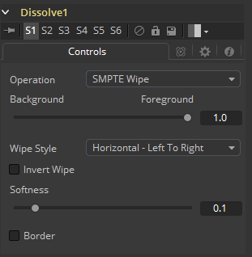

### Dissolve [DX]

Dissolve工具用于将两个图像混合在一起，从而在两个片段之间提供逐渐过渡。一个滑块控制前景层和背景层之间的混合量。Dissolve通常用于在一个片段和另一个片段之间渐变，并且这在剪辑中是非常常见的效果。Gradient Wipe设置允许基于第三个输入的亮度值的任意动画溶解模式。与几何形状、火、水波纹、雨、柏林噪音、粒子系统或您选择的视频片段使用此工具可以获得各种独特和创造性的过渡。柔边效果的遮罩也会增加一些可能的效果。

Dissolve工具的一个有用属性是，不同于Fusion中的所有其他工具，它不需要始终有效的背景，但会根据需要输出背景或前景。这使您可以将其用作简单的自动切换工具。您可以将片段连接到背景和前景。使用Background/Foreground控件确定输出的优先级，如果一个片段提前终止，则另一个片段自动输出。为Background/Foreground控件设置动画允许手动切换。

工具块提供三个图像输入：前景（Foreground）、背景（Background）和渐变映射（Gradient Map）。仅在选择了Gradient Map时才需要渐变映射输入。当前景和背景输入都是具有相同分辨率的图像时，Dissolve工具有最佳效果。如果将不同尺寸的输入图像混合在一起，则输出尺寸将足够大以覆盖两个图像。如果选择了完整的前景或背景，则该图像将以其原始大小不受影响地输出。在这种情况下，为Foreground/Background滑块设置动画可能会导致不希望的分辨率更改。

例如，尝试在NTSC图像（背景）和PAL图像（前景）之间溶解，当滑块设置为完全背景时，溶解工具的输出将为NTSC。设置为完整前景时，它会突然跳转到PAL。在FG和BG之间混合，输出图像的分辨率将是每个图像的最大尺寸；在这种情况下，输出将是720 x 576（PAL大小）。

建议确保Dissolve工具的所有输入都具有相同的分辨率和像素宽高比。

#### Controls 控件

##### Operation 运算

Operation下拉菜单包含七种不同的混合前景和背景输入的方法之一。使用Background/Foreground滑块的值将两个图像混合在一起，以确定每个图像所占百分比。

- **Dissolve 溶解：**标准的Dissolve模式相当于交叉溶解，当另一个剪辑淡入时，一个剪辑淡出。
- **Additive Dissolve 加性溶解：**类似于标准胶片溶解，添加剂溶解添加第二个片段然后淡出第一个片段。
- **Erode 腐蚀：**类似于标准胶片溶解，加性溶解添加第二个片段然后淡出第一个片段。
- **Random Dissolve 随机溶解：**随机生成的点图案用于执行图像的混合。
- **Random Noise Dissolve 随机噪声溶解：**移动的随机点图案用于执行图像的混合。
- **Gradient Wipe 渐变擦除：**溶解由渐变映射输入中的图像的亮度值控制。 这种溶解的边缘可以柔化。边框的密度和颜色可以独立调整。、
- **SMPTE Wipe SMPTE擦除：**SMPTE Wipe类似于许多视频效果切换器上的基本效果擦除。提供水平擦除和垂直擦除。擦除可以有柔软的边缘和额外的边框。边框的密度和颜色可以独立调整。

##### Background/Foreground 前景/背景

此控件确定输出是背景图像、前景图像还是两者之间的混合。混合类型由Operation控件确定。如果其中一个输入图像当前不可用，则无论此滑块的设置如何，都将输出另一个输入图像。

##### Gradient/SMPTE wipe controls 渐变/SMPTE擦除控件

仅当选择Gradient Wipe或SMPTE Wipe时，才会显示以下控件。

##### Wipe Style 擦除类型

[仅限SMPTE擦除]下拉列表允许选择两种擦除样式：
水平 - 从左到右和垂直 - 从上到下。使用Invert Wipe复选框可以反转擦除方向。

##### Invert Wipe 反转擦除

[仅限SMPTE擦除]选中时，擦除方向将反转。

##### Softness 柔度

使用此控件可以柔化过渡的边缘。

##### Border 边框

选择边框以启用过渡边缘的着色并显示关联的控件。效果是在过渡边缘周围创建边框。

##### Border Softness 边框柔度

Border Softness滑块控制边框的宽度和密度。较高的值将创建更密集的边框，而较低的值将创建更薄的边框。

##### Border Color 边框颜色

使用Border Color选择边框中使用的颜色。