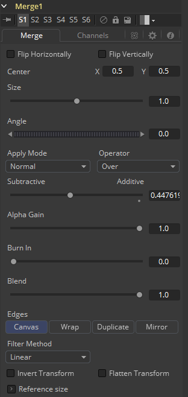
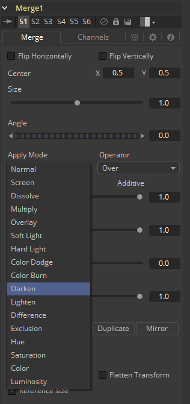
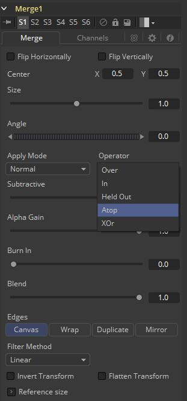
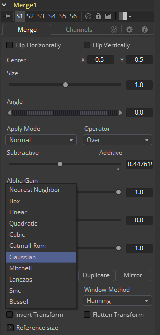

### Merge [Mrg] 合并

Merge工具根据与前一个相关联的alpha（不透明度）通道组合两个图像。此工具有两个输入——背景图像和前景图像。合并的运算模式决定了用于组合图像的方法。

Fusion不是为每种用于组合图像的不同方法提供十几种工具，而是使用一个Merge工具，支持标准的over、in、held、atop和xor方法来合成图像，以及许多常见的混合模式，如滤色（screen）、溶解（dissolve）、正片叠底（multiply）和叠加（overlay）。

Merge工具可以处理加法（预乘）和减法（非预乘）合成。使用Merge在加法和减法结果之间进行混合，为一些棘手的问题提供解决方案。

如果可用，该工具还可用于根据来自图像的Z缓冲通道的信息合成图像。Z合并不是依靠前景和背景顺序来确定层顺序，而是比较每个像素的深度值以确定哪个是前景像素，哪个是背景像素。

#### Merge Tab 合并选项卡

##### Center X and Y 中心X和Y

此控件确定合成中前景图像的位置。

默认值为`0.5, 0.5`，它将前景图像置于背景图像的精确中心。显示的值始终是标准化坐标中的实际位置，乘以参考尺寸。

有关参考尺寸控件的说明，请参见下文。

##### Size 尺寸

使用此控件可在前景图像在背景上合成之前增大或减小前景图像的大小。此滑块的值范围为0.0到5.0，但可以手动输入任何大于0的值。大小为1.0会给出像素对像素的合成，其中前景中的单个像素与背景中的单个像素大小相同。

##### Angle 角度

使用此控件旋转前景图像，然后将其与背景组合。

##### Apply Modes 应用模式

Apply Modes设置确定混合或组合前景像素和背景像素时使用的数学运算。

- **Normal 正常：**默认合并模式使用前景的Alpha通道作为掩码来确定哪些像素是透明的，哪些像素不是透明的。当它处于活动状态时，另一个菜单显示可能的操作，包括：over、in、hold out、atop和xor。
- **Screen 滤色：**Screen根据颜色值的乘法合并图像。忽略alpha通道，图层顺序变得无关紧要。产生的颜色总是更亮。滤黑色会使颜色保持不变，而滤白色则总是产生白色。这种效果产生了将几个胶片帧投射到同一表面上的相似外观。
- **Dissolve 溶解：**Dissolve将两个图像序列混合在一起。它使用两个图像的计算平均值来执行混合。
- **Multiply 正片叠底：**乘以颜色通道的值。当值从0到1缩放时，这将使图像的外观变暗。白色的值为1，因此结果将相同。灰色的值为0.5，因此结果将是较暗的图像，或者换句话说，图像的一半是明亮的。
- **Overlay 叠加：**根据背景图像的颜色值，叠加倍增或屏蔽前景图像的颜色值。 图案或颜色覆盖现有像素，同时保留背景图像颜色值的高光和阴影。背景图像不会被替换，而是与前景图像混合以反映背景图像的原始亮度或暗度。
- **Soft Light 柔光：**Soft Light使前景图像变暗或变亮，具体取决于背景图像的颜色值。效果类似于在图像上照射漫射聚光灯。
- **Hard Light 强光：**Hard Light倍增或屏幕显示前景图像的颜色值，具体取决于背景图像的颜色值。效果类似于在图像上发出刺眼的聚光灯。
- **Color Dodge 颜色减淡：**Color Dodge使用前景的颜色值来背景图像变亮。这类似于通过减少印刷区域的曝光来避光的照相操作。
- **Color Burn 颜色加深：**Color Burn使用前景的颜色值使背景图像变暗。这类似于通过增加印刷区域的曝光来避光的照相操作。
- **Darken 变暗：**Darken会查看每个通道中的颜色信息，并选择背景或前景图像的颜色值（以较暗者为准）作为结果颜色。比合并颜色更亮的像素被替换，并且比合并颜色更暗的像素不会改变。
- **Lighten 变亮：**Lighten查看每个通道中的颜色信息，并选择背景或前景图像的颜色值（以较亮者为准）作为结果颜色值。比合并颜色更暗的像素被替换，并且比合并颜色更亮的像素不会改变。
- **Difference 差值：**Difference查看每个通道中的颜色信息，并从背景颜色值或前景背景中减去前景颜色值，具体取决于哪个具有更高的亮度值。与白色合并会颠倒颜色。与黑色合并不会产生任何变化。
- **Exclusion 排除：**Exclusion产生的效果类似于Difference模式，但对比度低于Difference模式。与白色合并会反转基色值。与黑色合并不会产生任何变化。
- **Hue 色相：**Hue使用背景颜色值的亮度和饱和度以及前景颜色值的色相创建结果颜色。
- **Saturation 饱和度：**Saturation会根据基色的亮度和色相以及混合色的饱和度创建结果颜色。
- **Color 色彩：**Color使用背景颜色值的亮度和前景的色相和饱和度创建结果颜色。这样可以保留图像中的灰度级，对于着色单色图像非常有用。
- **Luminosity 明度：**Luminosity使用背景颜色值的色相和饱和度以及前景颜色值的明度创建结果颜色。此模式会创建与Color模式相反的效果。

##### Operator Modes 运算器模式

此菜单用于选择Merge的运算器模式。更改运算器模式会更改前景和背景的组合方式以产生结果。菜单仅在Merge工具的Apply模式设置为Normal时才会显示。

有关Operation模式的基础数学的精彩描述，请参阅《合成数字图像》（*Compositing Digital Images*），Porter, T和T. Duff，SIGGRAPH 84 proceedings，第253-259页。 基本上，数学上会如下所述。请注意，通过交换前景和背景输入（使用Command-T或Ctrl-T）并选择相应的模式，可以轻松获得运算器下拉列表中未列出的某些模式（Under、In、Held In、Below）。 

用于组合合并中的像素总是`fg * x + bg * y`。不同的操作确定`x`和`y`是什么，如每种模式的描述中所示。

- **Over：**Over模式通过将FG的alpha通道大于1的位置中的像素替换为BG中的像素，将FG图层添加到BG图层。

  `x = 1, y = 1-[foreground alpha] `

- **Held Out：**Held Out基本上与In操作相反。FG图像中的像素与BG图像的反转α通道相乘。使用In操作和Matte Control工具完成相同的结果，以反转BG图像的遮罩通道。

  `x = 1-[background alpha], y = 0`

- **ATop：**ATop仅在BG具有遮罩的情况下将FG放置在BG上。

  `x = [background alpha], y = 1-[foreground alpha] `

- **XOr：**当FG或BG有遮罩时，XOr将FG与BG结合在一起，但不会两者都没有遮罩。

  `x = 1-[background alpha], y = 1-[foreground alpha]`

##### Subtractive and Additive 减性和加性

此滑块控制Fusion是执行加性还是减性合并。加性合并假定前景图像是预乘的，这意味着颜色通道中的像素已经乘以alpha通道中的像素。结果是透明像素总是黑色，因为任何数字乘以0总是为0。

当Merge工具可以假设图像是预乘的时，它可以执行加性合并。这会遮挡背景（通过乘以前景alpha的倒数），然后简单地添加前景中的像素。

如果图像没有预乘，那么通常所需的全部是减性合并。此方法类似于加性，但前景图像首先乘以其自己的alpha，以消除alpha区域外的任何背景像素。

Fusion大多数操作默认为加性合并，并假设图像是预乘的。在预乘图像上使用减性合并可能会导致边缘变暗，而使用与非预乘图像合并的添加合并将导致前景alpha之外的任何非黑色区域添加到结果中。

尽管加性/减性选项很容易成为选择一种模式或另一种模式的复选框，但Fusion允许在加性和减性模式之间进行混合，这种操作偶尔可用于处理问题图像。

##### Alpha Gain Alpha增益

Alpha Gain线性缩放前景alpha通道的值。在减性合并中，它控制合成的密度，类似于Blend。在加性合并中，这有效地减少了背景被遮挡的数量，从而使整体结果更加明亮。在Alpha Gain设置为0.0的加性合并中，前景像素将简单地添加到背景中。

##### Burn In 烧入

Burn In控件调整用于使背景变暗的alpha值，而不会影响添加的前景量。在0.0时，合并的行为类似于直线alpha混合，而在1.0时，前景有效地添加到背景上（之后）在减法模式下的alpha乘法）。

与Alpha Gain一样，这可以使前景图像增亮背景图像。事实上，对于加性合并，增加Burn In会产生与降低Alpha Gain相同的结果。

##### Filter Modes 滤镜模式

- **Nearest Neighbor 最邻近的：**这会根据需要跳过或复制像素。这产生了最快但最粗糙的结果。
- **Box 盒：**这是一个简单的插值比例的图像。
- **Linear 线性：**这使用了一个简单的滤镜，它产生相对干净和快速的结果。
- **Quadratic 二次：**这个滤镜产生一个标称的结果。它在速度和质量之间提供了一个很好的折中方案。
- **Cubic 立方：**这在连续色调图像中产生了更好的效果，但比Quadratic慢。如果图像中有精细的细节，结果可能比预期的更模糊。
- **Catmull-Rom Catmull-Rom：**这产生了良好的结果与连续色调图像缩小，产生了清晰的结果与精细的图像。
- **Gaussian 高斯：**这在速度和质量上与Quadratic非常相似。3
- **Mitchell Mitchell：**这类似于Catmull-Rom，但使用精细的图像可以产生更好的效果。它比Catmull-Rom慢。
- **Lanczos Lanczos：**这与Mitchell和Catmull-Rom非常相似，但是更清晰，也更慢。
- **Sinc Sinc：**这是一个先进的滤镜，可以产生非常清晰，详细的结果，然而，它可能会在某些情况下产生可见的振铃。
- **Bessel Bessel：**这类似于Sinc滤镜，但可能更快一些。

*不同的Resize滤镜。从左到右：Nearest Neighbor、Box, Linear、Quadratic、Cubic、Catmull-Rom、Gaussian、Mitchell、Lanczos、Sinc和Bessel。*

##### Window Method 窗口模式

某些滤镜（如Sinc和Bessel）需要无限数量的像素才能精确计算。为了加速此操作，使用窗口功能来近似滤镜并限制所需的像素数。当选择需要窗口化的滤镜时，将显示此控件。

- **Hanning Hanning：**这是一个简单的锥形窗口。

- **Hamming Hamming：**Hamming是Hanning的一个稍作改动的版本。

- **Blackman Blackman：**一个下降幅度更大的窗口。

- **Kaiser Kaiser：**一个更复杂的窗口，Hamming和Blackman之间的结果。

  大多数这些滤镜仅在使图像变大时才有用。缩小图像时，通常使用Bi-Linear滤镜，但Catmull-Rom滤镜会对结果应用一些锐化，并可能在缩小图像时保留细节。

##### Blend 混合

这是Common Controls选项卡中Blend滑块的克隆实例。对此控件所做的更改同时对常用控件中的更改进行。

Blend滑块将工具的结果与其输入混合，将效果与任何小于1.0的值混合。在这种情况下，它会将背景与合并结果混合在一起。

##### Invert Transform 反转变换

选择Invert Transform控件来反转任何位置，旋转或缩放变换。将合并连接到跟踪器的位置以进行匹配移动时，此选项很有用。

##### Flatten Transform 展平变换

Flatten Transform选项可防止此工具将其转换与后续工具连接起来。该工具仍然可以从其输入中连接转换，但它不会将其转换与其输出处的工具连接起来。有关连接转换的详细信息，请参阅本手册前面的Transformations一章。（译注：有这一章吗？）

##### Reference Size 参考大小

Reference Size显示下的控件不会直接影响图像。相反，它们允许您控制Fusion如何表示Merge工具中心的位置。

通常，坐标表示为0到1之间的值，其中1是等于图像的整个宽度或高度的距离。这允许分辨率独立性，因为可以在不必改变中心值的情况下改变图像的大小。

该方法的一个缺点是使得对图像进行像素精确调整变得复杂。作为演示，想象一下尺寸为100x100像素的图像。要将前景元素的中心向右移动5个像素，我们会将合并中心的X值从`0.5,0.5`更改为`0.55,0.5`。我们知道变化必须为0.05，因为5/100 = 0.05。

如果在Reference Size控件中指定背景图像的尺寸，则会更改中心控件值的显示方式，以便在其X和Y字段中显示实际像素位置。

扩展这个示例，将宽度和高度设置为100，中心现在将显示为`50,50`，我们将通过输入`55,50`将其向右移动5个像素。

在内部，Merge工具仍将此值存储为介于0到1之间的数字，如果要通过脚本查询中心控件的值，或者要发布中心控件以供其他工具使用，则将检索原始标准化值。仅在工具控件中显示的合并中心值中可以看到更改。

##### Use Frame Format Settings 使用帧格式设置

选择此选项可强制合并使用合成的当前帧格式设置来设置参考宽度和参考高度值。

##### Width and Height 宽度和高度

将这些滑块设置为图像的宽度和高度，以更改Fusion显示合并工具中心控件值的方式。

#### Channels Tab 通道选项卡

##### Perform Depth Merge 执行深度合并

选中后，两个图像的Z缓冲通道将用于确定合成顺序。Alpha通道仍用于透明度，但Z缓冲通道的值将决定图像元素的排序。如果任一图像都没有Z缓冲区通道，则将忽略此复选框的设置，并且不会进行深度合成。

默认情况下，深度合并是关闭的。如果图像具有关联的Z缓冲区通道，并且该通道不用于执行深度合并，请关闭此复选框。

##### Foreground Z-Offset 前景Z偏移

此滑块设置应用于前景图像Z值的偏移。单击Pick按钮从显示的图像的Z通道中选择一个值，或使用滑块或输入框输入值。提高该值会导致前景图像的Z缓冲区沿Z轴进一步偏移，而降低该值会使前景移近。

##### Subtractive and Additive 减性和加性

当使用Z合成时，来自背景的图像像素可能在输出的前景中合成，因为该像素的Z缓冲区比前景像素的Z更接近。此滑块控制这些像素是以加性还是减性模式合并，其方式与Merge选项卡中的类似滑块完全相同。

当在不同颜色的背景上合并时，原始背景仍将在半透明区域中可见。加性合并将保持图像的透明度，但会将其值添加到背景中。