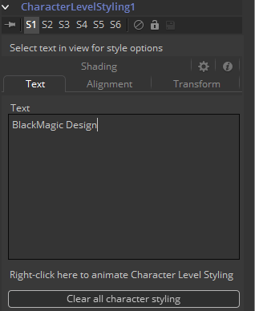
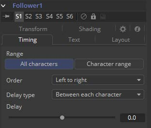
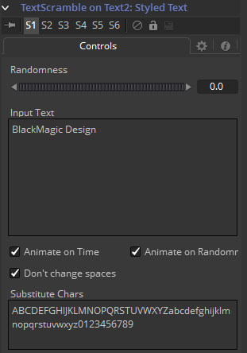
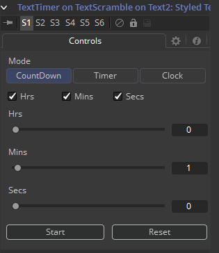
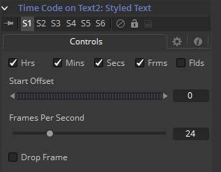

### Modifiers

#### **Character Level Styling** 

Character Level Styling修改器仅在Text+工具上生效。您可以直接在视图中选择单个字符，并将不同的文本属性应用于它们。考虑每行开头的大写字母，一个单词使用不同的字体，彩色高亮显示等等。

可以通过右键单击Text+工具的Styled Text字段并选择Character Level Styling来应用它。

字符级样式只能直接应用于Text+工具，而不能应用于Text 3D工具。 但是通过复制Text+，右键单击Text 3D并选择Paste Settings，可以将Text+工具中的样式化文本应用于Text 3D工具。

#### Text Tab 文本选项卡

##### Text Controls, Alignment, Transform and Shading Tab 文本控件、对齐、变换和着色选项卡

有关详细信息，请参见Text+工具文档。

##### Clear Character Styling on Selection 清除选中的字符样式

对当前所选字符所做的所有更改将被重置。

##### Clear all Character Styling 清除所有字符样式

所有字符属性都将重置为其原始值。

#### **Comp Name**

Comp Name仅适用于Text+工具。它将样式文本设置为当前的合成名称。这对于自动化每日渲染的烧入非常有用。另请参见TimeCode修改器。可以通过右键单击Text+工具的Styled Text字段并选择Comp Name来应用它。

#### Controls 控件

此修改器没有控件。

有关更多详细信息，请参见Text+ Tool文档。

#### **Follower**

Follower仅适用于Text+和Text3D工具。该工具可实现多种炫酷的图形效果。基本思想是为单个角色的参数设置动画，而其他角色将延迟跟随该动画。可以通过右键单击Text工具的Styled Text字段并选择Follower来应用它。

#### Timing Tab 计时选项卡

##### Range 范围

允许用户选择是否应影响所有字符或仅影响选定范围。您可以直接在屏幕上拖动选择一系列字符。

##### Order 顺序

确定字符受影响的顺序。注意，空格也被视为字符。可用的选项有：

- **Left to right 从左至右：**动画从左至右贯穿所有字符。
- **Right to left 从右至左：**动画从右至左贯穿所有字符。
- **Inside out 从内至外：**动画从角色的中心点向边缘对称地波动。
- **Outside in 从外至内：**动画从角色的边缘向中心点对称地波动。
- **Random but one by one 随机但一一跟随：**该动画将应用于随机选择的字符，但一次仅影响一个字符。
- **Completely random 完全随机：**动画将应用于随机选择的字符，一次影响多个字符。
- **Manual curve 手动曲线：**受影响的字符可以通过滑块指定。

##### Delay Type 延迟类型

确定对动画应用哪种延迟。可用的选项有：

- **Between Each Character 每个字符间：**文字中的字符越多，动画结束的时间就越长。
- **Between First and Last Character 第一个字符和最后一个字符间：**无论文本中有多少个字符，动画都将始终在选定的时间内完成。

##### Clear all Character Styling 清除所有字符样式

所有字符属性都将重置为其原始值。

##### Text Controls, Alignement, Transform and Shading Tab 文本控件、对齐、变换和着色选项卡

在这些选项卡中，字符的实际动画已完成。请注意，仅更改这些选项卡中的值将完全没有影响。该值需要设置动画以显示效果。

有关各种参数的详细说明，请参见Text+工具文档。

#### **Text Scramble**

Text Scramble仅适用于Text+工具。它拼凑文本，用用户自定义的其他字符随机替换字符。可以通过右键单击Text+工具的Styled Text字段并选择Text Scramble来应用它。

#### Controls 控件

##### Randomness 随机度

定义随机交换多少个字符。值为0不会改变任何字符。值为1会更改文本中的所有字符。在此拨轮应用动画从0到1，将逐渐交换所有字符。

##### Input Text 输入文本

这将在Text+ Styled Text中反映原始文本。可以在Text+中或此处输入文本。

##### Animate On Time 随时间的动画

设置后，字符将在每个新帧中随机拼凑。当Randomness设置为0时，此开关无效。

##### Animate On Randomness 随随机度的动画

设置后，当对Randomness拨轮设置动画时，角色将在每个新帧上随机拼凑。当Randomness设置为0时，此开关无效。

##### Don’t Change Spaces 不要改变空格

设置后，单个单词的长度将保持不变，尽管它们的字符会乱七八糟。

##### Substitute Chars 替换字符

定义用于拼凑文本的字符。

#### **Text Timer**

Text Timer仅适用于Text+工具。它使Text+工具成为倒数计时器、计时器或时钟。这对于屏幕上的实时显示或将帧的创建时间烧入到图片中非常有用。

可以通过右键单击Text+工具的Styled Text字段并选择Text Timer来应用它。

#### Controls 控件

##### Mode 模式

设置计时器工作的模式。在时钟模式下，将显示当前系统时间。

##### Hrs, Mins, Secs (Switches) 时、分、秒（切换）

定义应该在屏幕上显示时钟的哪一部分。

##### Hrs, Mins, Secs (Sliders) 时、分、秒（滑块）

设置倒数和计时器模式的开始时间。

##### Start 启动

启动计数器或计时器。计时器运行后切换为停止。

##### Reset 重置

将计数器和计时器重置为滑块设置的值。

#### **Time Code**

Time Code仅适用于Text+工具。它将Styled Text设置为基于当前框架的计数器。这对于自动化日常渲染的烧入非常有用。

可以通过右键单击Text+工具的Styled Text字段并选择Time Code来应用它。

#### Controls 控件

##### Hrs, Mins, Secs, Frms, Flds 时、分、秒、帧、字段

激活或停用这些选项来自定义时间代码显示，以分别显示小时、分钟、秒、帧和字段。仅激活帧会为您提供一个普通帧计数器。

##### Start Offset 起始偏移

为Fusion的当前时间引入正或负偏移，来与现有时间码匹配。

##### Frames per Second 每秒的帧数

这应该与您的合成的FPS设置相匹配，来提供准确的时间测量。

##### Drop Frame 丢帧

激活此复选框，以将时间码与具有丢帧的镜头（例如某些NTSC格式）相匹配。