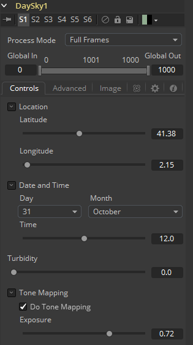
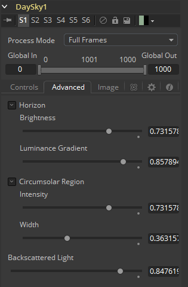
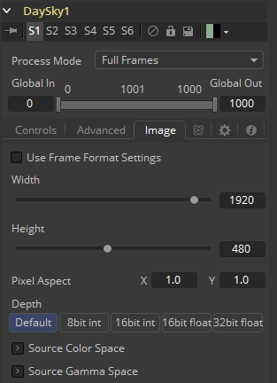

### Day Sky [DS] 天空图

DaySky发生器是Preetham、Shirley和Smits的研究论文《日光实用分析模型》（*A Practical Analytical Model for Daylight*）的操作实现。原始论文的副本可以在犹他大学视觉模拟小组的网站上找到（http://www.cs.utah.edu/~shirley/papers/sunsky/）。

该工具的目的是生成在地球上特定时间和位置产生的日光的模拟，并生成表示该光的映射的高动态范围图像。它不是天空发生器，尽管它可以与云发生器或噪声工具结合产生一个。

#### Controls 控件

##### Latitude, Longitude 纬度、经度

使用这些滑块来指定用于创建Day Sky模拟的纬度和经度。

##### Day, Month, Time 日、月、时间

使用这些控件来指定DaySky模拟的日、月和时间。

##### Turbidity 浊度

Turbidity使光散射和吸收，而不是通过模拟以直线传输。增加浊度会使天空模拟产生模糊的感觉，就像烟雾或大气雾霾一样。

##### Do Tone Mapping 使用色调映射

取消选中此复选框可禁用应用于模拟的任何色调映射。由于模拟是在32位浮点色彩空间中计算的，因此它会生成远高于1.0且远低于0.0的颜色值。色调映射是一个过程，它采用所得模拟的完整动态范围，并将数据压缩到所需的曝光范围，同时尝试尽可能多地保留高光和阴影的细节。

通常，只有在生成的图像稍后作为浮点颜色通道的一部分进行色彩校正时，才应取消选择此选项。

##### Exposure 曝光

使用此控件选择用于色调映射的曝光。

#### Advanced Tab 高级选项卡

##### Horizon Brightness 地平线亮度

使用此控件可调整地平线相对于天空的亮度。

##### Luminance Gradient 亮度渐变

使用此控件可调整将地平线与天空分开的渐变宽度。

##### Circumsolar Region Intensity 环日区域强度

使用此控件可调整距离太阳最近的天空的强度或亮度。

##### Circumsolar Region Width 环日区域宽度

使用此控件可调整受太阳影响的天空区域的宽度或大小。

##### Backscattered Light 反向散射光

使用此控件可增加或减少模拟中反向散射光的量。

#### Image Tab 图像选项卡

此选项卡中的控件用于设置工具生成的图像的分辨率、颜色深度和宽高比。

##### Process Mode 处理模式

使用此菜单控件选择Fusion用于渲染图像更改的字段处理模式。默认选项由Frame Format偏好设置中的Has Fields复选框控件确定。有关字段处理的更多信息，请参阅帧格式（Frame Format）一章。

##### Global In and Out 全局入和出

使用此控件指定此工具在项目中的位置。使用Global In指定片段开始的帧和Global Out指定此片段在项目的全局范围内结束（包括）的帧。

该工具不会在此范围之外的帧上生成图像。

##### Use Frame Format Settings 使用帧格式设置

选中此复选框后，工具创建的图像的宽度，高度和像素方面将锁定为合成的Frame Format首选项中定义的值。如果更改了Frame Format偏好设置，则将更改工具生成的图像的分辨率来匹配。禁用此选项有利于以不同于最终渲染的最终目标分辨率的分辨率构建合成。

##### Width/Height 宽度/高度

这对控件用于设置工具创建的图像的宽度和高度尺寸。

##### Pixel Aspect 像素宽高比

此控件用于指定所创建图像的像素宽高比。宽高比为1:1将产生两边具有相同尺寸的正方形像素（如计算机显示监视器），而0.9:1的宽高比将产生略微矩形的像素（如NTSC监视器）。

##### Depth 深度

Depth按钮组用于设置Creator工具创建的图像的像素颜色深度。32位像素需要8位像素的4倍内存，但色彩精度要高得多。浮点像素允许高于正常0..1范围的高动态范围值，用于表示比白色更亮或比黑色更暗的颜色。有关详细信息，请参阅帧格式（Frame Format）一章。

右键单击Width、Height或Pixel Aspect控件来显示列出偏好设置Frame Format选项卡中定义的文件格式的菜单。选择任何列出的选项将相应地将宽度、高度和像素宽高比设置为该格式的值。