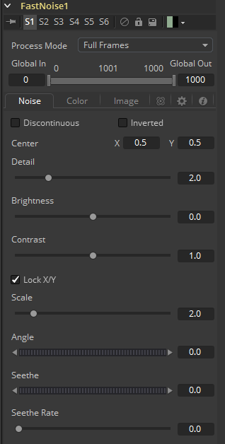
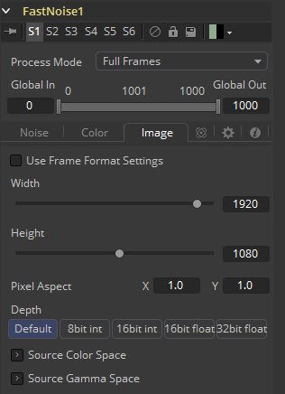

### Fast Noise [FN]

Fast Noise工具是一种非常快速和灵活的柏林噪声（Perlin Noise）发生器。它可以用于各种各样的效果，从云和旋转的雾到波浪、水的焦散、风格化的火和烟雾和其他有机纹理。它作为其他效果的噪声源也是非常宝贵的，例如热闪光、粒子系统和杂躁的贴图。

#### Noise Tab 噪声选项卡

##### Discontinuous 不连续

通常，噪声函数在值之间进行插值来创建平滑连续的结果渐变。启用此复选框可沿某些噪声等值线创建硬间断线。结果将产生截然不同的效果。

##### Inverted 反转

选中此复选框可反转噪声，从而创建原始图案的负像。这在启用Discontinuous时最有效。

##### Center 中心

使用Center坐标控制平移和移动噪声图案。

##### Detail 细节

增加此滑块的值可在噪声结果中生成更高级别的细节。较大的值会增加更多层的渐详细的噪声，而不会影响整体图案。较高的值渲染需要更长时间，但可以产生更自然的结果。

##### Brightness 亮度

此控件会在应用任何渐变颜色映射之前调整噪声贴图的整体亮度。在Gradient模式下，这与Offset控件具有类似的效果。

##### Contrast 对比度

此控件会在任何渐变颜色映射之前增加或减少噪声贴图的整体对比度。它可以增大噪声的影响，并扩大在Gradient模式下应用的颜色范围。

##### Lock and Scale X/Y 锁定和缩放X/Y

可以使用Scale滑块调整噪声贴图的大小，将其从整个图像的温和变化更改为更紧密的整体纹理效果。通过单击上面的Lock X/Y复选框，可以将Scale滑块分离为独立的X轴和Y轴缩放滑块，这也许对于拉丝金属效果有用。

##### Angle 角度

使用Angle控件旋转噪声图案。

##### Seethe 沸腾

调整此指轮控件以针对不同的噪声贴图插入噪声贴图。这将导致噪音的爬移，如漂移或流动。必须对此控件进行动画处理才能影响渐变，或者您可以使用下面的Seethe Rate控件。

##### Seethe Rate 沸腾率

与上面的Seethe控件一样，Seethe Rate也会使噪声图发生变化。Seethe Rate定义噪声每帧改变的速率，自动引起噪声的动画漂移，而不需要样条动画。

#### Color Tab 颜色选项卡

##### Two Color 双色

使用简单的双色渐变为噪声贴图着色。噪声函数将从第一种颜色平滑过渡到第二种颜色。

##### Gradient 渐变

Fusion中的Advanced Gradient控件用于更好地控制与噪声贴图一起使用的颜色渐变。选择此模式时出现的控件将在本手册的工具控件（Tool Controls ）一章中进行深入介绍。有关设置自定义渐变以在Fast Noise工具中使用的详细信息，请参阅这章。

#### Image Tab 图像选项卡

此选项卡中的控件用于设置工具生成的图像的分辨率、色彩深度和像素宽高比。

##### Process Mode 处理模式

使用此菜单控件选择Fusion用于渲染图像更改的字段处理模式。默认选项由Frame Format偏好设置中的Has Fields复选框控件确定。有关字段处理的更多信息，请参阅帧格式（Frame Format）一章。

##### Global In and Out 全局入和出

使用此控件指定此工具在项目中的位置。使用Global In指定片段开始的帧和Global Out指定此片段在项目的全局范围内结束（包括）的帧。

该工具不会在此范围之外的帧上生成图像。

##### Use Frame Format Settings 使用帧格式设置

选中此复选框后，工具创建的图像的宽度，高度和像素方面将锁定为合成的Frame Format首选项中定义的值。如果更改了Frame Format偏好设置，则将更改工具生成的图像的分辨率来匹配。禁用此选项有利于以不同于最终渲染的最终目标分辨率的分辨率构建合成。

##### Width/Height 宽度/高度

这对控件用于设置工具创建的图像的宽度和高度尺寸。

##### Pixel Aspect 像素宽高比

此控件用于指定所创建图像的像素宽高比。宽高比为1:1将产生两边具有相同尺寸的正方形像素（如计算机显示监视器），而0.9:1的宽高比将产生略微矩形的像素（如NTSC监视器）。

##### Depth 深度

Depth按钮组用于设置Creator工具创建的图像的像素颜色深度。32位像素需要8倍像素的4倍内存，但色彩精度要高得多。浮点像素允许高于正常0..1范围的高动态范围值，用于表示比白色更亮或比黑色更暗的颜色。有关详细信息，请参阅帧格式（Frame Format）一章。

右键单击Width、Height或Pixel Aspect控件来显示列出偏好设置Frame Format选项卡中定义的文件格式的菜单。选择任何列出的选项将相应地将宽度、高度和像素宽高比设置为该格式的值。

##### Mask Map Inputs 遮罩贴图输入

这些外部连接允许您使用遮罩分别控制每个像素的Noise Detail和Brightness控件的值。这会有一些有趣和创造性的效果。

##### Noise Detail Map 噪声细节贴图

连接到噪声细节贴图的软边遮罩将提供平坦的噪声贴图（零细节），其中遮罩为黑色，完整细节为白色，而中间值平滑地减少细节。它在任何渐变颜色贴图之前应用。这对于在特定区域应用最大噪声细节非常有帮助，同时在其他地方平稳地消失。

##### Noise Brightness Map 噪声亮度贴图

连接到此输入的遮罩可用于完全控制噪声贴图，例如在某些区域中对其进行增强，将其与其他纹理组合，或者如果将Detail设置为0，则完全替换Perlin Noise贴图。