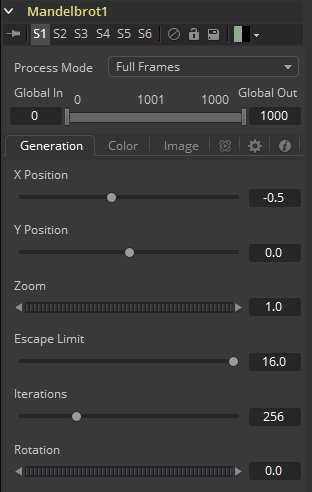
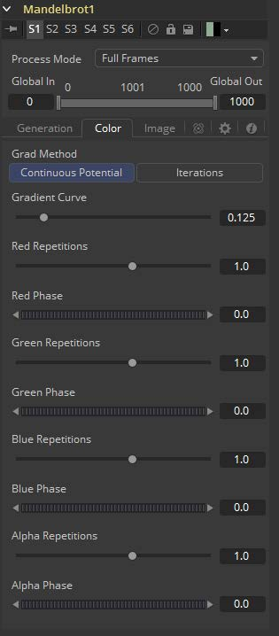
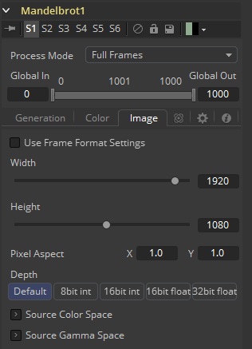

### Mandelbrot [MAN] 曼德布罗分形

该工具基于曼德布罗分形理论集创建图像样式。

#### Generation Tab 生成选项卡

##### Position X and Y X和Y位置

这指定图像的水平和垂直位置或种子点。

##### Zoom 缩放

缩放放大或缩小图案。所有放大倍数都会重新计算，所以缩放没有实际限制。

##### Escape Limit 逃逸极限

定义迭代计算中止的点。较低的值会导致光晕模糊。

##### Iterations 迭代

这决定了集合的重复性。使用动画时，它会模拟该组的增长。

##### Rotation 旋转

这会旋转图案。每个新角度都需要重新计算图像。

#### Color Tab 色彩选项卡

##### Grad Method 渐变方法

使用此控件可确定在图案边界处应用的渐变类型。

- **Continuous Potential 连续潜在：**这会使图案的边缘与背景颜色混合。
- **Iterations 迭代：**这导致图案的边缘是实心的。

##### Gradient Curve 渐变曲线

这会影响从图案到背景颜色的渐变宽度。

##### R/G/B/A 相位/重复

设置图案生成器的颜色值。

#### Image Tab 图像选项卡

此选项卡中的控件用于设置工具生成的图像的分辨率、色彩深度和像素宽高比。

##### Process Mode 处理模式

使用此菜单控件选择Fusion用于渲染图像更改的字段处理模式。默认选项由Frame Format偏好设置中的Has Fields复选框控件确定。有关字段处理的更多信息，请参阅帧格式（Frame Format）一章。

##### Global In and Out 全局入和出

使用此控件指定此工具在项目中的位置。使用Global In指定片段开始的帧和Global Out指定此片段在项目的全局范围内结束（包括）的帧。

该工具不会在此范围之外的帧上生成图像。

##### Use Frame Format Settings 使用帧格式设置

勾选此复选框后，工具创建的图像的宽度，高度和像素方面将锁定为合成的Frame Format首选项中定义的值。如果更改了Frame Format偏好设置，则将更改工具生成的图像的分辨率来匹配。禁用此选项有利于以不同于最终渲染的最终目标分辨率的分辨率构建合成。

##### Width/Height 宽度/高度

这对控件用于设置工具创建的图像的宽度和高度尺寸。

##### Pixel Aspect 像素宽高比

此控件用于指定所创建图像的像素宽高比。宽高比为1:1将产生两边具有相同尺寸的正方形像素（如计算机显示监视器），而0.9:1的宽高比将产生略微矩形的像素（如NTSC监视器）。

##### Depth 深度

Depth按钮组用于设置Creator工具创建的图像的像素颜色深度。32位像素需要8倍像素的4倍内存，但色彩精度要高得多。浮点像素允许高于正常0..1范围的高动态范围值，用于表示比白色更亮或比黑色更暗的颜色。有关详细信息，请参阅帧格式（Frame Format）一章。

右键单击Width、Height或Pixel Aspect控件来显示列出偏好设置Frame Format选项卡中定义的文件格式的菜单。选择任何列出的选项将相应地将宽度、高度和像素宽高比设置为该格式的值。