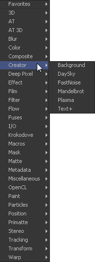
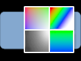
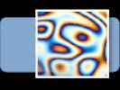

## 第八章 Creator Tools 创建器工具

- [Background [BG]](./Background%20[BG].md)
- [Day Sky [DS]](./Day%20Sky%20[DS].md)
- [Fast Noise [FN]](./Fast%20Noise%20[FN].md)
- [Mandelbrot [MAN]](./Mandelbrot%20[MAN].md)
- [Plasma [PLAS]](./Plasma%20[PLAS].md)
- [Text Plus [TXT+]](./Text%20Plus%20[TXT+].md)
- [Modifiers](./Modifiers.md)
  - [Character Level Styling](./Modifiers.md#Character%20Level%20Styling)
  - [Comp Name](./Modifiers.md#Comp%20Name)
  - [Follower](./Modifiers.md#Follower)
  - [Text Scramble](./Modifiers.md#Text%20Scramble)
  - [Text Timer](./Modifiers.md#Text%20Timer)
  - [Time Code](./Modifiers.md#Time%20Code)

<table id="img">
  <tr>
    <td rowspan="6"></td>
    <td></td>
  </tr>
  <tr>
    <td></td>
  </tr>
  <tr>
    <td></td>
  </tr>
  <tr>
    <td></td>
  </tr>
  <tr>
    <td></td>
  </tr>
  <tr>
    <td></td>
  </tr>
</table>

