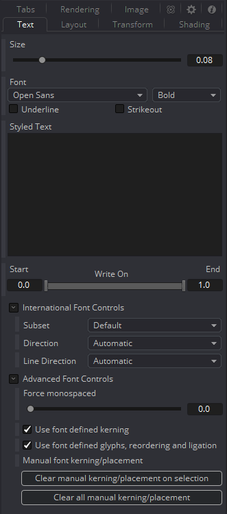
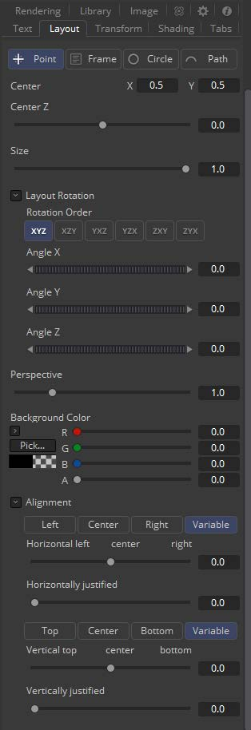
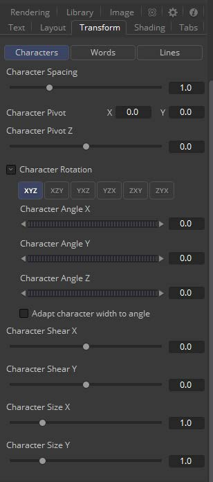
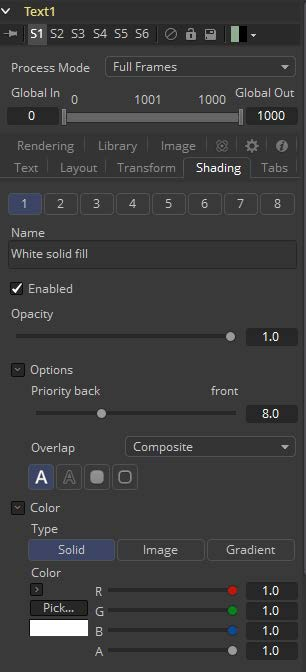
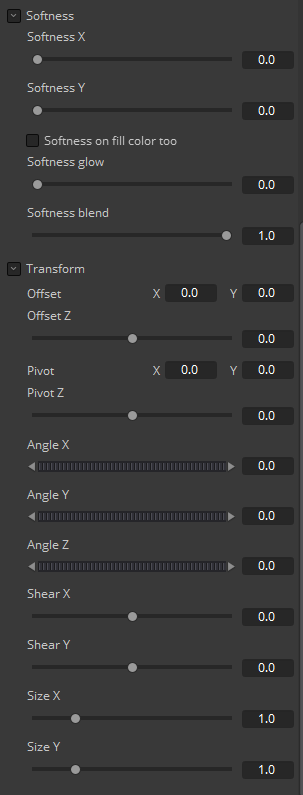
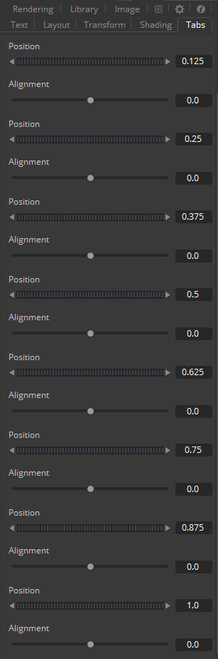
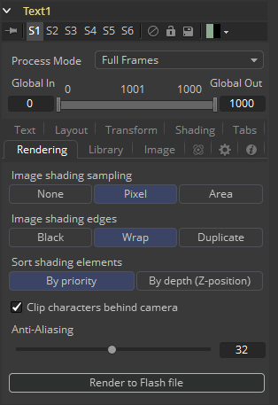
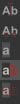

### Text Plus [TXT+] 文本+

Fusion的文字工具是一类高级的字符生成器，能够使用3D变换、多样式和多层着色。可以将文本布置到用户定义的框架、圆圈或路径上。

计算机上安装的任何True Type或Postscript 1字体均可用于创建文本。对多字节和Unicode字符的支持允许以任何语言生成文本，包括从右到左和垂直方向的文本。

该工具生成2D图像。若要生成带有可选倒角的挤出的3D文本，请参见Text 3D工具。

#### Text Tab 文本选项卡

##### Size 尺寸

此控件用于增加或减小文本的尺寸。这不像在文字处理器中选择点尺寸。尺寸是相对于图像的宽度。

##### Font 字体

Font控件用于选择Fusion用来创建文本的字体。Fusion对第三方字体管理器的支持有限。由第三方字体管理器管理的字体可能需要移动Mac OS X或Windows字体文件夹。

##### Underline and Strikeout 下划线和删除线

这些复选框允许在所使用的字体中添加强调样式。

##### Styled Text 样式文字

在此选项卡的编辑框中，输入要创建的文本。可以在此框中键入任何常用字符。也可以使用常用的系统剪贴板快捷方式（使用Command-C或Ctrl-C复制，使用Command-X或Ctrl-X剪切，使用Command-V或Ctrl-V粘贴），而右键单击编辑框会显示自定义上下文菜单。

Styled Text上下文菜单具有以下选项。

###### Character Level Styling 字符级别样式定义

此命令启用Character Level Styling，这将在Modifiers选项卡中放置一组控件。使用这些控件可以影响字体、颜色、大小和应用于单个字符变换的更改。

###### Comp Name 合成名称

Comp Name将合成的名称放在编辑框中，通常用于创建slate。

###### Follower 跟随器

跟随器是一个文本修改器，可用于在文本中的每个字符上波纹化应用于文本的动画。请参阅本节末尾的文本修改器。

###### Publish 发布

“发布”文本来让其他的文本工具连接。

###### Text Scramble 文本拼凑

文本修改器ID用于将文本中的字符随机化。请参阅本节末尾的文本修改器。

###### Text Timer 文本计时器

一个用于从指定时间倒数或输出当前日期和时间的文本修改器。请参阅本节末尾的文本修改器。

###### Time Code 时间码

一个用于输出当前帧的时间码文本修改器。请参阅本节末尾的文本修改器。

###### Connect To 连接到

使用此选项可以将此文本工具生成的文本连接到另一个工具的已发布的输出。

###### Write On 写上

此范围控件用于将简单的写上（Write On）和擦除（Write Off）效果快速应用于文本。若要创建写上效果，请在所需的时间内将控件的End部分从1设置为0。若要创建擦除效果，请将范围控件的Start部分设置为从0到1的动画。

##### International Font Controls 国际字体控件

###### Subset 子集

此下拉菜单可用于选择特定于字体子集的语言。

###### Direction 方向

该菜单提供用于确定文本写入方向的选项。

###### Line Direction 线方向

这些菜单选项用于确定文字流从上向下、从上向下还是从左向右或从左向右。

##### Advanced Font Controls 高级字体控件

###### Force Monospaced 强制等宽

此滑块控件可用于替代字体中定义的字距调整（字符之间的间距）。将此滑块设置为零（默认值）将导致Fusion完全依赖于每个字符定义的字距调整。值为1会使字符之间的间距完全均匀，或等宽。

###### Do Font Defined Kerning 使用字体定义的字距调整

这将启用按true type指定的字距调整，并且默认情况下处于启用状态。

###### Font Defined Glyphs, Reordering and Ligation 字体定义的字形、重排和连笔

除非支持人员另有指示，否则请保留Font Defined Glyphs, Reordering and Ligation复选框。

###### Manual Font Kerning/Placement 手动字距调整/放置

右键单击该标签将显示一个上下文菜单，可用于为文本的字距设置动画。有关手动字距调整的详细信息，请参阅本章稍后的该工具文档的工具栏（Toolbar）部分。

#### Layout Tab 布局选项卡

用于放置文本的控件位于Layout选项卡中。可以使用按钮组选择四种布局类型之一。

- **Point 点：**Point布局是最简单的布局模式。文本围绕着可调整的中心点排列。
- **Frame 框架：**Frame布局允许您定义用于对齐文本的矩形框架。对齐控件用于在框架边界内垂直和水平对齐文本。
- **Circle 圆形：**Circle布局将文本放置在圆形或椭圆形的曲线周围。可以控制圆形的直径和宽度。当布局设置为该模式时，Alignment控件将确定文本是沿着圆的边缘的内部还是外部定位，以及如何对齐多行文本。
- **Path 路径：**Path布局使您可以沿路径的边缘调整文本的形状。该路径可以简单地用于为文本添加样式，也可以使用选择此模式时出现的Position on Path控件对其进行动画处理。

##### Center X, Y and Z 中心X、Y和Z

这些控件用于在空间中放置布局元素的中心。X和Y是屏幕上的控件，Center Z是工具控件中的滑块。

##### Size 尺寸

此滑块用于控制布局元素的比例。

##### Layout Rotation 布局旋转

选中此复选框，将出现另一组选项来设置文本旋转的选项。

##### Rotation Order 旋转顺序

此按钮组使您可以选择将3D旋转应用于文本的顺序。

##### Angle X, Y and Z 角度X、Y和Z

这些角度控件可用于调整布局元素沿任何轴的角度。

##### Width and Height 宽度和高度

当布局模式设置为Circle或Frame时，Width控件可见。仅当布局模式设置为Frame时，Height控件才可见。它们用于调整布局元素的尺寸和外观。

##### Perspective 透视

此滑块控件用于从Angle X, Y and Z控件应用的旋转中添加或移除透视。

##### Fit Characters 适应字符

仅当布局类型设置为Circle时，此菜单控件才可见。此菜单用于选择字符沿圆周的间距。

##### Position On Path 路径上的位置

Position On Path控件用于控制文本在路径上的位置。小于0或大于1的值将导致文本在最后两个关键帧之间的路径向量相同的方向上超出路径。

##### Background Color 背景色

仅当布局类型设置为Path时，此标签才会出现。它用于提供对上下文菜单的访问，该菜单提供用于将路径连接到流中的其他路径以及随时间推移对路径的形状进行动画处理的选项。

##### Right-Click Here for Shape Animation 右键单击此处使用形状动画

有关详细信息，请查阅本手册的运动路径（Motion Paths）一章。

##### Horizontal and Vertical Alignment 水平和垂直对齐

用于控制文本的垂直和水平对齐的两组相同的控件。使用第一个按钮组选择文本的对齐方式。下面的滑块控制对齐方式。

#### 变换选项卡

##### Select Transform 选择变换

有三个按钮来确定受此选项卡中应用的变换影响的文本部分。变换可以同时应用于行、单词和字符级别。此菜单仅用于将可见控件的数量保持在合理的数量。

- **Characters 字符：**文本的每个字符都沿其自身的中心轴变换。
- **Words 词：**每个单词在单词的中心轴上分别变换。
- **Lines 行：**文本的每一行在该行的中心轴上分别进行变换。

##### Spacing 间距

Spacing滑块用于调整每行、单词或字符之间的间距。小于1的值通常会导致字符开始重叠。

##### Pivot X, Y and Z 中心X、Y和Z

这提供了轴精确位置的控制。默认情况下，该轴位于所计算的线条、单词或字符的中心。Axis控件用作偏移量，因此该控件中的`0.1, 0.1`值将导致每个文本元素的轴向下和向右移动。Z轴滑块中的正值将使该轴沿该轴进一步移动（远离查看器）。负值将使旋转轴更近。

##### Rotation Order 旋转顺序

这些按钮用于确定应用转换的顺序。XYZ表示将旋转应用于X，然后是Y，最后是Z。

##### Angle X, Y and Z 角度X、Y和Z

这些控件可用于调整三个维度中任何一个的文本元素的角度。

##### Shear X and Y 剪切X和Y

调整这些滑块可修改文本元素沿X轴和Y轴的倾斜度。

##### Size X and Y 尺寸X和Y

调整这些滑块可修改文本元素沿X和Y轴上的尺寸。

#### Shading Tab 着色选项卡

Shading选项卡提供控件来调整文本的着色、纹理和柔度。也可以从此选项卡控制变换，将额外的变换独立地应用于多达八个单独的文本着色元素。Number菜单用于选择受此选项卡中控件调整影响的元素。

##### Name 名称

此文本标签可用于为每个着色元素分配一个更具描述性的名称。

##### Enabled 启用

选择此复选框以启用或禁用每一层着色元素。默认情况下，元素1是启用的。除非选中此复选框，否则不会显示着色元素的控件。

##### Opacity 不透明度

Opacity滑块控制着色元素的整体透明度。通常，将不透明度分配给着色元素比调整应用于该元素的颜色的Alpha更好。

##### Priority Back/Front 优先后/前

此滑块确定着色元素的图层顺序，也称为Z顺序。向右滑动控件，使元素更靠近前面。将其向左移动可将一个着色元素隐藏在另一个着色元素之后。

##### Overlap 重叠

Overlap用于确定当同一着色元素的部分重叠时如何处理着色。将此菜单设置为透明会导致像素的颜色和Alpha通道设置为0（透明）。

- **Composite 合成：**此重叠选项会将着色合并到自身顶部。
- **Solid 实心：**此选项将重叠区域中的像素设置为纯不透明。
- **Transparent 透明：**此选项将重叠区域中的像素设置为纯透明。

##### Element Type (Buttons) 元素类型（按钮）

此菜单有四个选项，可控制如何将着色元素应用于文本。根据所选元素的类型，下面将出现不同的控件。

- **Text Fill 文字填充：**着色元素将应用于整个文本。这是默认模式。
- **Text Outline 文字描边：**着色元素被绘制为围绕文本边缘的轮廓。
- **Border Fill 边框填充：**着色元素填充文本周围的边框。此着色模式提供了五个其他控件。
- **Border Outline 边框描边：**边框轮廓模式在围绕文本的边框周围绘制轮廓。它提供了几个附加控件。

##### Thickness 厚度

（仅Outline）使用此滑块控件调整轮廓的厚度。值越高，轮廓越粗。

##### Adapt Thickness To Perspective 使厚度适应透视

（仅Outline）选择此复选框将使您的轮廓在文本距离相机更远的地方变细，而在文本离相机更远的地方变粗。这将为3D转换后的文本创建一个更加逼真的轮廓，但渲染时间更长。

##### Outside Only 仅外部

（仅Outline）选择此复选框将导致仅在文本的外侧边缘上绘制轮廓。默认情况下，轮廓在边缘居中，部分与文本重叠。

##### Join Style 加入类型

（仅Outline）此菜单提供有关如何绘制轮廓转角的选项。选项包括Sharp（锐角），Rounded（圆角）和Beveled（斜角）。

##### Line Style 线类型

（仅Outline）此菜单提供对线条样式的额外控制。除了默认的实线之外，还可以使用多种破折号和点图案。

##### Level 级别

（仅Border Fill）这用于控制文本边框填充的部分。

- **Text 文本：**这会在整个文本周围绘制边框。
- **Line 线：**这会在每行文本周围绘制边框。
- **Word 词：**这会在每个单词周围绘制边框。
- **Character 字符：**这会在每个字符周围绘制边框。

##### Extend Horizontal and Extend Vertical 水平延伸和垂直延伸

（仅Border）使用此滑块更改每个边框的尺寸。

##### Round 圆角

（仅边框）此滑块用于将边框的边缘圆角化。

##### Color Types 颜色类型

除了纯色着色外，还可以将外部图像映射到文本上。此菜单用于确定着色元素的颜色是从用户选择的颜色派生还是从外部图像源获取。根据所选的颜色类型，下面将显示不同的控件。

- **Solid Mode 纯色模式：**当Type菜单设置为Solid模式时，将提供颜色选择器控件来选择文本的颜色。
- **Image Mode 图像模式：**流程中工具的输出将为文本添加纹理。选择此选项后，将使用显示的Color Image控件来选择使用的工具。
- **Gradient Mode 渐变模式：**当Type菜单设置为Solid模式时，将提供渐变颜色控件来选择文本的颜色。

##### Color Image 色彩图像

（仅Image Mode）此Color Image文本框用于在将提供图像的流程中输入工具的名称。您可以键入名称、将工具从流程中拖到文本框中或右键单击并从上下文菜单中选择Connect To以选择要使用的图像。

##### Shading Mapping 着色映射

（仅Image Mode）该控件可以用选择图像映射为纹理时的模式。

- **Stretch To Fit 拉伸以适应：**选择该选项会使图像拉伸来适应文本，这是默认选项。
- **Maintain Aspect 保持宽高比：**选择该选项会使图像保持自己的宽高比。

##### Mapping Angle 映射角度

（仅Image Mode）Mapping Angle菜单用于选择图像映射到文本的角度。

##### Mapping Size 映射尺寸

（仅Image Mode）Mapping Size菜单用于选择图像映射到文本的尺寸。

##### Mapping Aspect 映射宽高比

（仅Image Mode）Mapping Size菜单用于选择图像映射到文本的宽高比。

##### Mapping Level 映射级别

- **Full Image 完整图像：**此选项将整个图像应用于文本。
- **Text 文本：**此选项对整个文本集应用图像。
- **Line 行：**此选项每行文本应用图像。
- **Word 单词：**此选项对每个文本单词应用图像。
- **Character 字符：**此选项对每个字符应用图像。

##### Softness X and Y 柔度X和Y

这些滑块控件用于创建着色元素的文本轮廓的柔和度。分别为X轴和Y轴提供控制。

##### Softness On Fill Color Too 柔软度也应用于填充色

选中此复选框将导致模糊（柔度）也应用于着色元素。当应用于由外部图像着色的着色元素时，效果最佳。

##### Softness Glow 柔度发光

该滑块将向着色元素的软化部分施加发光。

##### Softness Blend 柔度混合

此滑块控制将柔度控件结果与原始图像融合在一起的量。它可用于淡化软化操作的结果。

##### Transform Controls 变换控件

在Shading选项卡中选择Transform按钮将显示用于对着色元素执行变换的控件。这些控件的工作方式与Alignment和Layout选项卡中的等效控件完全相同，并添加了Center Offset控件。

##### Offset X, Y and Z 偏移X、Y和Z

这些控件用于为着色元素应用与文本的全局中心（在Layout标签中设置的）偏移量。坐标控件中的值`X0.0, Y0.1`将使着色元素的图像中心沿Y轴位于屏幕的下方10％。Z-Offset滑块控件中的正值会将中心推离相机更远，而正值会使它更靠近相机。

#### Tabs Tab 制表符选项卡

Tabs区域中的控件用于配置8个单独的制表符的水平屏幕位置。文本中的所有制表符都将符合这些位置。

由于Fusion使用Tab键前进到下一个控件，因此无法直接在样式文本输入中输入标签。使用以下方法输入选项卡。

（译注：是可以直接输入的。）

###### Copy and Paste 复制和粘贴

从另一个文档（如Mac OS X上的Notes或Windows上的记事本）复制一个制表符，并将其粘贴到文本框中。

##### Position 位置

此控件用于设置选项卡在框架中的水平位置。值的范围是0.0到1.0，其中0是框架的最左侧，而1是框架的最右侧。当选择了Text工具并且Tabs选项卡处于打开状态时，选项卡的位置将在查看器中由一条细的垂直白线指示。

##### Alignment 对齐

每个选项卡可以设置为左对齐，右对齐或居中。 此滑块的范围是-1.0到1.0，其中-1.0是左对齐的标签，0.0是居中的标签，而1.0是右对齐的标签。 标签线顶部的小白框表示流程中存在标签。在这些框中单击将在三个状态之间切换选项卡的对齐方式。

#### Rendering Tab 渲染选项卡

##### Image Shading Sampling 图像着色采样

使用此按钮组可以选择用于着色渲染和转换的采样类型。默认Pixel着色足以完成90％的任务。要减少文本中可检测到的混叠，请将采样类型设置为Area。这比较慢，但可能会产生更好的质量结果。设置为None将加快渲染速度，但是不应用其他采样，因此质量会降低。

##### Image Shading Edges 图像着色边缘

使用此按钮组可以选择在着色元素包裹文本边缘时如何处理应用于图像着色元素的变换。

##### Sort Shading Elements 排序着色元素

此按钮选择确定着色元素的顺序。默认值为By Priority（按优先级），它会根据每个着色元素控件中的Priority Back/Front滑块将着色元素从前到后组织。

选择By Depth (Z-Position)（按深度（Z-位置））选项将根据每个元素的Z位置（由元素的转换设置）重新组织它们。

##### Clip Characters Behind Camera 裁剪相机后面的字符

此复选框确定是否将裁剪超出摄像机平面的字符，或者它们是否会向图像中心反射回来。通常应该启用裁剪功能，但是禁用裁剪功能后，会产生一些有趣的效果。

##### Anti-Aliasing 抗锯齿

此滑块用于增加或减少应用于文本的抗锯齿量。较高的值表示渲染时间成指数增长，而较低的值则以质量为代价减少渲染时间。

##### Render to Flash File 渲染到Flash文件

单击此按钮可将Text工具的输出渲染为Adobe Flash文件。

#### Text+ Toolbar Text+工具栏

选择Text工具后，查看器中将出现一个工具栏。

##### Allow Typing In Preview Window 允许在预览窗口中键入

启用此按钮可以在查看器中直接键入和编辑文本，单击文本以产生可以定位在文本内的光标。可以使用箭头键移动光标。可以正常地键入。

##### Allow Manual Kerning 允许手动字距调整

此按钮启用手动字距调整，它会覆盖通常应用于文本的自动字距调整。在查看器中，每个文本字符下方都会出现一个小红点。在点上拖动以重新定位字符。同时选择多个字符并将它们一起移动。拖动时按住Option或Alt键，可将移动限制在单个轴上。

使用键盘上的箭头键可以手动调整所选字符的位置。按住Command或Ctrl键的同时，按箭头键以较小的增量移动字符。Shift将以更大的增量移动字符。

要设置每个字符的位置动画，请右键单击Text标签的Advanced Font控件下方的控件标签Manual Font Kerning/Placement（手动字距调整/放置），然后从上下文菜单中选择Animate。每次移动字符时，都会在动画样条线上设置一个新关键点。与折线遮罩动画一样，所有字符都使用相同的样条进行动画处理。

##### No Text Outline 无文字描边

此按钮禁用在文本边缘周围绘制任何轮廓。该描边不是文本的一部分。它是一个屏幕控件，用于帮助识别文本的位置。

##### Text Outline Outside Frame Only 仅边框外侧文字轮廓

此按钮在可见边框之外的文本边缘周围绘制轮廓。这对于查找已移出屏幕且不再渲染可见结果的文本很有用。

##### Show Always Text Outline 显示始终文本描边

无论文本在框架内是否可见，此按钮始终会在文本边缘周围绘制轮廓。