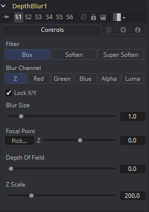

### Depth Blur [DBl] 深度模糊

Depth Blur工具主要用于创建焦距或景深效果。它基于所包含的Z通道值对3D渲染的图像进行模糊处理，还可以通过Blur Channel控件将其用于一般的每像素模糊效果。如果连接了Blur Image输入，则使用该图像的通道将用于控制模糊。

#### Controls 控件

##### Filter 滤镜

这些按钮用于选择用于应用模糊的滤镜。

##### Box 框

这会将应用基于深度的方框模糊效果到图像。

##### Soften 柔化

这将应用基于深度的常规软化滤镜效果。

##### Super Soften 超级柔化

这将应用基于深度的高质量软化滤镜效果。

##### Blur Channels 模糊通道

选择以下选项之一以确定用于控制应用于每像素的模糊等级的通道。它将使用来自主图像输入的通道，除非有工具连接到流程上的Blur Image输入。

##### Lock X/Y 锁定X/Y

启用后，此控件会将X和Y模糊滑块锁定在一起，以实现对称模糊。

##### Blur Size 模糊尺寸

此滑块用于设置应用于图像的水平和垂直模糊的强度。

##### Focal Point 焦点

仅当Blur通道设置为使用Z缓冲区时，此控件才可见。

使用此控件选择模拟焦点的距离。减小该值会使Focal Point离摄像机更近，增大该值会使焦点离摄像机更远。

在显示的图像上拖动Pick按钮（指针变为滴管），然后选择Z缓冲区值。如果图像不包含有效的Z缓冲区，则该值不会发生变化。

##### Depth of Field 景深

此控件用于确定焦点区域的深度。焦点位于区域的中间，区域内所有具有Z值的像素保持焦点。例如，如果从图像中选择了焦点并将其设置为值300，并且将景深设置为200，则Z值在200到400之间的任何像素都将保持焦点。

##### Z Scale Z缩放

按所选量缩放Z缓冲区值。增加值会导致Z通道中的距离扩大。而降低值会使其收缩。这对于放大深度效果很有用。它也可以用于软化模糊的边界。某些深度值较小的图像可能需要将Z比例设置得非常低，低于1.0。