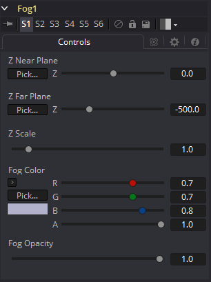

### Fog [Fog] 雾

Fog工具用于在包含有效Z缓冲区通道的3D渲染图像上创建模拟雾效果。可以基于选定的Z通道平面将雾放置在渲染图像的各个元素的前面或后面。有关更多信息，请参见辅助通道（Auxiliary Channels）一章。

Fog工具上输入的第二个图像可用于提供用作雾源的图像。如果未提供图像，则雾由单一颜色组成。通常，这里应提供某种噪声图。

#### Controls 控件

##### Z-Buffer Near Plane and Far Plane Z缓冲区近平面和远平面

这些控件用于选择场景中的雾化程度。要选择一个值，请将Pick按钮拖动到正在查看的图像上要放置平面的区域。

Near Plane用于选择雾变得稀薄的深度。Far Plane用于选择雾变得不透明的深度。

##### Z Depth Scale Z深度缩放

此选项按选定的量缩放Z缓冲区值。增大该值将导致Z通道中的距离扩大，而减小该值将使其收缩。这对于放大雾化效果很有用。

##### Fog Color 雾颜色

此选项显示和控制当前雾颜色。Alpha调整雾的透明度值。

##### Fog Opacity 雾不透明度

使用此控件可以调整雾的不透明度。
