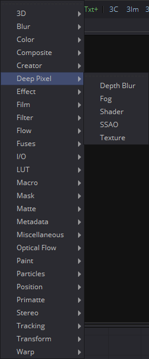
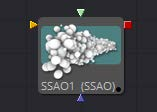
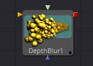
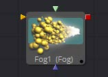
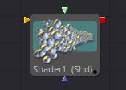
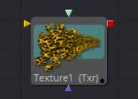

## 第九章 DeepPixel Tools 深度像素工具

- [Ambient Occlusion [SSAO] 环境光遮蔽](./Ambient%20Occlusion%20[SSAO].md)
- [Depth Blur [DBl] 深度模糊](./Depth%20Blur%20[DBl].md)
- [Fog [Fog] 雾](./Fog%20[Fog].md)
- [Shader [Shd] 着色器](./Shader%20[Shd].md)
- [Texture [Txr] 纹理](./Texture%20[Txr].md)

<table id="img">
  <tr>
    <td rowspan="6"></td>
    <td></td>
  </tr>
  <tr>
    <td></td>
  </tr>
  <tr>
    <td></td>
  </tr>
  <tr>
    <td></td>
  </tr>
  <tr>
    <td></td>
  </tr>
</table>

