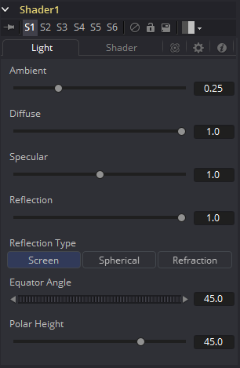
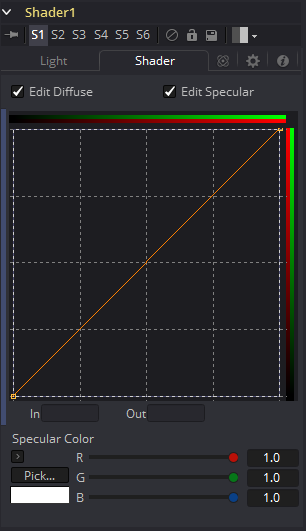

### Shader [Shd] 着色器

Shader工具可以控制渲染图像中元素的照明、反射贴图和3D阴影。反射贴图图像（连接到绿色输入）可以投影到场景中的所有元素上，或投影到通用控件中Object和Material ID通道选择的元素上。效果遮罩也可用于限制此工具的效果。

Shader工具依赖于3D渲染图像中X、Y和Z法线贴图通道的存在。如果不存在这些通道，则此工具无效。

有关更多信息，请参见《用户手册》中的辅助通道（Auxiliary Channels）一章。

#### Light Tab 光照选项卡

##### Ambient 环境

Ambient控制场景或所选对象中存在的环境光量。这是添加到所有像素的基本亮度，即使在完全遮蔽的区域也是如此。

##### Diffuse 漫反射

此选项控制场景或所选对象中存在的Diffuse颜色的量。这是物体的正常颜色，在所有方向上均等反射。

##### Specular 高光

此选项控制场景或所选对象中出现的Specular颜色的数量。这是从光源反射到眼睛的光泽高光的颜色。

##### Reflection 反射

此选项控制场景中或所选对象的反射贡献量。高等级使对象看起来像是镜像，低级别则覆盖了微小的反射，从而提供了抛光效果。如果未连接反射贴图，则无效。

##### Reflection Type 反射类型

从这三个按钮中进行选择，以确定用于在第二个输入中投影图像的反射贴图的类型。

- **Screen 屏幕：**Screen使反射贴图看起来像是投影到视点后面的屏幕上。
- **Spherical 球形：**Spherical使反射贴图看起来像是投影到整个场景周围的巨大球体上。
- **Refraction 折射：**Refraction会使反射贴图看起来像是根据场景中的几何形状折射或扭曲一样。

##### Equator Angle 赤道角

Equator Angle控制由Shader工具为场景或所选对象生成和映射的光的左右角度。

##### Polar Height 极高度

Polar Height控制由Shader工具为场景或选定对象生成和映射的光线的上下角度。

#### Shader Tab 着色器选项卡

##### Edit Diffuse and Specular 编辑漫反射和高光

启用这些控件可以在Shader样条曲线窗口中编辑各个通道的“ Shader”曲线。

##### In and Out 入和出

这些选项用于显示和编辑样条线上的点值。

##### Specular Color 高光颜色

使用Diffuse曲线可操纵漫反射着色，而使用Specular曲线可影响高光着色。框选多个点上以将其分组选择。右键单击将显示一个菜单，其中包含用于调整样条曲线的选项。有关样条窗口选项和控件的完整说明，请参见手册中控件（Controls）一章中的LUT编辑器（LUT Editor）文档。

