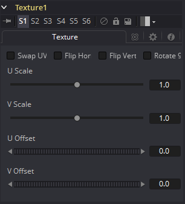

### Texture [Txr]

Texture工具可以控制渲染图像中元素的纹理贴图。纹理贴图图像（连接到绿色输入）可以包裹在对象周围以替换当前纹理。纹理工具依赖于3D渲染图像中U和V Map通道的存在。如果不存在这些通道，则此工具无效。

> **注意：**背景像素的U和V值可能为0.0，这会将这些像素设置为纹理的角像素的颜色。要将纹理限制为特定对象，请使用基于对象或其物体或材质ID通道的Alpha的效果遮罩。有关更多信息，请参见辅助通道（Auxiliary Channels）一章。

#### Texture Tab 纹理选项卡

##### Swap UV 交换UV

选中此复选框后，将交换源图像的U和V通道。

##### Flip Horizontal and Vertical 翻转水平和垂直

启用此控件后，将水平和/或垂直翻转纹理贴图图像。

##### Rotate 90 旋转90

启用此复选框后，纹理贴图图像将旋转90度。

##### U and V Scale U和V缩放

这些控件更改用于映射纹理的U和V坐标的比例。更改这些值可在应用纹理贴图时有效地放大和缩小纹理贴图。

##### U and V Offset U和V偏移

调整这些控件以偏移U和V坐标。更改值会导致纹理看起来沿对象的几何形状移动。