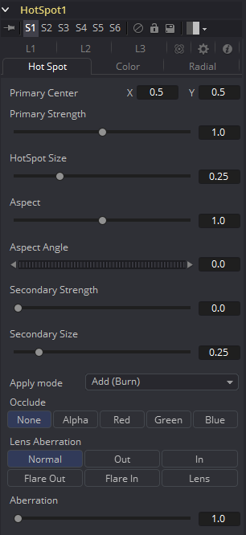
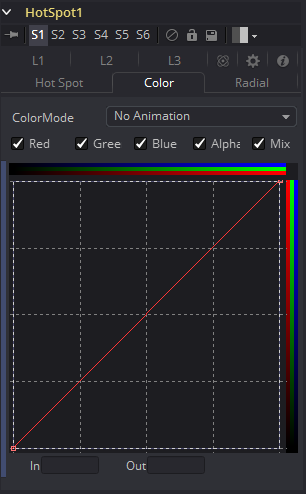
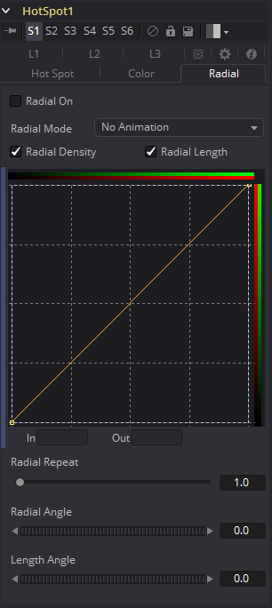

### Hot Spot [Hot] 热点

Hot Spot工具用于创建各种类型的镜头光晕、聚光灯和燃烧/减淡效果。

在现实世界中，当场景中由于反射而出现的极亮光源被相机镜头内部的元件反射时，就会发生镜头光晕。当通过摄像机镜头观察强光源时，例如太阳或明亮的恒星，可能会在镜头中看到镜头光晕。

#### Hot Spot Tab 热点选项卡

##### Primary Center X and Y 基础中心X和Y

这是场景中基础热点的位置。次要镜头元素和反射相对于基础的位置定位。

##### Primary Strength 基础强度

此控件确定主要热点的亮度。

##### 热点 Size 热点尺寸

该控件确定主要热点的直径。值1.0代表拥有整个图像宽度的圆。

##### Aspect 宽高比

这控制了spot的宽高比。值为1.0会产生一个完美的圆形热点。大于1.0的值将水平拉长圆，小于1.0的值将垂直拉长圆。

##### Aspect Angle 宽高比角度

此控件可用于旋转主要热点。

##### Secondary Strength 次要强度

该控件确定次要热点的强度，即亮度。次要热点是主要热点的反射。它始终位于与主要热点相对的图像的另一侧。

##### Secondary Size 次要尺寸

这确定了次要热点的大小。

##### Apply Mode 应用模式

此控件确定热点如何影响基础图像。

##### Add (Burn) 加（燃烧）

这会使创建的斑点使图像变亮。

##### Subtract (Dodge) 减（减淡）

这会使创建的斑点使图像变暗。

##### Multiply (Spotlight) 乘（聚光灯）

这会导致产生的斑点使光线的一部分图像分离，并使其余部分变暗。

##### Occlude 遮挡

使用此按钮组可以选择与热点工具的Occlusion输入相连的图像通道，以提供遮挡遮罩。

热点的源被它和摄像机之间有物体阻挡时，就会发生遮挡。当热点的源被遮挡时，热点就会闪出。

遮挡可以通过与工具块上的Occlusion输入相连的任何图像的Alpha或R、G或B通道进行控制。图像中的白色像素将遮挡热点。灰色像素将部分抑制热点。

##### Lens Aberration 镜头像差

像差会更改主要和次要热点的形状和行为。

##### In and Out Modes 入和出模式

将热点的形状拉长成眩光。在In模式下，热点向图像的中心延伸，而在Out模式下，热点向角落延伸。

##### Flare In and Flare Out Modes 光晕入和光晕出模式

此选项是由镜头效果的移动控制的镜头失真效果。Flare In将使热点越靠近中心效果变得越明显。而Flare Out将使热点越靠近图像边缘效果变得越明显。

##### Lens 镜头

此模式模拟圆形、环形镜头效果。

##### Aberration 像差

Aberration滑块控制镜头像差效果的整体强度。

#### Color Tab 色彩选项卡

##### Color Channel and Mix 色彩通道和混合

选中后，这些复选框控件将允许在下面的LUT中编辑所选的样条线。

##### Red, Green, Blue and Alpha Splines Red、Green、Blue和Alpha样条

Red、Green、Blue和Alpha样条用于沿热点半径调整聚光灯的颜色。

垂直轴表示颜色通道的强度或强度，从底部的0值到顶部的1值。 水平轴表示沿热点半径的位置，从左侧的外部边缘到右侧的内部。

因此，该工具的默认曲线表示Red、Green、Blue和Alpha从曲线的外部边缘到内部边缘都具有线性衰减。

##### Mix Spline 混合样条

Mix样条用于确定Radial选项卡沿热点半径具有的控件的影响。横轴代表沿圆周的位置，0为0度，1.0为360度。垂直轴表示要与颜色热点混合的径向热点的数量。值为0表示所有径向热点，而值为1.0表示所有色彩热点。

> **注意：**在LUT中单击鼠标右键将显示一个上下文菜单，其中包含与修改样条曲线有关的选项。

LUT编辑器控件和选项的完整说明可在本手册的工具控件（Tool Controls）一章中找到。

#### Radial Tab 径向选项卡

##### Radial On 径向开

选中后，此控件将启用Radial样条。否则，由样条创建的径向遮罩将不会应用到热点，并且颜色控件中的Mix样条线将不会对热点产生影响。

##### Radial Length and Radial Density  径向长度和径向密度样条

这些样条曲线的关键是认识到LUT编辑器的水平轴代表围绕热点圆周的位置。值0.0是0度，而1.0是360度。根据这一点，长度决定了沿圆周构成热点的光的半径，而密度表示沿圆周的光的亮度。

##### Radial Repeat 径向重复

此控件将重复径向样条的效果X倍。例如，重复为2.0将使样条在0和180度之间生效，而不是在0和360度之间生效，并在180和360之间再次重复样条曲线。

##### Length Angle 长度角度

此控件将围绕热点的圆周旋转Radial Length样条曲线的效果。

##### Density Angle 密度角度

此控件将围绕热点的圆周旋转Radial Density样条曲线的效果。

> **注意：**在样条曲线区域中单击鼠标右键将显示一个上下文菜单，其中包含与修改样条曲线相关的选项。

LUT编辑器控件和选项的完整说明可在本手册的工具控件（Tool Controls）一章中找到。

#### L1, L2 and L3 Tab L1、L2和L3选项卡

##### Lens Reflect 1-3 镜头光晕1-3

选中后，将启用由元素引起的反射。

##### Element Strength 元素强度

这确定了元素反射的亮度。

##### Element Size 元素尺寸

这确定了元素反射的大小。

##### Element Position 元素位置

这确定了元素反射与轴的距离。将该轴计算为热点位置和图像中心之间的线。

##### Element Type 元素类型

使用此按钮组选择元素反射的形状和密度。可用的预设如下所述。

- **Circular 圆形：**这会产生稍微软边的圆形反射。
- **Soft Circular 软圆形：**这会产生非常软边的圆形反射。
- **Circle 圆：**这将创建一个硬边的圆形。
- **NGon Solid NGon实心：**这将创建具有可变边数的填充多边形。
- **NGon Star NGon星形：**这将创建一个非常软边的星形，其边数可变。
- **NGon Shaded Out NGon着色出：**这将创建软边圆形形状。
- **NGon Shaded In NGon着色入：**这将创建一个边数可变的多边形，该多边形具有非常柔软的反向（暗中心，亮半径）圆。

##### NGon Angle NGon角度

此控件用于确定NGon形状的角度。

##### NGon Sides NGon边数

此控件用于确定将Element Type设置为Ngon Star、Ngon Shaded Ou和Ngon Shaded In时使用的边数。

##### NGon Starriness NGon星度

此控件用于将多边形弯曲为星形。值越高，形状越星形。

##### Lens Color Controls 镜头色彩控制

这些控件确定影响反射颜色的镜头颜色。要选择一种镜头颜色，请从显示的图像中选择一种，或者使用滑块或输入框输入RGBA值。

