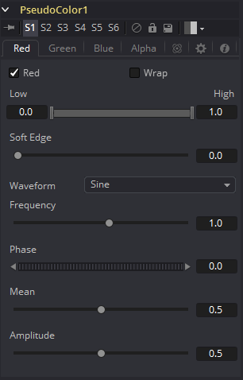

### Pseudo Color [PsCl] 伪色

Pseudo Color工具提供了根据该工具的控件生成的波形产生颜色变化的功能。它可以产生原始图像的静态或动画变化。该工具的控件分为四个相同的标签，每个颜色通道一个。

#### R/G/B/A Tabs R/G/B/A选项卡

##### Color Check Box 色彩复选框

选中后，Pseudo Color工具将影响此颜色通道。

##### Wrap 交换

选中后，超过允许参数值的波形值将被交换到相反的极端。

##### High and Low 高和低

High and Low用于确定工具在特定颜色通道中的影响范围。

##### Soft Edge 柔边

此滑块确定颜色过渡的柔和边缘。

##### Waveform 波形

这将选择发生器要创建的波形类型。有四种波形可用：正弦波（Sine），三角波（Triangle），锯齿波（Sawtooth ）和方波（Square）。

##### Frequency 频率

这将控制选定波形的频率。较高的值将增加出现方差的次数。

##### Phase 相位

这将修改波形的相位。为此控件加入动画将产生颜色循环效果。

##### Mean 均值

这将确定所选波形的电平或平均值。较高的值将增加通道的整体亮度，直到达到允许的最大值。

##### Amplitude 振幅

幅度增加或减少波形的总功率。