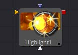
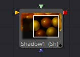
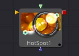
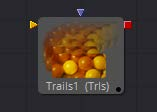
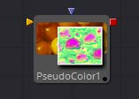
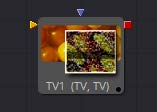

## 第十章 Effect Tools 效果工具

- [Highlight [Hil] 高光](./Highlight%20[Hil].md) 
- [Hot Spot [Hot] 热点](./Hot%20Spot%20[Hot].md) 
- [Pseudo Color [PsCl] 伪色](./Pseudo%20Color%20[PsCl].md) 
- [Shadow [Sh] 阴影](./Shadow%20[Sh].md) 
- [Trails [Trls] 尾迹](./Trails%20[Trls].md) 
- [TV [TV] 老电视](./TV%20[TV].md) 

<table id="img">
  <tr>
    <td rowspan="3"></td>
    <td></td>
    <td></td>
  </tr>
  <tr>
    <td></td>
    <td></td>
  </tr>
  <tr>
    <td></td>
    <td></td>
  </tr>
</table>