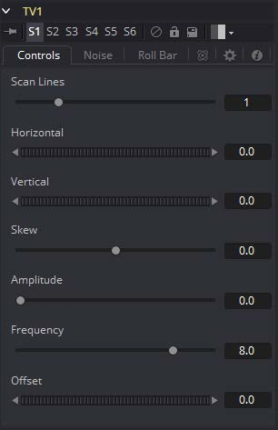
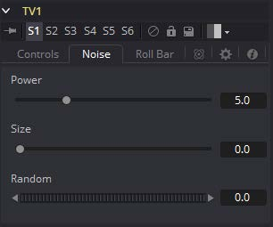
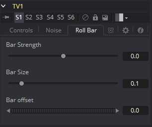

### TV [TV]

TV工具是设计来模仿模拟电视广播和屏幕中出现的一些典型缺陷的一种简单工具。

#### Controls 控件

##### Scan Lines 扫描线

此滑块用于通过从图像下降线条来模拟隔行的外观。将其设置为带透明Alpha的黑色会下降线条。值为1（默认）将每二行下降一次。值为2表示每一行，然后下降第二和第三行并如此重复。值为零将关闭效果。

##### Horizontal 水平

使用此滑块可以对图像应用简单的水平偏移。

##### Vertical 垂直

使用此滑块可以对图像应用简单的垂直偏移。

##### Skew 偏斜

该滑块用于对图像应用对角线偏移。正值会将图像偏斜到左上方。负值会使图像偏斜到右上方。像素将脱离帧环绕并重新出现在图像的另一侧。

##### Amplitude 幅度

Amplitude滑块可用于将平滑的正弦波型变形引入图像的边缘。较高的值将增加变形的强度。使用Frequency来确定重复失真的频率。

##### Frequency 频率

Frequency滑块在Amplitude控件大于1时设置沿图像边缘产生失真的正弦波频率。

##### Offset 偏移

使用Offset调整正弦波的位置，来让Amplitude和Frequency控件应用于图像的变形在整个图像中都能看到。

#### Noise Tab 噪声选项卡

##### Power 强度

将此滑块的值增加到大于0会在图像中引入噪声。值越高，噪声越强。

##### Size 尺寸

使用此滑块可将噪声贴图缩放更大。

##### Random 随机

如果此拨轮控件设置为0，则噪声图将是静态的。随时间更改该值会导致静态在帧之间变化。

#### Roll Bar Tab 滚动条形选项卡

##### Bar Strength 条形强度

默认值为0时，不会绘制任何条形图。值越高，条形覆盖的区域将越暗。

##### Bar Size 条形尺寸

增加此滑块的值以使条形更高。

##### Bar Offset 条形偏移

设置此控件的动画以在屏幕上滚动条形。